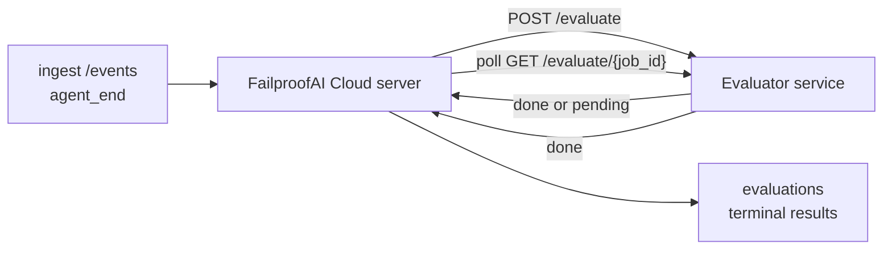

يمكن لـ FailproofAI Cloud تسجيل كل جلسة وكيل مكتملة تلقائياً من حيث الجودة: أنت توفر خدمة تسجيل صغيرة، وتتعامل FailproofAI Cloud مع الباقي. استخدمها لتتبع الأبعاد التي تهمك (الفائدة، كفاءة الأدوات، الدقة، الأمان؛ اختر أنت)، اكتشف الانحدار مبكراً، وقارن الوكلاء أو البيئات في لمحة واحدة. التسجيل اختياري: لا يفعل خط الأنابيب شيئاً حتى تعيّن `EVALUATOR_ENDPOINT` على الخادم.

> **ملاحظة:** أنت تحدد أبعاد النقاط. يمكن لمُقيّمك إرجاع أي مفاتيح رقمية يريدها؛ تخزن FailproofAI Cloud وتتجه وتعرض كل ما تُرسله مرة أخرى.

## لمحة سريعة

1. **اكتب مُسجّل.** أنشئ خدمة HTTP صغيرة تقرأ نسخة من جلسة وترجع نقاط. تشحن FailproofAI Cloud مرجعاً يعمل يمكنك نسخه. انظر [كتابة مُقيّم مع SDK](#writing-an-evaluator-with-the-sdk).
2. **وجّه FailproofAI Cloud إليه.** عيّن `EVALUATOR_ENDPOINT` (و`EVALUATOR_TOKEN` مشترك) على عملية الخادم.
3. **راقب النقاط تصل.** كل جلسة مكتملة يتم تسجيلها تلقائياً؛ تظهر النتائج على صفحة تفاصيل الجلسة، شبكة الجلسات، والقوائم المحفوظة.


*بمجرد تكوين مُقيّم، يتم تسجيل كل عملية مكتملة وتظهر النتائج في الشريط الأيمن للجلسة: الملخص في الأعلى، ثم أشرطة نقاط لكل بعد مع التبرير.*

---

## كيفية العمل



عندما يُصدر FailproofAI Cloud SDK حدث `agent_end` لجلسة، يجدول الخادم تقييماً. ثم يُرسل نسخة الحدث الكاملة إلى خدمة المُقيّم الخاصة بك، والتي يمكنها إما:

- **إرجاع النتيجة مباشرة** مع `{"status":"done", "scores":{...}, "reasoning":{...}, "summary":"..."}`. تُلحق النتيجة بجدول تقييم الجلسة. `reasoning` و `summary` اختياريين.
- **تأجيل** مع `{"status":"pending", "job_id":"abc-123"}`. ثم تستدعي FailproofAI Cloud `GET {EVALUATOR_ENDPOINT}/evaluate/abc-123` حتى يُرجع مُقيّمك `{"status":"done", ...}` أو `{"status":"error", "error":"..."}`.

  وتيرة الاستقصاء لكل وظيفة: قد تتضمن استجابة `pending` `next_poll_secs` للتجاوز؛ وإلا فتستخدم FailproofAI Cloud قيمة `default_poll_interval_secs` من `GET /config`؛ وإلا يعود الخادم إلى `EVALUATOR_POLLING_INTERVAL_SECS` (افتراضي 10 ثانية). جميع القيم محصورة في [1 ثانية، 1 ساعة].

يمكن أيضاً التقاط الجلسات التي لم تُصدر أبداً `agent_end` (على سبيل المثال، عملية وكيل منهارة): قد يُرجع `GET /config` الخاص بالمُقيّم `{"inactivity_timeout_secs": 1800}`، وستقيّم FailproofAI Cloud أي جلسة خاملة لتلك المدة. عيّن الحقل إلى `null` أو احذفه لتعطيل هذا البديل.

خط الأنابيب عديم التأثير تماماً عندما يكون `EVALUATOR_ENDPOINT` غير محدد.

يمكن للجلسة تجميع **تقييمات نهائية متعددة بمرور الوقت**: كل حدث `agent_end` (وكل إعادة تقييم يدوية من القوائس) تُلحق صف تقييم جديد. هذه هي الطريقة المدعومة لتقييم محادثة مستأنفة: ينهي المستخدم وكيلاً، ويعود لاحقاً، يُرسل المزيد من الأحداث، ينهي الوكيل مرة أخرى، ويعمل تقييم ثانٍ ضد النسخة الكاملة المحدثة. تُصيّر القوائس أحدث تقييم كعنوان رئيسي والتقييمات السابقة كجدول زمني قابل للطي. بينما يعمل تقييم واحد لجلسة، تُتجاهل أحداث `agent_end` الإضافية لتلك الجلسة؛ الحدث التالي بعد انتهاء التقييم الجاري سيُدرج تقييماً جديداً كالمعتاد.

يُعاد تفعيل بديل عدم النشاط على الجلسات المستأنفة أيضاً: إذا وصلت أحداث جديدة بعد تقييم نهائي سابق وذهبت الجلسة خاملة بعد `inactivity_timeout_secs`، يُدرج تقييم جديد في الطابور.

الأعطال العابرة (5xx، 429، انتهاءات المهلة الزمنية، أخطاء الشبكة) تُعاد محاولتها مع تراجع أسي حتى `EVALUATOR_MAX_ATTEMPTS`؛ استجابات 4xx نهائية. FailproofAI Cloud آمن للتشغيل مع خوادم متعددة مقسمة أفقياً؛ يُقسم العمل بحيث لا تُرسل نفس الجلسة مرتين معاً.

---

## عقد HTTP

كل مسار مصادق يستخدم **مصادقة رمز الحامل**. يجب أن تكون نفس القيمة مُعدة على كلا الجانبين:

- خادم FailproofAI Cloud: متغير env `EVALUATOR_TOKEN`
- خدمة المُقيّم: معدة بنفس الطريقة (يقرأ `EVALUATOR_TOKEN` SDK `agenteye-evaluator` حسب الاتفاقية)

إذا كان `EVALUATOR_TOKEN` غير محدد، لا يُرسل الخادم رأس `Authorization`؛ قد يقبل المُقيّم طلبات مجهولة، وهذا جيد لشبكة داخلية فقط لكن غير موصى به على الإنترنت العام.

### المسارات التي يجب أن يخدمها المُقيّم

| المسار | الجسم / المعاملات | الاستجابة |
|---|---|---|
| `GET /health` | بلا | `{"status":"ok"}` (مفتوح، بدون مصادقة) |
| `GET /config` | بلا | `{"inactivity_timeout_secs": <int> \| null, "default_poll_interval_secs": <int> \| omitted}` |
| `POST /evaluate` | `EvalRequest` JSON | `{"status":"done", ...}` أو `{"status":"pending", "job_id":"..."}` |
| `GET /evaluate/{id}` | بلا | نفس شكل الاستجابة `/evaluate` |

### جسم `EvalRequest` المُرسل من الخادم

```json
{
  "schema_version": "1",
  "session_id":     "session-abc123",
  "agent_id":       "planner",
  "environment":    "production",
  "started_at":     "2026-05-10T12:00:00Z",
  "ended_at":       "2026-05-10T12:05:00Z",
  "events": [
    { "id": 1234, "ts": "...", "event_type": "agent_start", "payload": { ... } },
    ...
  ]
}
```

### أشكال الاستجابة

**متزامن (مكتمل):**

```json
{
  "status": "done",
  "scores": { "helpfulness": 0.85, "tool_efficiency": 0.6 },
  "reasoning": {
    "helpfulness": "answered the question directly with citations",
    "tool_efficiency": "called list_files three times when one would have done"
  },
  "summary": "strong answer quality, weak tool selection"
}
```

`reasoning` (خريطة تبرير لكل نقطة) و `summary` (سرد واحد شامل) كلاهما اختياري. يجب أن تعكس المفاتيح في `reasoning` المفاتيح في `scores`؛ تُصيّر القوائس كل إدخال مباشرة تحت شريط النقاط الخاص به. المُقيّمون الأقدم الذين يُرجعون `scores` فقط يستمرون في العمل بدون تغيير؛ `reasoning` و `summary` ببساطة يُقرآن كـ null وتُحذف تسهيلات الواجهة المقابلة.

**غير متزامن (مؤجل):**

```json
{ "status": "pending", "job_id": "abc-123", "next_poll_secs": 30 }
```

`next_poll_secs` اختياري؛ إذا تم حذفه يعود الخادم إلى `default_poll_interval_secs` الخاص بالمُقيّم من `/config`، ثم إلى متغير env `EVALUATOR_POLLING_INTERVAL_SECS` الخاص به.

**خطأ نهائي من جانب المُقيّم:**

```json
{ "status": "error", "error": "model service unavailable" }
```

يتعامل الخادم مع أي جسم 2xx آخر كخطأ بروتوكول ويسجل `error` نهائي للجلسة.

---

## كتابة مُقيّم مع SDK

لا يجب أن تُطبق عقد HTTP باليد. حزمة `agenteye-evaluator` Python توفر لك غلاف FastAPI مكتوب يتعامل مع المصادقة والتوجيه وأشكال الطلب/الاستجابة لك.

تشحن FailproofAI Cloud أيضاً **مُقيّم مرجعي يعمل** يسجل `helpfulness` و `tool_efficiency` و `factuality` من شكل النسخة. انسخه كنقطة بداية وبدّل منطقك الخاص: قاضٍ LLM، محرك قواعد، أي شيء يناسب معيار الجودة لديك.

مُقيّم قابل للحياة الدنيا:

```python
import os
from agenteye_evaluator import Evaluator, EvalRequest, EvalResponse

app = Evaluator(token=os.environ["EVALUATOR_TOKEN"])

@app.evaluator
def run(req: EvalRequest) -> EvalResponse:
    # Inspect req.events (the full session transcript) and return scores.
    tool_calls = sum(1 for e in req.events if e.event_type == "tool_use")
    return EvalResponse(
        scores={"tool_calls": float(tool_calls)},
        reasoning={"tool_calls": f"{tool_calls} tool invocations in the transcript"},
        summary="tight tool loop" if tool_calls < 5 else "agent looped on tools",
    )
```

مثيل `app` يعمل تحت أي خادم ASGI، لذا `uvicorn module:app` يبدئه.

بالنسبة للمُقيّمين الذين يحتاجون تأجيل عمل مكلف، أرجع `JobPending` بدلاً من ذلك وسجل معالج `@app.job_lookup`؛ يستقصي خادم FailproofAI Cloud `GET /evaluate/{job_id}` حتى تُرجع حالة نهائية أو تنقضي قيمة حد `EVALUATOR_MAX_POLL_DURATION_SECS` (افتراضي 1 ساعة).

مرجع الـ API الكامل والنمط غير المتزامن وشماء الحدث موثقة في قراءة `agenteye-evaluator` SDK.

---

## تشغيل مُقيّمك

المُقيّم هو **خدمتك** — لا تشحن FailproofAI Cloud مُقيّماً افتراضياً، لذا تبني وتشغل أينما تشغل خدماتك. يعمل تحت أي خادم ASGI (على سبيل المثال `uvicorn my_evaluator:app`؛ خدم المسارات `/health` و `/config` و `/evaluate` من [عقد HTTP](#http-contract)، ثم وجّه الخادم إليه (انظر [تكوين الخادم](#configuring-the-server)).

بمجرد وصول المُقيّم، `GET /health` يُرجع `{"status":"ok"}`. بعد انتهاء الوكيل من البداية إلى النهاية، `GET /evaluations` على الخادم يُرجع صفاً مع `status: "done"` والنقاط التي أنتجها مُقيّمك.

---

## تكوين الخادم

عيّن على عملية الخادم:

| متغير Env | المعنى |
|---|---|
| `EVALUATOR_ENDPOINT` | URL الأساسي لمُقيّمك (`http://evaluator:9000`). غير محدد = خط أنابيب معطل. |
| `EVALUATOR_TOKEN` | رمز الحامل. يجب أن يساوي القيمة التي عُدت خدمة المُقيّم معها. |
| `EVALUATOR_WORKERS` | مهام العامل لكل مثيل خادم (افتراضي 2). |
| `EVALUATOR_CLAIM_BATCH` | الصفوف المُستقاة لكل تطبيق عامل (افتراضي 4). تُعالج الدفعات **معاً**؛ الدرجة الفعالة على نقطة المُقيّم هي `EVALUATOR_WORKERS × EVALUATOR_CLAIM_BATCH`. |
| `EVALUATOR_POLL_IDLE_SECS` | مدة نوم العامل بين محاولات الإرسال عند عدم وجود تقييم مستحق (افتراضي 2 ثانية). |
| `EVALUATOR_POLLING_INTERVAL_SECS` | التراجع النهائي لوتيرة `GET /evaluate/{id}` عند عدم تعيين كل من `next_poll_secs` في الاستجابة أو `default_poll_interval_secs` الخاص بالمُقيّم (افتراضي 10 ثانية). |
| `EVALUATOR_REQUEST_TIMEOUT_MS` | انتهاء مهلة زمنية لكل طلب (افتراضي 30000). |
| `EVALUATOR_MAX_ATTEMPTS` | بعد هذا العديد من الأعطال العابرة يُسجل الناتج كـ `error` نهائي (افتراضي 5). |
| `EVALUATOR_CONFIG_REFRESH_SECS` | وتيرة `GET /config` (افتراضي 300). |
| `EVALUATOR_MAX_POLL_DURATION_SECS` | الحد الأقصى من الوقت الحقيقي الذي يمكن أن تبقى الجلسة في طابور الاستقصاء قبل إنهاؤها كـ `timeout` (افتراضي 3600 ثانية). حماية من مُقيّم يستمر في إرجاع `pending` للأبد. |

لتفعيل التسجيل التلقائي، عيّن كلاً من `EVALUATOR_ENDPOINT` و `EVALUATOR_TOKEN` على الخادم، ثم أعد تشغيله لاستقبال التغيير. مع عدم تعيين `EVALUATOR_ENDPOINT` يبقى خط الأنابيب عديم التأثير.

أزرار المعايرة أعلاه اختيارية؛ عيّن متغيرات البيئة المقابلة على الخادم فقط إذا اضطررت لتجاوز الافتراضيات.

---

## مرجع API

| الطريقة | المسار | الصلاحية المطلوبة | الغرض |
|---|---|---|---|
| `GET` | `/evaluations` | `evaluations:read` | الاستعلام النتائج النهائية. يدعم `session_id` و `agent_id` و `environment` و `status` (`done`/`error`/`timeout`) و `ts_from` و `ts_to` و `cursor` و `limit` و `score_filters` و `latest_per_session`. `limit` افتراضي 50 ومحصور عند 200 (لاحظ هذا يختلف عن `/events` الذي يحد عند 1000). `environment` يقبل قائمة مفصولة بفواصل (مثل `environment=prod,staging`)؛ القيم الفردية لا تزال تعمل. مع `latest_per_session=true` تحتوي الاستجابة على صف واحد على الأكثر لكل `session_id` (الأحدث بـ `completed_at`) يُستخدم من صفحة قائمة الجلسات لطي جدول الجلسة الزمني إلى عنوانها الحالي. افتراضي false (يُرجع السجل الكامل). |
| `GET` | `/evaluations/aggregate` | `evaluations:read` | صحة تقييم مدرجة لشريحة مصفاة: إجمالي العدد، تفصيل done/error/timeout، إحصائيات لكل مفتاح نقطة (عدد/متوسط/min/max/p50 على مفاتيح `scores` التعسفية)، وجدول زمني مقسم بالوقت. يقبل **نفس معاملات تصفية `/evaluations`** بالإضافة إلى `featured_keys` (CSV من مفاتيح النقاط للاتجاه) و `latest_per_session`. يقوي ميزة القوائس؛ المقاييس دقيقة على المجموعة المطابقة بأكملها، وليست مُأخوذة عينات. |
| `GET` | `/evaluations/environments` | `evaluations:read` | قيم البيئة المميزة من جدول `evaluations`. يُستخدم لملء القوائس المنسدلة للتصفية المقيدة بالبيانات القابلة للقراءة للتقييم. |
| `GET` | `/evaluation-jobs` | `evaluations:read` | رؤية في التقييمات قيد الطيران. صفّي حسب `status` (`pending`/`polling`). |
| `GET` | `/events` | `events:read` | بث أحداث جلسة خام. يدعم `session_id` و `agent_id` و `event_type` (CSV) و `environment` (CSV) و `ts_from` و `ts_to` و `cursor` و `limit` و `order`. `order` هو `desc` (الأحدث أولاً، الافتراضي) أو `asc` (الأقدم أولاً)؛ تعود القيمة غير المعروفة إلى `desc`. استقصاء المؤشر عبر `next_cursor` الاستجابة (معرف حدث): مرره مرة أخرى كـ `cursor` للحصول على الصفحة التالية؛ مع `asc` الصفحة التالية هي الأحداث بعد ذلك المعرف، مع `desc` الأحداث قبله. `limit` افتراضي 50 ومحصور عند 1000. |
| `GET` | `/sessions/:session_id/export` | `events:read` | يُرجع جسم JSON الدقيق الذي سيستقبله المُقيّم لهذه الجلسة، مخدوماً كملحق قابل للتنزيل باسم `session-<id>.json`. مفيد لإعادة تشغيل جلسات الإنتاج عبر `agenteye-evaluator` للاختبار دون الاتصال. البايتات متطابقة بايت لبايت مع ما يُرسله خط أنابيب المُقيّم. |
| `POST` | `/sessions/:session_id/re-evaluate` | `evaluations:trigger` | اطلب تقييماً جديداً لجلسة؛ يعمل سواء كان لدينا تقييم سابق أم لا. تُلحق النتيجة الجديدة **بـ** جدول تقييم الجلسة الزمني بدلاً من الكتابة فوق الجلسة السابقة، لذا تبقى النقاط السابقة مرئية كسجل. يُرجع `202` عند الإدراج، `404` لجلسة مجهولة، `409` إذا كان تقييم قيد الطيران بالفعل. استخدم هذا بعد نشر مُقيّم جديد، أو لجلسات لم تُصدر أبداً `agent_end`. |

### التصفية حسب نطاق النقاط: `score_filters`

يقبل `GET /evaluations` معامل `score_filters` اختياري يضيق النتائج حسب القيم الرقمية داخل كائن `scores`. المعامل هو قائمة مفصولة بفواصل من إدخالات `key:min..max`؛ يمكن حذف أي من الحد. تجمع الإدخالات المتعددة مع AND منطقي. تُستثنى الصفوف حيث المفتاح المسمى غائب أو غير رقمي. قد يحمل طلب واحد 20 إدخال تصفية على الأكثر؛ تجاوز ذلك يُرجع HTTP 400.

أمثلة:
```text
# helpfulness in [0.5, 0.8]
GET /evaluations?score_filters=helpfulness:0.5..0.8

# tool_efficiency at most 0.3 (no lower bound)
GET /evaluations?score_filters=tool_efficiency:..0.3

# helpfulness >= 0.5 AND factuality >= 0.9
GET /evaluations?score_filters=helpfulness:0.5..,factuality:0.9..
```

لكل كائن استجابة `/evaluations` هذه الحقول:

| الحقل | النوع | ملاحظات |
|---|---|---|
| `evaluation_id` | string (UUID) | المعرّف الأساسي لهذا التقييم النهائي. يحصل كل تقييم نهائي على UUID جديد؛ يمكن للجلسة الواحدة أن تحمل متعددة. |
| `id` | string (UUID) | اسم مستعار للتوافقية للخلف يحمل نفس قيمة `evaluation_id`. |
| `session_id` | string | الجلسة التي عمل التقييم ضدها. يمكن للجلسة الواحدة أن تحمل تقييمات متعددة في الجدول الزمني. |
| `agent_id` | string | يعرّف الوكيل الذي أنتج الجلسة. |
| `environment` | string | علامة البيئة المنسوخة من الجلسة. |
| `status` | enum | واحد من `"done"` أو `"error"` أو `"timeout"`. |
| `scores` | object \| null | النقاط المُرجعة من قبل مُقيّمك. |
| `reasoning` | object \| null | خريطة تبرير اختيارية لكل نقطة مُرجعة من قبل مُقيّمك. تعكس المفاتيح عادة تلك في `scores`. تُصيّر القوائس كل إدخال تحت شريط النقاط الخاص به. |
| `summary` | string \| null | سرد واحد شامل اختياري مُرجع من قبل مُقيّمك. تُصيّر القوائس هذا فوق التفصيل لكل نقطة كعنوان التقييم. |
| `error` | string \| null | ممتلأ على `"error"` / `"timeout"` فقط. |
| `attempt_count` | integer | عدد محاولات الإرسال (≥ 1). |
| `duration_ms` | integer \| null | مدة المحاولة الأخيرة. |
| `completed_at` | string (ISO 8601 UTC) | عندما تم تسجيل النتيجة النهائية. تُرتب النتائج حسب `completed_at` (الأحدث أولاً). |
| `created_at` | string (ISO 8601 UTC) | يحمل نفس الطابع الزمني كـ `completed_at` (دلالات الكتابة مرة واحدة). |

---

## الصلاحيات

| الصلاحية | تمنح |
|---|---|
| `evaluations:read` | قائمة نتائج التقييم، عرض النقاط في القوائس، وتحميل مقاييس صحة القوائس. |
| `evaluations:trigger` | اطلب يدوياً تقييماً لجلسة عبر `POST /sessions/:session_id/re-evaluate` أو زر إعادة تقييم القوائس. |
| `dashboards:read` | عرض القوائس المحفوظة (يحتاج أيضاً `evaluations:read` لتحميل مقاييسها). |
| `dashboards:write` | إنشاء وتعديل القوائس. |
| `dashboards:delete` | حذف القوائس. |

يحصل المسؤول التمهيدي (`ADMIN_KEY` و `ADMIN_EMAIL`) تلقائياً على هذه.

---

## عرض النتائج

- **`/sessions/<id>`**: جدول زمني للأحداث + شريط أيمن يعرض نقاط الجلسة وأي خطأ من محاولة الإرسال. إذا كان مفتاحك يملك `evaluations:trigger`، يظهر زر **إعادة تقييم** بجانب زر التصدير، مفيد للجلسات التي لم تُصدر أبداً `agent_end`، أو لتحديث النقاط بعد نشر مُقيّم جديد. تستقصي القوائس النتيجة الجديدة وتحدّث الشريط الأيمن عند وصولها.
- **`/sessions`**: شبكة جلسات قابلة للتصفية؛ عمود النقاط يعرض حالة تقييم كل جلسة ونقاطها في لمحة.
- **`/dashboards`**: عروض صحة تقييم محفوظة (انظر [القوائس](#dashboards) أدناه).


*تعرض شبكة الجلسات حالة تقييم كل جلسة ونقاطها في لمحة؛ جعل الشارات الحمراء/الكهرمانية/الخضراء النقاط المنخفضة تبرز.*

---

## القوائس

تسمح صفحة **القوائس** (`/dashboards`) بحفظ مزيج من تصافي التقييم كعرض مسمى وقابل لإعادة الاستخدام ومراقبة كيفية تطور تلك الشريحة من التقييمات في لمحة. **تُشاركت القوائس عبر منظمتك بأكملها**؛ يرى الجميع لديهم `dashboards:read` نفس المجموعة.

تثبت كل لوحة:

- **التصافي**: نفس الضوابط كصفحة الجلسات: البيئة والحالة والوكيل ونافذة زمنية متدرجة وتصافي نطاق النقاط (`key:min..max`).
- **تشكيل عرض**: مفاتيح النقاط التي تميز، أعتاب صحة أخضر/كهرماني/أحمر، أي لوحات تعرض، وما إذا كنت تطوي إلى أحدث تقييم لكل جلسة.

يعرض كل بطاقة عدد الجلسات المطابقة، تفصيل done/error/timeout، متوسط كل نقطة مميزة، وخط اتجاه صغير. فتح لوحة يعرض اللوحات بحجم كامل؛ **تفتح في جلسات** توديعك في صفحة الجلسات المصفاة مسبقاً لتلك الشريحة تماماً. تُحسب المقاييس على جانب الخادم على المجموعة المطابقة بأكملها (عبر `GET /evaluations/aggregate`)، لذا تكون الأرقام دقيقة بدلاً من أخذ عينات.


**الصلاحيات:** العرض يحتاج كلاً من `dashboards:read` و `evaluations:read`؛ الإنشاء والتعديل يحتاج `dashboards:write`؛ الحذف يحتاج `dashboards:delete`. يستقبل المسؤول التمهيدي جميع هذه تلقائياً.

---

## استكشاف الأخطاء والإصلاح

**توجد جلسات لكن لا تُنشأ تقييمات.** تأكد من تعيين `EVALUATOR_ENDPOINT` على عملية الخادم، وأن الخادم والمُقيّم يتشاركان نفس قيمة `EVALUATOR_TOKEN`، وأن نقطة المسار `/health` الخاصة بالمُقيّم قابلة للوصول من الخادم. مع عدم تعيين `EVALUATOR_ENDPOINT` خط الأنابيب عديم التأثير.

**تقييمات قيد الطيران تتراكم.** استعلم `GET /evaluation-jobs` لترى طابور الطيران. فتش `attempt_count` و `next_attempt_at` و `last_error` على كل صف. الأسباب الشائعة: خدمة المُقيّم غير قابلة للوصول أو تُرجع 5xx (أعيدت محاولتها مع تراجع)، `EVALUATOR_TOKEN` خاطئ (401 نهائي)، أو مُقيّم غير متزامن يُرجع `pending` إلى الأبد (انظر أدناه).

**اكتملت الجلسات لكن لا تقييم نهائي.** استعلم `GET /evaluation-jobs?status=polling`؛ النتيجة قد لا تزال قيد الطيران. إذا علقت وظيفة في `pending`، يواجه الخادم مشكلة في الوصول إلى المُقيّم؛ تحقق من أن المُقيّم مرفوع وأن `EVALUATOR_TOKEN` يطابق.

**`HTTP 401 from evaluator: invalid bearer token`.** `EVALUATOR_TOKEN` على الخادم لا يطابق القيمة التي عُدت خدمة المُقيّم معها. يجب أن تكون متطابقة.

**مُقيّم غير متزامن يُرجع `pending` للأبد.** يستقصي الخادم `GET /evaluate/{job_id}` حتى يُرجع المُقيّم `done` أو `error`، أو حتى تنقضي `EVALUATOR_MAX_POLL_DURATION_SECS` (افتراضي 1 ساعة). بعد الحد يُسجل التقييم كـ `timeout` ويُزال من طابور الطيران. ارفع `EVALUATOR_MAX_POLL_DURATION_SECS` إذا كان مُقيّمك بشكل شرعي يحتاج أكثر من الافتراضي.

---

## الخطوات التالية

- [مهارة وكيل المُقيّم](/ar/cloud/agent-skills): اطلب من وكيل ترميز أن يصمم أبعادك ضد جلسات حقيقية وينشئ هذه الخدمة لك.
- [Python SDK](/ar/cloud/sdk): أصدر أحداث `agent_end` التي تُثير التسجيل.
- [مفاتيح API](/ar/cloud/access): صلاحيات `evaluations:read` و `evaluations:trigger`.
- [عمليات التدقيق](/ar/cloud/audits): ميزة جودة مؤتمتة أخرى من FailproofAI Cloud، للمراجعة المستندة إلى السياسة.