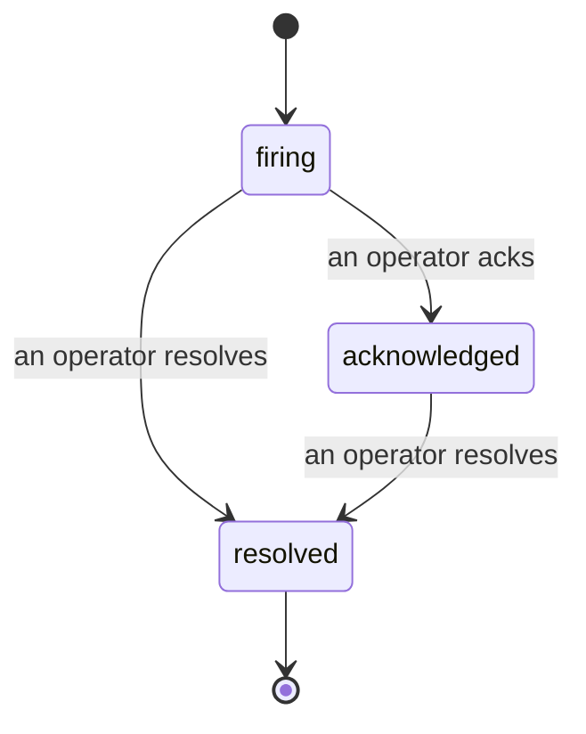

---
---
title: "الحوادث"
description: "عندما يطلق تنبيه ما، يمكن للجميع رؤية أن الحادثة مفتوحة، ومن يملك الملكية، وما حدث حتى الآن — على خط زمني موحد ومنسوب."
---

عندما يطلق تنبيه ما، السؤال الأول هو دائماً "من يتولى الأمر؟" الحوادث تجيب على ذلك: في اللحظة التي يحدث خرق ما، يمكن للجميع رؤية أن الحادثة مفتوحة، ومن يملك الملكية، وبالضبط ما حدث حتى الآن، مع سجل نظيف ومنسوب يمكنك تسليمه مباشرة إلى جلسة تحليل ما بعد الحادثة.

*يجمع الصندوق الحوادث المفتوحة حسب الحالة وينقيها حسب مستوى الخطورة والشخص المسؤول، لتري ما يحتاج تدخل بشري الآن.*

## اعرف من يتولى الأمر، بلمحة واحدة

لا مزيد من "هل أحد ما ينظر إلى هذا؟" في خيط دردشة. يفتح الخرق حادثة تلقائياً ويضعها في صندوق وارد مشترك، مجمعة حسب الحالة. اعترف بها واسمك عليها، لذا يعرف بقية الفريق أنه تم التعامل معها. الاعتراف مشترك: عدة مشغلين يمكنهم الاعتراف بنفس الحادثة وكل واحد يُسجل بشكل منفصل، لذا تظهر غرفة حرب كاملة بالأسماء بدلاً من التداخل. عيّن مالك واحد للفحص الأولي، وصفّي صندوق الوارد حسب مستوى الخطورة أو الشخص المسؤول لتقليصه إلى ما هو من مسؤوليتك.

## القصة كاملة، في خط زمني واحد

عندما تنتهي الحادثة، تكون لديك بالفعل التقرير. افتح أي حادثة وستحصل على دليل الخرق، والأشخاص المسؤولين والمشتركين، وخيط تعليقات للتنسيق في نفس المكان، وخط زمني نشاط منسوب وإضافي فقط.

*كل ما حدث، بالترتيب، كل سطر موقّع من قبل من قام به.*

كل إجراء (مفتوح، معترف به، تم حله، وما إلى ذلك) يُكتب في هذا الخط الزمني ولا يُعدّل أبداً. كل إدخال منسوب: إلى المشغل الذي اتخذه، برسالة البريد الإلكتروني، أو إلى **automated** لأي شيء فعلته Failproof AI تلقائياً، مثل فتح الحادثة على الخرق. لا شيء مجهول ولا شيء ضائع، لذا فإن تحليل ما بعد الحادثة يكتب نفسه تقريباً.

## كيف تتحرك الحادثة

- **مفتوحة (نشطة):** يفتح الخرق الحادثة وينبه قنواتك مرة واحدة. تطويات الخروقات المتكررة في نفس الحادثة وتحديث أدلتها بدلاً من إنبيهك مراراً وتكراراً.
- **معترف بها:** يلتقطها مشغل. تبقى مفتوحة، والخروقات اللاحقة تحدث الأدلة بهدوء.
- **تم حلها:** يغلقها مشغل. الحل التلقائي عندما تتضح الحالة مخطط له لكن لم يتم تفعيله بعد، لذا تبقى الحادثة مفتوحة حتى يحلها إنسان، مما يجعل الجميع مسؤولين عما تم حله فعلاً. يمكن أن تفتح حادثة جديدة على نفس التنبيه لاحقاً.

يحتفظ التنبيه الواحد بحادثة مفتوحة واحدة على الأكثر في المرة الواحدة، لذا فإن القاعدة المتذبذبة لا يمكنها أن تدفنك في النسخ المكررة. يمكنك أيضاً فتح حادثة يدويًا: واحدة مستقلة لشيء لم يلتقطه أي تنبيه، أو واحدة مرتبطة بتنبيه موجود، إذا كان لديك `incidents:write`.

## أين تجدها

تعيش الحوادث في `/<org-slug>/incidents`. العرض يحتاج **`incidents:read`**؛ فتح حادثة يدوية يحتاج **`incidents:write`**؛ الاعتراف والتعيين والتعليق والحل يحتاج **`incidents:ack`**. المفاتيح الأقدم التي منحت `alerts:ack` المتقاعد تستمر في العمل، حيث يتم احترامها كـ `incidents:ack`، لذا فإن دوران الحراسة لا يحتاج إلى إعادة إصدار.

## ذات صلة

- [التنبيهات](/ar/cloud/alerts): القواعد التي تفتح هذه الحوادث عندما يحدث خرق للحد.
- [تتبع الأخطاء](/ar/cloud/errors): شاهد كل فشل في مكان واحد وارفعه إلى تنبيه.
- [التدقيق](/ar/cloud/audits): محلل مجدول يجد الأخطاء التي لم تراقبها أي قاعدة.