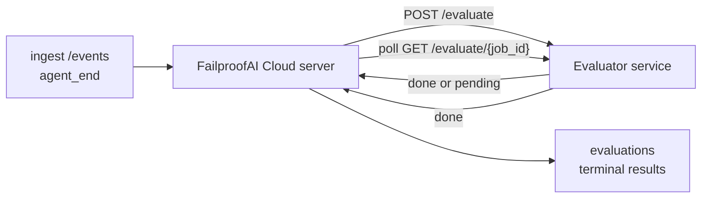

FailproofAI Cloud kann jeden abgeschlossenen Agenten-Lauf automatisch auf Qualität bewerten: Sie stellen einen kleinen Scoring-Dienst bereit, und FailproofAI Cloud erledigt den Rest. Nutzen Sie es, um die Dimensionen zu verfolgen, die Ihnen wichtig sind (Hilfsbereitschaft, Tool-Effizienz, Faktentreue, Sicherheit – Sie entscheiden), Regressionen frühzeitig zu erkennen und Agenten oder Umgebungen auf einen Blick zu vergleichen. Scoring ist optional: Die Pipeline tut nichts, bis Sie `EVALUATOR_ENDPOINT` auf dem Server setzen.

> **Hinweis:** Sie definieren die Score-Dimensionen. Ihr Evaluator kann beliebige numerische Schlüssel zurückgeben; FailproofAI Cloud speichert, verfolgt und zeigt alles an, was Sie zurücksenden.

## Auf einen Blick

1. **Schreiben Sie einen Scorer.** Starten Sie einen kleinen HTTP-Dienst, der ein Sitzungsprotokoll liest und Scores zurückgibt. FailproofAI Cloud liefert ein funktionsfähiges Referenzbeispiel, das Sie kopieren können. Siehe [Evaluator mit dem SDK schreiben](/de/cloud/evaluators).
2. **Richten Sie FailproofAI Cloud darauf aus.** Setzen Sie `EVALUATOR_ENDPOINT` (und ein gemeinsames `EVALUATOR_TOKEN`) auf dem Serverprozess.
3. **Beobachten Sie die eingehenden Scores.** Jede abgeschlossene Sitzung wird automatisch bewertet; die Ergebnisse erscheinen auf der Sitzungsdetailseite, im Sitzungsraster und in gespeicherten Dashboards.


*Sobald ein Evaluator konfiguriert ist, wird jeder abgeschlossene Lauf bewertet, und die Ergebnisse erscheinen in der rechten Spalte der Sitzung: oben die Zusammenfassung, dann Score-Balken pro Dimension mit Begründung.*

---

## Funktionsweise



Wenn das FailproofAI Cloud SDK ein `agent_end`-Ereignis für eine Sitzung auslöst, plant der Server eine Bewertung. Er sendet dann per POST das vollständige Ereignisprotokoll an Ihren Evaluator-Dienst, der entweder:

- **Das Ergebnis direkt zurückgibt** mit `{"status":"done", "scores":{...}, "reasoning":{...}, "summary":"..."}`. Das Ergebnis wird an die Bewertungs-Timeline der Sitzung angehängt. `reasoning` und `summary` sind optional.
- **Verzögert** mit `{"status":"pending", "job_id":"abc-123"}`. FailproofAI Cloud ruft dann `GET {EVALUATOR_ENDPOINT}/evaluate/abc-123` auf, bis Ihr Evaluator `{"status":"done", ...}` oder `{"status":"error", "error":"..."}` zurückgibt.

  Der Abfrageintervall ist pro Job konfigurierbar: Eine `pending`-Antwort kann `next_poll_secs` enthalten, um den Standardwert zu überschreiben; andernfalls verwendet FailproofAI Cloud den Wert `default_poll_interval_secs` aus `GET /config`; ansonsten fällt der Server auf `EVALUATOR_POLLING_INTERVAL_SECS` zurück (Standard: 10 s). Alle Werte werden auf [1 s, 1 h] begrenzt.

Sitzungen, die niemals `agent_end` auslösen (zum Beispiel ein abgestürzter Agentenprozess), können ebenfalls erfasst werden: Das `GET /config` des Evaluators kann `{"inactivity_timeout_secs": 1800}` zurückgeben, und FailproofAI Cloud bewertet jede Sitzung, die so lange inaktiv war. Setzen Sie das Feld auf `null` oder lassen Sie es weg, um diesen Fallback zu deaktivieren.

Die Pipeline ist vollständig inaktiv, wenn `EVALUATOR_ENDPOINT` nicht gesetzt ist.

Eine Sitzung kann **mehrere abschließende Bewertungen im Laufe der Zeit** ansammeln: Jedes `agent_end`-Ereignis (und jede manuelle Neubewertung über das Dashboard) fügt eine neue Bewertungszeile hinzu. Dies ist die unterstützte Methode zur Bewertung eines wiederaufgenommenen Gesprächs: Ein Benutzer beendet einen Agenten, kommt später zurück, sendet weitere Ereignisse, beendet den Agenten erneut, und eine zweite Bewertung läuft gegen das vollständig aktualisierte Protokoll. Das Dashboard zeigt die aktuellste Bewertung als Hauptanzeige und die früheren Bewertungen als aufklappbare Timeline. Während eine Bewertung für eine Sitzung läuft, werden weitere `agent_end`-Ereignisse für diese Sitzung ignoriert; das nächste nach Abschluss der laufenden Bewertung stellt wie gewohnt eine neue Bewertung in die Warteschlange.

Der Inaktivitäts-Fallback greift auch bei wiederaufgenommenen Sitzungen: Wenn nach einer vorherigen abschließenden Bewertung neue Ereignisse eintreffen und die Sitzung dann länger als `inactivity_timeout_secs` inaktiv bleibt, wird eine neue Bewertung in die Warteschlange gestellt.

Vorübergehende Fehler (5xx, 429, Timeouts, Netzwerkfehler) werden mit exponentiellem Backoff bis zu `EVALUATOR_MAX_ATTEMPTS` wiederholt; 4xx-Antworten sind endgültig. FailproofAI Cloud kann sicher mit mehreren horizontal skalierten Serverinstanzen betrieben werden; die Arbeit wird so aufgeteilt, dass dieselbe Sitzung nie gleichzeitig zweimal verteilt wird.

---

## HTTP-Vertrag

Alle authentifizierten Routen verwenden **Bearer-Token-Authentifizierung**. Derselbe Wert muss auf beiden Seiten konfiguriert sein:

- FailproofAI Cloud-Server: Umgebungsvariable `EVALUATOR_TOKEN`
- Evaluator-Dienst: auf dieselbe Weise konfiguriert (das `agenteye-evaluator` SDK liest `EVALUATOR_TOKEN` gemäß Konvention)

Wenn `EVALUATOR_TOKEN` nicht gesetzt ist, sendet der Server keinen `Authorization`-Header; der Evaluator kann dann anonyme Anfragen akzeptieren, was für ein rein internes Netzwerk in Ordnung ist, im öffentlichen Internet jedoch nicht empfohlen wird.

### Routen, die der Evaluator bereitstellen muss

| Route | Body / Parameter | Antwort |
|---|---|---|
| `GET /health` | keine | `{"status":"ok"}` (offen, keine Authentifizierung) |
| `GET /config` | keine | `{"inactivity_timeout_secs": <int> \| null, "default_poll_interval_secs": <int> \| omitted}` |
| `POST /evaluate` | `EvalRequest` JSON | `{"status":"done", ...}` oder `{"status":"pending", "job_id":"..."}` |
| `GET /evaluate/{id}` | keine | gleiche Antwortstruktur wie `/evaluate` |

### `EvalRequest`-Body, der vom Server gesendet wird

```json
{
  "schema_version": "1",
  "session_id":     "session-abc123",
  "agent_id":       "planner",
  "environment":    "production",
  "started_at":     "2026-05-10T12:00:00Z",
  "ended_at":       "2026-05-10T12:05:00Z",
  "events": [
    { "id": 1234, "ts": "...", "event_type": "agent_start", "payload": { ... } },
    ...
  ]
}
```

### Antwortformate

**Synchron (done):**

```json
{
  "status": "done",
  "scores": { "helpfulness": 0.85, "tool_efficiency": 0.6 },
  "reasoning": {
    "helpfulness": "answered the question directly with citations",
    "tool_efficiency": "called list_files three times when one would have done"
  },
  "summary": "strong answer quality, weak tool selection"
}
```

`reasoning` (eine Begründungszuordnung pro Score) und `summary` (eine zusammenfassende Gesamterzählung) sind beide optional. Schlüssel in `reasoning` sollten die Schlüssel in `scores` widerspiegeln; das Dashboard rendert jeden Eintrag direkt unter seinem Score-Balken. Ältere Evaluatoren, die nur `scores` zurückgeben, funktionieren weiterhin unverändert; `reasoning` und `summary` werden einfach als null gelesen, und die entsprechenden UI-Elemente werden weggelassen.

**Asynchron (deferred):**

```json
{ "status": "pending", "job_id": "abc-123", "next_poll_secs": 30 }
```

`next_poll_secs` ist optional; wenn weggelassen, fällt der Server auf den `default_poll_interval_secs`-Wert des Evaluators aus `/config` zurück, dann auf seine eigene Umgebungsvariable `EVALUATOR_POLLING_INTERVAL_SECS`.

**Endgültiger evaluatorseitiger Fehler:**

```json
{ "status": "error", "error": "model service unavailable" }
```

Der Server behandelt jeden anderen 2xx-Body als Protokollfehler und protokolliert einen endgültigen `error` für die Sitzung.

---

## Evaluator mit dem SDK schreiben

Sie müssen den HTTP-Vertrag nicht manuell implementieren. Das Python-Paket `agenteye-evaluator` bietet Ihnen einen typisierten FastAPI-Wrapper, der Authentifizierung, Routing und die Anfrage-/Antwortformate für Sie übernimmt.

FailproofAI Cloud liefert auch einen **funktionsfähigen Referenz-Evaluator**, der `helpfulness`, `tool_efficiency` und `factuality` anhand der Struktur des Protokolls bewertet. Kopieren Sie ihn als Ausgangspunkt und tauschen Sie Ihre eigene Logik ein: ein LLM-Richter, eine Regelmaschine – was auch immer Ihrem Qualitätsstandard entspricht.

Minimal funktionsfähiger Evaluator:

```python
import os
from agenteye_evaluator import Evaluator, EvalRequest, EvalResponse

app = Evaluator(token=os.environ["EVALUATOR_TOKEN"])

@app.evaluator
def run(req: EvalRequest) -> EvalResponse:
    # Inspect req.events (the full session transcript) and return scores.
    tool_calls = sum(1 for e in req.events if e.event_type == "tool_use")
    return EvalResponse(
        scores={"tool_calls": float(tool_calls)},
        reasoning={"tool_calls": f"{tool_calls} tool invocations in the transcript"},
        summary="tight tool loop" if tool_calls < 5 else "agent looped on tools",
    )
```

Die `app`-Instanz läuft unter jedem ASGI-Server, sodass `uvicorn module:app` sie startet.

Für Evaluatoren, die aufwändige Arbeit verzögern müssen, geben Sie stattdessen `JobPending` zurück und registrieren Sie einen `@app.job_lookup`-Handler; der FailproofAI Cloud-Server fragt `GET /evaluate/{job_id}` ab, bis Sie einen endgültigen Status zurückgeben oder die Obergrenze `EVALUATOR_MAX_POLL_DURATION_SECS` (Standard: 1 h) erreicht wird.

Die vollständige API-Referenz, das asynchrone Muster und das Ereignisschema sind in der README des `agenteye-evaluator` SDK dokumentiert.

---

## Ihren Evaluator betreiben

Der Evaluator ist **Ihr Dienst** – FailproofAI Cloud liefert keinen Standard-Evaluator, daher erstellen und betreiben Sie ihn dort, wo Sie Ihre eigenen Dienste betreiben. Er läuft unter jedem ASGI-Server (zum Beispiel `uvicorn my_evaluator:app`); stellen Sie die Routen `/health`, `/config` und `/evaluate` gemäß dem [HTTP-Vertrag](/de/cloud/evaluators) bereit, und verweisen Sie den Server darauf (siehe [Server konfigurieren](/de/cloud/evaluators)).

Sobald der Evaluator erreichbar ist, gibt `GET /health` `{"status":"ok"}` zurück. Nachdem ein Agent vollständig durchgelaufen ist, gibt `GET /evaluations` auf dem Server eine Zeile mit `status: "done"` und den von Ihrem Evaluator erzeugten Scores zurück.

---

## Server konfigurieren

Auf dem Serverprozess setzen:

| Umgebungsvariable | Bedeutung |
|---|---|
| `EVALUATOR_ENDPOINT` | Basis-URL Ihres Evaluators (`http://evaluator:9000`). Nicht gesetzt = Pipeline deaktiviert. |
| `EVALUATOR_TOKEN` | Bearer-Token. Muss dem Wert entsprechen, mit dem der Evaluator-Dienst konfiguriert ist. |
| `EVALUATOR_WORKERS` | Worker-Tasks pro Serverinstanz (Standard: 2). |
| `EVALUATOR_CLAIM_BATCH` | Pro Worker-Tick beanspruchte Zeilen (Standard: 4). Batches werden **gleichzeitig** verarbeitet; die effektive Parallelität auf Ihrem Evaluator-Endpunkt beträgt `EVALUATOR_WORKERS × EVALUATOR_CLAIM_BATCH`. |
| `EVALUATOR_POLL_IDLE_SECS` | Wie lange ein Worker zwischen Verteilungsversuchen schläft, wenn keine Bewertung fällig ist (Standard: 2 s). |
| `EVALUATOR_POLLING_INTERVAL_SECS` | Endgültiger Fallback für den `GET /evaluate/{id}`-Intervall, wenn weder das antwortspezifische `next_poll_secs` noch das `default_poll_interval_secs` des Evaluators gesetzt ist (Standard: 10 s). |
| `EVALUATOR_REQUEST_TIMEOUT_MS` | Timeout pro Anfrage (Standard: 30000). |
| `EVALUATOR_MAX_ATTEMPTS` | Nach so vielen vorübergehenden Fehlern wird das Ergebnis als endgültiger `error` aufgezeichnet (Standard: 5). |
| `EVALUATOR_CONFIG_REFRESH_SECS` | `GET /config`-Intervall (Standard: 300). |
| `EVALUATOR_MAX_POLL_DURATION_SECS` | Maximale Echtzeit, die eine Sitzung in der Abfragewarteschlange verbleiben kann, bevor sie als `timeout` beendet wird (Standard: 3600 s). Schützt vor einem Evaluator, der dauerhaft `pending` zurückgibt. |

Um automatisches Scoring zu aktivieren, setzen Sie sowohl `EVALUATOR_ENDPOINT` als auch `EVALUATOR_TOKEN` auf dem Server und starten Sie ihn dann neu, damit die Änderungen wirksam werden. Ohne gesetztes `EVALUATOR_ENDPOINT` bleibt die Pipeline inaktiv.

Die obigen Feinabstimmungsoptionen sind optional; setzen Sie die entsprechenden Umgebungsvariablen auf dem Server nur, wenn Sie die Standardwerte überschreiben müssen.

---

## API-Referenz

| Methode | Pfad | Erforderliche Berechtigung | Zweck |
|---|---|---|---|
| `GET` | `/evaluations` | `evaluations:read` | Endgültige Ergebnisse abfragen. Unterstützt `session_id`, `agent_id`, `environment`, `status` (`done`/`error`/`timeout`), `ts_from`, `ts_to`, `cursor`, `limit`, `score_filters`, `latest_per_session`. `limit` ist standardmäßig 50 und auf 200 begrenzt (beachten Sie, dass dies von `/events` abweicht, das auf 1000 begrenzt ist). `environment` akzeptiert eine kommagetrennte Liste (z. B. `environment=prod,staging`); einzelne Werte funktionieren weiterhin. Mit `latest_per_session=true` enthält die Antwort höchstens eine Zeile pro `session_id` (die aktuellste nach `completed_at`), die von der Sitzungsliste verwendet wird, um die Bewertungs-Timeline einer Sitzung auf ihre aktuelle Hauptanzeige zu reduzieren. Standardmäßig false (gibt den vollständigen Verlauf zurück). |
| `GET` | `/evaluations/aggregate` | `evaluations:read` | Zusammengefasste Bewertungsqualität für ein gefiltertes Segment: Gesamtanzahl, eine Aufschlüsselung nach done/error/timeout, Statistiken pro Score-Schlüssel (Anzahl/Durchschnitt/Min/Max/p50 über die beliebigen `scores`-Schlüssel) und eine zeitlich aufgeteilte Timeline. Akzeptiert **dieselben Filterparameter wie `/evaluations`** plus `featured_keys` (CSV der zu trendenden Score-Schlüssel) und `latest_per_session`. Betreibt die Dashboards-Funktion; Metriken sind über den gesamten übereinstimmenden Datensatz exakt, nicht gesampelt. |
| `GET` | `/evaluations/environments` | `evaluations:read` | Eindeutige Umgebungswerte aus der `evaluations`-Tabelle. Wird verwendet, um Filter-Dropdowns zu befüllen, die auf bewertungslesbare Daten beschränkt sind. |
| `GET` | `/evaluation-jobs` | `evaluations:read` | Einblick in laufende Bewertungen. Filtern nach `status` (`pending`/`polling`). |
| `GET` | `/events` | `events:read` | Die Rohereignisse einer Sitzung streamen. Unterstützt `session_id`, `agent_id`, `event_type` (CSV), `environment` (CSV), `ts_from`, `ts_to`, `cursor`, `limit` und `order`. `order` ist `desc` (neueste zuerst, Standard) oder `asc` (älteste zuerst); ein unbekannter Wert fällt auf `desc` zurück. Cursor-Paginierung über den `next_cursor` der Antwort (eine Ereignis-ID): Übergeben Sie ihn als `cursor`, um die nächste Seite zu erhalten; bei `asc` sind dies die Ereignisse nach dieser ID, bei `desc` die Ereignisse davor. `limit` ist standardmäßig 50 und auf 1000 begrenzt. |
| `GET` | `/sessions/:session_id/export` | `events:read` | Gibt den genauen JSON-Body zurück, den der Evaluator für diese Sitzung erhalten würde, als herunterladbaren Anhang mit dem Namen `session-<id>.json`. Nützlich zum Wiedergeben von Produktionssitzungen durch `agenteye-evaluator` für Offline-Tests. Die Bytes sind byteidentisch mit dem, was die Evaluator-Pipeline sendet. |
| `POST` | `/sessions/:session_id/re-evaluate` | `evaluations:trigger` | Eine neue Bewertung für eine Sitzung in die Warteschlange stellen; läuft unabhängig davon, ob eine frühere Bewertung vorhanden ist. Das neue Ergebnis wird an die Bewertungs-Timeline der Sitzung **angehängt**, anstatt das vorherige zu überschreiben, sodass frühere Scores als Verlauf sichtbar bleiben. Gibt `202` bei Einstellung in die Warteschlange zurück, `404` für eine unbekannte Sitzung, `409` wenn bereits eine Bewertung läuft. Verwenden Sie dies nach der Bereitstellung eines neuen Evaluators oder für Sitzungen, die niemals `agent_end` ausgelöst haben. |

### Nach Score-Bereich filtern: `score_filters`

`GET /evaluations` akzeptiert einen optionalen `score_filters`-Parameter, der Ergebnisse nach numerischen Werten im `scores`-Objekt einschränkt. Der Parameter ist eine kommagetrennte Liste von `key:min..max`-Einträgen; jede Grenze kann weggelassen werden. Mehrere Einträge werden mit logischem UND kombiniert. Zeilen, bei denen der genannte Schlüssel fehlt oder nicht numerisch ist, werden ausgeschlossen. Eine Anfrage darf höchstens 20 Filtereinträge enthalten; bei Überschreitung wird HTTP 400 zurückgegeben.

Beispiele:
```text
# helpfulness in [0.5, 0.8]
GET /evaluations?score_filters=helpfulness:0.5..0.8

# tool_efficiency at most 0.3 (no lower bound)
GET /evaluations?score_filters=tool_efficiency:..0.3

# helpfulness >= 0.5 AND factuality >= 0.9
GET /evaluations?score_filters=helpfulness:0.5..,factuality:0.9..
```

Jedes `/evaluations`-Antwortobjekt hat folgende Felder:

| Feld | Typ | Hinweise |
|---|---|---|
| `evaluation_id` | string (UUID) | Der kanonische Bezeichner für diese endgültige Bewertung. Jede endgültige Bewertung erhält eine neue UUID; eine einzelne Sitzung kann mehrere enthalten. |
| `id` | string (UUID) | Abwärtskompatibilitäts-Alias mit demselben Wert wie `evaluation_id`. |
| `session_id` | string | Die Sitzung, gegen die diese Bewertung gelaufen ist. Eine Sitzung kann mehrere Bewertungen in der Timeline haben. |
| `agent_id` | string | Identifiziert den Agenten, der die Sitzung erzeugt hat. |
| `environment` | string | Umgebungsbezeichnung, die aus der Sitzung kopiert wurde. |
| `status` | enum | Eines von `"done"`, `"error"`, `"timeout"`. |
| `scores` | object \| null | Von Ihrem Evaluator zurückgegebene Scores. |
| `reasoning` | object \| null | Optionale Begründungszuordnung pro Score, zurückgegeben von Ihrem Evaluator. Schlüssel spiegeln typischerweise die in `scores` wider. Das Dashboard rendert jeden Eintrag unter seinem Score-Balken. |
| `summary` | string \| null | Optionale zusammenfassende Gesamterzählung, zurückgegeben von Ihrem Evaluator. Das Dashboard rendert diese oberhalb der Score-Aufschlüsselung als Hauptanzeige der Bewertung. |
| `error` | string \| null | Nur bei `"error"` / `"timeout"` befüllt. |
| `attempt_count` | integer | Anzahl der Verteilungsversuche (≥ 1). |
| `duration_ms` | integer \| null | Dauer des letzten Versuchs. |
| `completed_at` | string (ISO 8601 UTC) | Zeitpunkt, zu dem das endgültige Ergebnis aufgezeichnet wurde. Ergebnisse sind nach `completed_at` geordnet (neueste zuerst). |
| `created_at` | string (ISO 8601 UTC) | Enthält denselben Zeitstempel wie `completed_at` (einmalige Schreibsemantik). |

---

## Berechtigungen

| Berechtigung | Gewährt |
|---|---|
| `evaluations:read` | Bewertungsergebnisse auflisten, Scores im Dashboard anzeigen und Dashboard-Qualitätsmetriken laden. |
| `evaluations:trigger` | Manuell eine Bewertung für eine Sitzung über `POST /sessions/:session_id/re-evaluate` oder die Neubewertungsschaltfläche im Dashboard in die Warteschlange stellen. |
| `dashboards:read` | Gespeicherte Dashboards anzeigen (benötigt auch `evaluations:read`, um deren Metriken zu laden). |
| `dashboards:write` | Dashboards erstellen und bearbeiten. |
| `dashboards:delete` | Dashboards löschen. |

Der Bootstrap-Administrator (`ADMIN_KEY`, `ADMIN_EMAIL`) erhält diese automatisch.

---

## Ergebnisse anzeigen

- **`/sessions/<id>`**: Ereignis-Timeline + eine rechte Spalte mit den Scores der Sitzung und etwaigen Fehlern aus dem Verteilungsversuch. Wenn Ihr Schlüssel `evaluations:trigger` hat, erscheint neben der Export-Schaltfläche eine **Neubewerten**-Schaltfläche, nützlich für Sitzungen, die niemals `agent_end` ausgelöst haben, oder zum Aktualisieren von Scores nach der Bereitstellung eines neuen Evaluators. Das Dashboard fragt das neue Ergebnis ab und aktualisiert die rechte Spalte, wenn es eintrifft.
- **`/sessions`**: filterbares Sitzungsraster; die Score-Spalte zeigt den Bewertungsstatus und die Scores jeder Sitzung auf einen Blick.
- **`/dashboards`**: gespeicherte Bewertungsqualitätsansichten (siehe [Dashboards](#dashboards) unten).


*Das Sitzungsraster zeigt den Bewertungsstatus und die Scores jedes Laufs auf einen Blick; rote/gelbe/grüne Abzeichen lassen niedrige Scores sofort auffallen.*

---

## Dashboards

Die **Dashboards**-Seite (`/dashboards`) ermöglicht es Ihnen, eine Kombination von Bewertungsfiltern als benannte, wiederverwendbare Ansicht zu speichern und zu beobachten, wie sich dieses Segment von Bewertungen entwickelt. Dashboards werden **organisationsweit geteilt**; jeder mit `dashboards:read` sieht denselben Satz.

Jedes Dashboard fixiert:

- **Filter**: dieselben Steuerelemente wie die Sitzungsseite: Umgebung, Status, Agent, ein rollierendes Zeitfenster und Score-Bereichsfilter (`key:min..max`).
- **Eine Anzeigekonfiguration**: welche Score-Schlüssel hervorgehoben werden, die grünen/gelben/roten Qualitätsschwellen, welche Panels angezeigt werden und ob auf die neueste Bewertung pro Sitzung reduziert werden soll.

Jede Karte zeigt die Anzahl übereinstimmender Sitzungen, eine done/error/timeout-Aufschlüsselung, den Durchschnitt jedes hervorgehobenen Scores und eine kleine Trend-Sparkline. Das Öffnen eines Dashboards zeigt die vollständigen Panels; **„In Sitzungen öffnen"** führt Sie zur Sitzungsseite, die genau auf dieses Segment vorge filtert ist. Metriken werden serverseitig über den gesamten übereinstimmenden Datensatz berechnet (über `GET /evaluations/aggregate`), sodass die Zahlen exakt und nicht gesampelt sind.


**Berechtigungen:** Anzeigen erfordert sowohl `dashboards:read` als auch `evaluations:read`; Erstellen und Bearbeiten erfordert `dashboards:write`; Löschen erfordert `dashboards:delete`. Der Bootstrap-Administrator erhält all diese automatisch.

---

## Fehlerbehebung

**Sitzungen sind vorhanden, aber es werden keine Bewertungen erstellt.** Bestätigen Sie, dass `EVALUATOR_ENDPOINT` auf dem Serverprozess gesetzt ist, dass Server und Evaluator denselben `EVALUATOR_TOKEN`-Wert verwenden, und dass der `/health`-Endpunkt des Evaluators vom Server aus erreichbar ist. Ohne gesetztes `EVALUATOR_ENDPOINT` ist die Pipeline inaktiv.

**Laufende Bewertungen stauen sich auf.** Fragen Sie `GET /evaluation-jobs` ab, um die laufende Warteschlange zu sehen. Überprüfen Sie `attempt_count`, `next_attempt_at` und `last_error` in jeder Zeile. Häufige Ursachen: Evaluator-Dienst nicht erreichbar oder gibt 5xx zurück (wird mit Backoff wiederholt), falsches `EVALUATOR_TOKEN` (401 ist endgültig), oder ein asynchroner Evaluator, der dauerhaft `pending` zurückgibt (siehe unten).

**Sitzungen abgeschlossen, aber keine endgültige Bewertung.** Fragen Sie `GET /evaluation-jobs?status=polling` ab; das Ergebnis kann noch in Bearbeitung sein. Wenn ein Job in `pending` feststeckt, hat der Server Probleme, den Evaluator zu erreichen; prüfen Sie, ob der Evaluator läuft und ob `EVALUATOR_TOKEN` übereinstimmt.

**`HTTP 401 from evaluator: invalid bearer token`.** Das `EVALUATOR_TOKEN` auf dem Server stimmt nicht mit dem Wert überein, mit dem der Evaluator-Dienst konfiguriert ist. Sie müssen identisch sein.

**Asynchroner Evaluator gibt dauerhaft `pending` zurück.** Der Server fragt `GET /evaluate/{job_id}` ab, bis der Evaluator `done` oder `error` zurückgibt, oder bis `EVALUATOR_MAX_POLL_DURATION_SECS` (Standard: 1 h) abläuft. Nach Erreichen der Obergrenze wird die Bewertung als `timeout` aufgezeichnet und aus der laufenden Warteschlange entfernt. Erhöhen Sie `EVALUATOR_MAX_POLL_DURATION_SECS`, wenn Ihr Evaluator legitimerweise länger als den Standard benötigt.

---

## Nächste Schritte

- [Evaluator-Agenten-Skill](/de/cloud/agent-skills): Lassen Sie einen Coding-Agenten Ihre Dimensionen anhand echter Sitzungen entwerfen und diesen Dienst für Sie erstellen.
- [Python SDK](/de/cloud/sdk): Die `agent_end`-Ereignisse auslösen, die das Scoring anstoßen.
- [API-Schlüssel](/de/cloud/access): Die Berechtigungen `evaluations:read` und `evaluations:trigger`.
- [Audits](/de/cloud/audits): Die andere automatisierte Qualitätsfunktion von FailproofAI Cloud für richtlinienbasierte Überprüfungen.