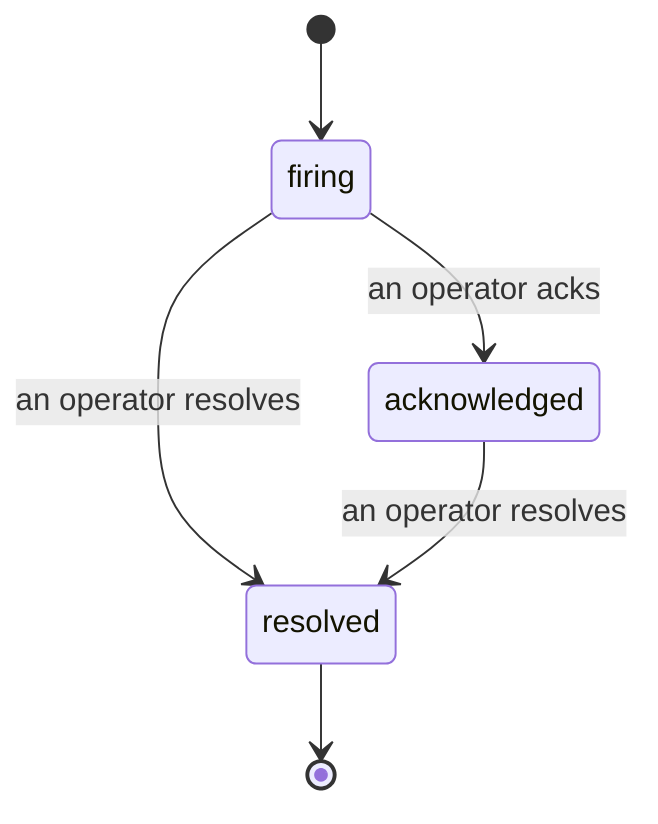

Wenn ein Alert ausgelöst wird, lautet die erste Frage immer: „Wer kümmert sich darum?" Incidents liefern die Antwort: Sobald eine Schwellenwertüberschreitung eintritt, sieht jeder, dass der Incident offen ist, wer ihn verantwortet und was bisher genau passiert ist – als saubere, zugeordnete Dokumentation, die sich direkt für eine Post-mortem-Analyse verwenden lässt.

*Der Posteingang gruppiert offene Incidents nach Status und filtert nach Schweregrad und zugewiesener Person, sodass sofort ersichtlich ist, was jetzt menschliches Eingreifen erfordert.*

## Auf einen Blick sehen, wer zuständig ist

Kein „Schaut da gerade jemand drauf?" mehr im Chat. Eine Schwellenwertüberschreitung öffnet automatisch einen Incident und legt ihn in einen gemeinsamen Posteingang, gruppiert nach Status. Wer ihn bestätigt, erscheint namentlich darauf – das Team weiß sofort, dass es in Bearbeitung ist. Die Bestätigung ist gemeinsam nutzbar: Mehrere Operatoren können denselben Incident bestätigen, wobei jeder einzeln erfasst wird. So ist ein vollständiges War-Room-Team namentlich sichtbar, ohne dass sich Einträge überschneiden. Eine verantwortliche Person für das Triage lässt sich zuweisen; der Posteingang kann nach Schweregrad oder zugewiesener Person gefiltert werden, um nur die eigenen Incidents anzuzeigen.

## Die vollständige Geschichte in einer Timeline

Wenn der Incident abgeschlossen ist, ist das Protokoll bereits fertig. Beim Öffnen eines Incidents sind der Auslöser, eine Zusammenfassung der Überschreitung, zugewiesene Personen und Abonnenten, ein Kommentarbereich zur direkten Koordination sowie eine unveränderliche Aktivitäts-Timeline sichtbar.

*Alles, was passiert ist, in chronologischer Reihenfolge – jede Zeile mit dem Namen der verantwortlichen Person.*

Jede Aktion (geöffnet, bestätigt, gelöst usw.) wird in diese Timeline geschrieben und niemals nachträglich geändert. Jeder Eintrag ist zugeordnet: per E-Mail dem Operator, der die Aktion durchgeführt hat, oder **automated** für alles, was FailproofAI Cloud selbstständig getan hat – beispielsweise das Öffnen des Incidents bei einer Schwellenwertüberschreitung. Nichts ist anonym und nichts geht verloren, sodass die Post-mortem-Analyse nahezu von selbst entsteht.

## Wie sich ein Incident entwickelt

- **Offen (firing):** Die Überschreitung öffnet den Incident und benachrichtigt die konfigurierten Kanäle einmalig. Wiederholte Überschreitungen werden in denselben Incident aufgenommen und aktualisieren dessen Nachweis, anstatt erneut Benachrichtigungen zu versenden.
- **Bestätigt (acknowledged):** Ein Operator übernimmt den Incident. Er bleibt offen, und spätere Überschreitungen aktualisieren den Nachweis ohne weitere Benachrichtigungen.
- **Gelöst (resolved):** Ein Operator schließt den Incident. Eine automatische Auflösung beim Wegfall der Bedingung ist geplant, aber noch nicht aktiviert – ein Incident bleibt daher offen, bis ein Mensch ihn manuell auflöst. Das sorgt für Klarheit darüber, was tatsächlich behoben ist. Für denselben Alert kann später ein neuer Incident geöffnet werden.

Ein Alert kann zu einem Zeitpunkt höchstens einen offenen Incident haben, sodass eine flatternde Regel keine Duplikate erzeugen kann. Incidents lassen sich auch manuell öffnen: als eigenständiger Incident für etwas, das kein Alert erfasst hat, oder als einem bestehenden Alert zugeordneter Incident – sofern die Berechtigung `incidents:write` vorhanden ist.

## Wo es zu finden ist

Incidents befinden sich unter `/<org-slug>/incidents`. Für die Anzeige wird **`incidents:read`** benötigt; für das manuelle Öffnen eines Incidents **`incidents:write`**; für das Bestätigen, Zuweisen, Kommentieren und Lösen **`incidents:ack`**. Ältere Schlüssel mit der zurückgezogenen Berechtigung `alerts:ack` funktionieren weiterhin, da sie als `incidents:ack` anerkannt werden – eine Neuausstellung für Bereitschaftsrotationen ist daher nicht erforderlich.

## Verwandte Themen

- [Alerts](/de/cloud/alerts): die Regeln, die Incidents öffnen, wenn ein Schwellenwert überschritten wird.
- [Error Tracking](/de/cloud/errors): alle Fehler an einem Ort einsehen und einen davon zu einem Alert heraufstufen.
- [Audits](/de/cloud/audits): der geplante Analyst, der Fehler findet, die von keiner Regel überwacht wurden.