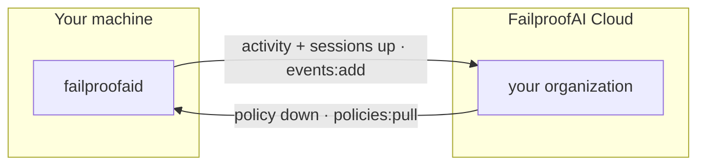

Connecting a machine to FailproofAI Cloud opens two streams in opposite directions:



You give it one URL and one key, and both are configured from that. Asking twice is what
made this feel like two products — connect for policy, see an empty dashboard, and
reasonably conclude the thing is broken.

---

## The command

```bash
failproofai config --connect https://app.befailproof.ai --token <your-key>
```

Or run `failproofai config` and choose **Paste an API key** when it asks. Both paths write
byte-identical state, so a machine set up interactively and one set up by a script end up
the same.

Don't have a key? Create one at
[befailproof.ai/get-started](https://befailproof.ai/get-started/).

| Flag | What it does |
|---|---|
| `--connect <url>` | The cloud base URL. Your dashboard origin is the right value. |
| `--token <key>` | An API key for your organization. See [which permissions it needs](#what-the-key-needs). |
| `--machine-id <id>` | A stable id for this machine. Defaults to the one already recorded here, or a fresh random one. |
| `--machine-label <name>` | The human-readable name shown in the dashboard. Defaults to the hostname. |
| `--no-transcripts` | Send policy decisions only — never session transcripts. |
| `--disconnect` | Stop pulling policy and stop sending activity. |
| `--status` | Show connection, service, and pause state. |

<Note>
  Connecting needs **no root**. It writes a credential file the service reads rather than
  baking a token into the service definition — that file is world-readable, so a token
  there would hand an organization-scoped key to every local user. Re-connecting, rotating
  a token, and disconnecting are all unprivileged, and an already-running service can be
  connected without reinstalling anything.
</Note>

---

## What leaves this machine

Read this section before you connect a machine that touches anything sensitive.

Connecting turns on **both** streams by default:

| Stream | Contents |
|---|---|
| **Policy decisions** | Which policy fired, on which tool, in which session, with what verdict and reason. Tool *names*, never file contents — plus the working-directory path and the OS username the daemon runs as. |
| **Session transcripts** | The full agent session — prompts, model responses, file contents the agent read or wrote, and command output. |

Transcripts are the point. A dashboard that shows only decisions is the empty-dashboard
problem in a different costume: you can see that something was blocked, but not what your
agents actually did. That is also exactly why it is stated here in plain words rather than
buried behind a flag nobody finds.

**If that is more than you want to centralize:**

```bash
failproofai config --connect <url> --token <key> --no-transcripts
```

Decisions still flow, transcripts never do. The mode is recorded in
`~/.failproofai/config.json` under `collector.sessions` — read it there to confirm.

Whichever you choose, the machine keeps enforcing locally either way — connecting adds
visibility and central policy, it never removes protection.

---

## What the key needs

One key, two independent permissions:

| Permission | Enables |
|---|---|
| `policies:pull` | Receiving centrally-managed policy |
| `events:add` | Reporting decisions and sessions |

Both are verified **before anything is written**, and reported **separately** — because a
key carrying one and not the other is a real, supported state, not a broken setup.

| Key carries | What happens |
|---|---|
| Both | Fully connected. Policy arrives, activity flows, the dashboard fills. |
| `policies:pull` only | Connected for policy. Enforcement works; the CLI tells you the dashboard will stay empty and exactly why. |
| `events:add` only | Connected for reporting. The machine keeps enforcing its **local** policies and reports what they decide, but receives no central ones. |
| Neither | Nothing is written. A credential file that does not work is worse than none, because `--status` would then report a connection the machine does not have. |

The organization the key belongs to is named on every outcome, including the partial ones.
A key pasted from the wrong organization authenticates perfectly and reports somewhere
nobody is looking — naming the org on screen is what makes that visible immediately.

[Creating scoped keys →](/es/cloud/access)

---

## Machine identity

Two separate things, and the distinction matters:

- **Machine id** — the stable identity your fleet history, deployments, and enrolment are
  keyed on. Reconnecting reuses the id already on the machine, so `--connect` is idempotent
  and never "moves" a host.
- **Machine label** — the human-readable name in the dashboard. Defaults to the hostname,
  and is display-only.

A machine that has never carried an id gets a **random** one — deliberately not the
hostname. Two hosts sharing a hostname (fresh cloud VMs, cloned images) would otherwise
silently merge into one machine on the server, stranding one host's history and making the
fleet page lie about your coverage.

Renaming later needs no re-enrolment:

```bash
failproofai config --machine-label "build-runner-3"
```

---

## Environments

Label what a machine belongs to — `production`, `staging`, `dev` — and almost every
dashboard surface can filter by it. It is set on the machine's collector settings and
stamped on everything it reports.

<Warning>
  An environment name must not contain a comma. Dashboard filters pass environments as a
  comma-separated list, so `prod,blue` would be read as two values. Events carrying one are
  rejected at ingest.
</Warning>

---

## Checking it worked

```bash
failproofai config --status
```

Reports the connection (including which organization and which mode), whether the service
is running, and whether enforcement is paused on any session.

Two commands for when you want to stop waiting:

```bash
failproofai flush --wait          # deliver everything spooled right now
failproofai backfill --since 6m   # re-read history the collector already passed
```

`backfill` is the one to reach for after clearing a dashboard, re-enrolling a machine, or
connecting later than the work you want to see. `--dry-run` reports what would be re-read
without changing anything.

---

## Connecting a fleet without a human at each keyboard

`--connect` is non-interactive by design, so it drops straight into whatever you already
use to configure machines:

```bash
npm install -g failproofai
failproofai config --connect "$FAILPROOFAI_URL" \
  --token "$FAILPROOFAI_KEY" \
  --machine-id "$(cat /etc/machine-id)" \
  --machine-label "$(hostname)"
```

A few things that make this safe to run unattended:

- **Idempotent.** Re-running it on a connected machine reuses the existing id and re-verifies
  the key rather than creating a second machine.
- **Verified before written.** A typo'd or revoked key fails at connect time with a precise
  reason, instead of becoming a silent pile of rejected uploads discovered a week later.
- **Refuses plaintext.** A token is never sent to a non-`https` host — except `localhost`,
  where there is no network to intercept.
- **Exit codes mean something.** A failed connect exits non-zero with the reason on stderr.

<Tip>
  Bake the policies into your machine image and connect at boot. A machine that has
  FailproofAI but is not connected still enforces locally — it just does not appear in your
  fleet view, which is the one gap the [fleet page](/es/cloud/fleet) is built to make obvious.
</Tip>

---

## Disconnecting

```bash
failproofai config --disconnect
```

This does both halves properly: it clears the credentials **and** stops enforcing the
cloud-managed deployment. Clearing credentials alone would stop the machine *refreshing*
policy while every artifact already on disk kept being enforced on every tool call — so a
machine that deliberately left an organization would go on being governed by whatever
deployment happened to be current when it left, indefinitely, while `--status` reported it
as unconnected.

Local policies are untouched. The machine keeps enforcing exactly what it enforced before
it was ever connected.

---

## Troubleshooting

<AccordionGroup>

<Accordion title="The server rejected this token (401)">
  The key was not accepted at all. Check it was copied whole — keys are long, and a
  truncated paste looks like a valid string.
</Accordion>

<Accordion title="This key lacks the policies:pull permission (403)">
  The key is valid but too narrow. Create one with the permission you need, or add it to
  the existing key. See [Access](/es/cloud/access).
</Accordion>

<Accordion title="That URL redirects rather than accepting events">
  You pointed at the dashboard's web front end rather than its API path. Pass the plain
  origin (`https://app.befailproof.ai`) and let the CLI derive the rest — it accepts either
  form, but a redirect that lands on a login page would otherwise look like success while
  every upload was silently lost.
</Accordion>

<Accordion title="Connected, but the dashboard stays empty">
  Almost always a key with `policies:pull` and not `events:add`. `failproofai config
  --status` names the missing permission. If both are present, run `failproofai flush
  --wait` to force a delivery and see the result immediately.
</Accordion>

<Accordion title="One host shows up as two machines">
  Something changed the machine id between connections — usually an explicit `--machine-id`
  on one run and not the other. Reconnect with the id you want to keep; the id, not the
  label, is what history is keyed on.
</Accordion>

<Accordion title="Every tool call is being denied">
  That is the [fail-closed guarantee](/es/daemon#fail-closed) doing its job: on a configured
  machine, a policy that cannot answer denies. Check the service is running with
  `failproofai config --status`. If it reports a protocol-version mismatch, run
  `failproofai config` to bring both halves back into step.
</Accordion>

</AccordionGroup>

---

## Related

<CardGroup cols={2}>

<Card title="Managed policies" icon="cloud-arrow-down" href="/es/cloud/managed-policies">
  What comes down the policy stream, and how to roll it out safely.
</Card>

<Card title="Fleet" icon="server" href="/es/cloud/fleet">
  Every machine, its deployment, and its coverage.
</Card>

<Card title="Access and permissions" icon="key" href="/es/cloud/access">
  Creating a key with exactly the two permissions this needs.
</Card>

<Card title="The daemon" icon="gear" href="/es/daemon">
  What actually moves the data, and what happens when it can't.
</Card>

</CardGroup>
