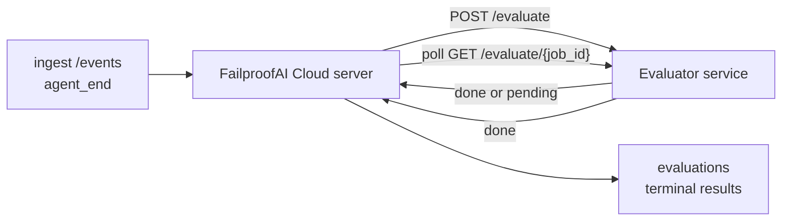

FailproofAI Cloud puede puntuar automáticamente cada ejecución de agente finalizada para medir su calidad: tú proporcionas un pequeño servicio de puntuación y FailproofAI Cloud se encarga del resto. Úsalo para rastrear las dimensiones que te importan (utilidad, eficiencia de herramientas, factualidad, seguridad; tú decides), detectar regresiones a tiempo y comparar agentes o entornos de un vistazo. La puntuación es opcional: el pipeline no hace nada hasta que configures `EVALUATOR_ENDPOINT` en el servidor.

> **Nota:** Tú defines las dimensiones de puntuación. Tu evaluador puede devolver las claves numéricas que quiera; FailproofAI Cloud almacena, analiza tendencias y muestra todo lo que le envíes.

## Resumen rápido

1. **Escribe un evaluador.** Levanta un pequeño servicio HTTP que lea la transcripción de una sesión y devuelva puntuaciones. FailproofAI Cloud incluye una referencia funcional que puedes copiar. Consulta [Escribir un evaluador con el SDK](/es/cloud/evaluators).
2. **Apunta FailproofAI Cloud hacia él.** Configura `EVALUATOR_ENDPOINT` (y un `EVALUATOR_TOKEN` compartido) en el proceso del servidor.
3. **Observa cómo llegan las puntuaciones.** Cada sesión completada se puntúa automáticamente; los resultados aparecen en la página de detalle de sesión, la cuadrícula de sesiones y los dashboards guardados.


*Una vez configurado un evaluador, cada ejecución completada recibe una puntuación y los resultados aparecen en el panel lateral derecho de la sesión: el resumen en la parte superior, seguido de barras de puntuación por dimensión con su razonamiento.*

---

## Cómo funciona



Cuando el SDK de FailproofAI Cloud emite un evento `agent_end` para una sesión, el servidor programa una evaluación. Luego envía mediante POST la transcripción completa de eventos a tu servicio evaluador, que puede:

- **Devolver el resultado de forma inmediata** con `{"status":"done", "scores":{...}, "reasoning":{...}, "summary":"..."}`. El resultado se añade a la línea temporal de evaluaciones de la sesión. `reasoning` y `summary` son opcionales.
- **Diferir la respuesta** con `{"status":"pending", "job_id":"abc-123"}`. FailproofAI Cloud entonces llama a `GET {EVALUATOR_ENDPOINT}/evaluate/abc-123` hasta que tu evaluador devuelva `{"status":"done", ...}` o `{"status":"error", "error":"..."}`.

  La cadencia de sondeo es por trabajo: una respuesta `pending` puede incluir `next_poll_secs` para sobreescribirla; de lo contrario, FailproofAI Cloud usa el valor `default_poll_interval_secs` de `GET /config`; si tampoco está definido, el servidor recurre a `EVALUATOR_POLLING_INTERVAL_SECS` (10s por defecto). Todos los valores se limitan al rango [1s, 1h].

Las sesiones que nunca emiten `agent_end` (por ejemplo, un proceso de agente que se ha bloqueado) también pueden procesarse: el `GET /config` del evaluador puede devolver `{"inactivity_timeout_secs": 1800}`, y FailproofAI Cloud evaluará cualquier sesión que haya estado inactiva durante ese tiempo. Establece el campo en `null` u omítelo para desactivar este comportamiento alternativo.

El pipeline es completamente inactivo cuando `EVALUATOR_ENDPOINT` no está configurado.

Una sesión puede acumular **múltiples evaluaciones terminales a lo largo del tiempo**: cada evento `agent_end` (y cada re-evaluación manual desde el dashboard) añade una nueva fila de evaluación. Esta es la forma admitida de evaluar una conversación reanudada: un usuario termina un agente, vuelve más tarde, envía más eventos, vuelve a terminar el agente y se ejecuta una segunda evaluación sobre la transcripción completa actualizada. El dashboard muestra la evaluación más reciente como titular y las evaluaciones anteriores como una línea temporal plegable. Mientras se ejecuta una evaluación para una sesión, los eventos `agent_end` adicionales para esa sesión se ignoran; el siguiente que llegue después de que la evaluación en curso complete pondrá en cola una nueva evaluación como de costumbre.

La recuperación por inactividad también se activa en sesiones reanudadas: si llegan nuevos eventos después de una evaluación terminal anterior y la sesión vuelve a quedar inactiva pasando el umbral de `inactivity_timeout_secs`, se pone en cola una nueva evaluación.

Los fallos transitorios (5xx, 429, timeouts, errores de red) se reintentan con retroceso exponencial hasta `EVALUATOR_MAX_ATTEMPTS`; las respuestas 4xx son terminales. FailproofAI Cloud es seguro de ejecutar con múltiples instancias de servidor escaladas horizontalmente; el trabajo se distribuye de forma que la misma sesión nunca se despacha dos veces de forma concurrente.

---

## Contrato HTTP

Todas las rutas autenticadas usan **autenticación mediante token bearer**. El mismo valor debe configurarse en ambos lados:

- Servidor de FailproofAI Cloud: variable de entorno `EVALUATOR_TOKEN`
- Servicio evaluador: configurado de la misma forma (el SDK `agenteye-evaluator` lee `EVALUATOR_TOKEN` por convención)

Si `EVALUATOR_TOKEN` no está configurado, el servidor no envía cabecera `Authorization`; el evaluador puede entonces aceptar solicitudes anónimas, lo cual es aceptable en una red exclusivamente interna pero no recomendado en internet público.

### Rutas que el evaluador debe servir

| Ruta | Cuerpo / parámetros | Respuesta |
|---|---|---|
| `GET /health` | ninguno | `{"status":"ok"}` (abierta, sin autenticación) |
| `GET /config` | ninguno | `{"inactivity_timeout_secs": <int> \| null, "default_poll_interval_secs": <int> \| omitted}` |
| `POST /evaluate` | JSON `EvalRequest` | `{"status":"done", ...}` o `{"status":"pending", "job_id":"..."}` |
| `GET /evaluate/{id}` | ninguno | mismo formato de respuesta que `/evaluate` |

### Cuerpo `EvalRequest` enviado por el servidor

```json
{
  "schema_version": "1",
  "session_id":     "session-abc123",
  "agent_id":       "planner",
  "environment":    "production",
  "started_at":     "2026-05-10T12:00:00Z",
  "ended_at":       "2026-05-10T12:05:00Z",
  "events": [
    { "id": 1234, "ts": "...", "event_type": "agent_start", "payload": { ... } },
    ...
  ]
}
```

### Formatos de respuesta

**Síncrono (done):**

```json
{
  "status": "done",
  "scores": { "helpfulness": 0.85, "tool_efficiency": 0.6 },
  "reasoning": {
    "helpfulness": "answered the question directly with citations",
    "tool_efficiency": "called list_files three times when one would have done"
  },
  "summary": "strong answer quality, weak tool selection"
}
```

`reasoning` (un mapa de justificación por puntuación) y `summary` (una narrativa general de un párrafo) son ambos opcionales. Las claves de `reasoning` deben coincidir con las claves de `scores`; el dashboard renderiza cada entrada bajo su barra de puntuación. Los evaluadores más antiguos que solo devuelven `scores` siguen funcionando sin cambios; `reasoning` y `summary` simplemente se leen como null y los elementos de UI correspondientes se omiten.

**Asíncrono (diferido):**

```json
{ "status": "pending", "job_id": "abc-123", "next_poll_secs": 30 }
```

`next_poll_secs` es opcional; si se omite, el servidor recurre al `default_poll_interval_secs` del evaluador desde `/config`, y luego a su propia variable de entorno `EVALUATOR_POLLING_INTERVAL_SECS`.

**Error terminal en el lado del evaluador:**

```json
{ "status": "error", "error": "model service unavailable" }
```

El servidor trata cualquier otro cuerpo 2xx como un error de protocolo y registra un `error` terminal para la sesión.

---

## Escribir un evaluador con el SDK

No tienes que implementar el contrato HTTP a mano. El paquete Python `agenteye-evaluator` te proporciona un wrapper tipado de FastAPI que gestiona la autenticación, el enrutamiento y los formatos de solicitud/respuesta por ti.

FailproofAI Cloud también incluye un **evaluador de referencia funcional** que puntúa `helpfulness`, `tool_efficiency` y `factuality` a partir de la estructura de la transcripción. Cópialo como punto de partida y sustituye la lógica por la tuya: un juez LLM, un motor de reglas, lo que mejor se adapte a tu criterio de calidad.

Evaluador mínimo viable:

```python
import os
from agenteye_evaluator import Evaluator, EvalRequest, EvalResponse

app = Evaluator(token=os.environ["EVALUATOR_TOKEN"])

@app.evaluator
def run(req: EvalRequest) -> EvalResponse:
    # Inspect req.events (the full session transcript) and return scores.
    tool_calls = sum(1 for e in req.events if e.event_type == "tool_use")
    return EvalResponse(
        scores={"tool_calls": float(tool_calls)},
        reasoning={"tool_calls": f"{tool_calls} tool invocations in the transcript"},
        summary="tight tool loop" if tool_calls < 5 else "agent looped on tools",
    )
```

La instancia `app` se ejecuta bajo cualquier servidor ASGI, por lo que `uvicorn module:app` la pone en marcha.

Para evaluadores que necesitan diferir trabajo costoso, devuelve `JobPending` en su lugar y registra un handler `@app.job_lookup`; el servidor de FailproofAI Cloud sondea `GET /evaluate/{job_id}` hasta que devuelves un estado terminal o se agota el límite de `EVALUATOR_MAX_POLL_DURATION_SECS` (1 h por defecto).

La referencia completa de la API, el patrón asíncrono y el esquema de eventos están documentados en el README del SDK `agenteye-evaluator`.

---

## Ejecutar tu evaluador

El evaluador es **tu servicio** — FailproofAI Cloud no incluye un evaluador por defecto, así que lo construyes y ejecutas donde ejecutas tus propios servicios. Se ejecuta bajo cualquier servidor ASGI (por ejemplo `uvicorn my_evaluator:app`); sirve las rutas `/health`, `/config` y `/evaluate` del [contrato HTTP](/es/cloud/evaluators) y luego apunta el servidor hacia él (consulta [Configurar el servidor](/es/cloud/evaluators)).

Una vez que el evaluador sea accesible, `GET /health` devuelve `{"status":"ok"}`. Después de que un agente se ejecute de principio a fin, `GET /evaluations` en el servidor devuelve una fila con `status: "done"` y las puntuaciones que produjo tu evaluador.

---

## Configurar el servidor

Establece en el proceso del servidor:

| Variable de entorno | Significado |
|---|---|
| `EVALUATOR_ENDPOINT` | URL base de tu evaluador (`http://evaluator:9000`). Sin definir = pipeline desactivado. |
| `EVALUATOR_TOKEN` | Token bearer. Debe coincidir con el valor configurado en el servicio evaluador. |
| `EVALUATOR_WORKERS` | Tareas de worker por instancia de servidor (por defecto 2). |
| `EVALUATOR_CLAIM_BATCH` | Filas reclamadas por tick de worker (por defecto 4). Los lotes se procesan **de forma concurrente**; la concurrencia efectiva en tu endpoint del evaluador es `EVALUATOR_WORKERS × EVALUATOR_CLAIM_BATCH`. |
| `EVALUATOR_POLL_IDLE_SECS` | Tiempo que un worker duerme entre intentos de despacho cuando no hay ninguna evaluación pendiente (por defecto 2s). |
| `EVALUATOR_POLLING_INTERVAL_SECS` | Reserva final para la cadencia de `GET /evaluate/{id}` cuando no se ha definido ni el `next_poll_secs` por respuesta ni el `default_poll_interval_secs` del evaluador (por defecto 10s). |
| `EVALUATOR_REQUEST_TIMEOUT_MS` | Timeout por solicitud (por defecto 30000). |
| `EVALUATOR_MAX_ATTEMPTS` | Tras este número de fallos transitorios, el resultado se registra como `error` terminal (por defecto 5). |
| `EVALUATOR_CONFIG_REFRESH_SECS` | Cadencia de `GET /config` (por defecto 300). |
| `EVALUATOR_MAX_POLL_DURATION_SECS` | Tiempo máximo en tiempo real que una sesión puede permanecer en la cola de sondeo antes de terminar como `timeout` (por defecto 3600s). Protege contra un evaluador que sigue devolviendo `pending` indefinidamente. |

Para activar la puntuación automática, define tanto `EVALUATOR_ENDPOINT` como `EVALUATOR_TOKEN` en el servidor y reinícialo para que tome los cambios. Con `EVALUATOR_ENDPOINT` sin definir, el pipeline permanece inactivo.

Los parámetros de ajuste anteriores son opcionales; configura las variables de entorno correspondientes en el servidor solo si necesitas sobreescribir los valores por defecto.

---

## Referencia de la API

| Método | Ruta | Permiso requerido | Propósito |
|---|---|---|---|
| `GET` | `/evaluations` | `evaluations:read` | Consultar resultados terminales. Admite `session_id`, `agent_id`, `environment`, `status` (`done`/`error`/`timeout`), `ts_from`, `ts_to`, `cursor`, `limit`, `score_filters`, `latest_per_session`. `limit` tiene por defecto 50 y un máximo de 200 (a diferencia de `/events`, que tiene un máximo de 1000). `environment` acepta una lista separada por comas (p. ej. `environment=prod,staging`); los valores individuales siguen funcionando. Con `latest_per_session=true`, la respuesta contiene como máximo una fila por `session_id` (la más reciente por `completed_at`), utilizada por la página de lista de sesiones para colapsar la línea temporal de evaluaciones de una sesión a su titular actual. Por defecto es false (devuelve el historial completo). |
| `GET` | `/evaluations/aggregate` | `evaluations:read` | Métricas resumidas de salud de evaluación para un subconjunto filtrado: total, desglose por done/error/timeout, estadísticas por clave de puntuación (count/avg/min/max/p50 sobre las claves arbitrarias de `scores`), y una línea temporal por intervalos de tiempo. Acepta los **mismos parámetros de filtro que `/evaluations`** más `featured_keys` (CSV de claves de puntuación para mostrar en tendencias) y `latest_per_session`. Da soporte a la función de Dashboards; las métricas son exactas sobre todo el conjunto coincidente, no muestreadas. |
| `GET` | `/evaluations/environments` | `evaluations:read` | Valores de entorno distintos de la tabla `evaluations`. Se usa para poblar los desplegables de filtro con datos de evaluación. |
| `GET` | `/evaluation-jobs` | `evaluations:read` | Visibilidad de las evaluaciones en curso. Filtra por `status` (`pending`/`polling`). |
| `GET` | `/events` | `events:read` | Transmitir los eventos brutos de una sesión. Admite `session_id`, `agent_id`, `event_type` (CSV), `environment` (CSV), `ts_from`, `ts_to`, `cursor`, `limit` y `order`. `order` es `desc` (los más recientes primero, por defecto) o `asc` (los más antiguos primero); un valor no reconocido vuelve a `desc`. Pagina mediante el `next_cursor` de la respuesta (un id de evento): pásalo de nuevo como `cursor` para obtener la siguiente página; con `asc` la siguiente página contiene los eventos después de ese id, con `desc` los eventos anteriores. `limit` tiene por defecto 50 y un máximo de 1000. |
| `GET` | `/sessions/:session_id/export` | `events:read` | Devuelve exactamente el cuerpo JSON que recibiría el evaluador para esta sesión, servido como archivo adjunto descargable llamado `session-<id>.json`. Útil para reproducir sesiones de producción a través de `agenteye-evaluator` para pruebas sin conexión. Los bytes son idénticos byte a byte a lo que envía el pipeline del evaluador. |
| `POST` | `/sessions/:session_id/re-evaluate` | `evaluations:trigger` | Encola una nueva evaluación para una sesión; se ejecuta independientemente de si existe una evaluación previa. El nuevo resultado se **añade** a la línea temporal de evaluaciones de la sesión en lugar de sobreescribir la anterior, por lo que las puntuaciones previas permanecen visibles como historial. Devuelve `202` al encolar, `404` para una sesión desconocida, `409` si ya hay una evaluación en curso. Úsalo tras desplegar un nuevo evaluador, o para sesiones que nunca emitieron `agent_end`. |

### Filtrar por rango de puntuación: `score_filters`

`GET /evaluations` acepta un parámetro opcional `score_filters` que reduce los resultados por valores numéricos dentro del objeto `scores`. El parámetro es una lista separada por comas de entradas `key:min..max`; cualquiera de los límites puede omitirse. Múltiples entradas se combinan con AND lógico. Las filas donde la clave nombrada está ausente o no es numérica quedan excluidas. Una solicitud puede tener como máximo 20 entradas de filtro; superarlo devuelve HTTP 400.

Ejemplos:
```text
# helpfulness en [0.5, 0.8]
GET /evaluations?score_filters=helpfulness:0.5..0.8

# tool_efficiency como máximo 0.3 (sin límite inferior)
GET /evaluations?score_filters=tool_efficiency:..0.3

# helpfulness >= 0.5 AND factuality >= 0.9
GET /evaluations?score_filters=helpfulness:0.5..,factuality:0.9..
```

Cada objeto de respuesta de `/evaluations` tiene estos campos:

| Campo | Tipo | Notas |
|---|---|---|
| `evaluation_id` | string (UUID) | El identificador canónico de esta evaluación terminal. Cada evaluación terminal recibe un nuevo UUID; una sola sesión puede tener múltiples. |
| `id` | string (UUID) | Alias de compatibilidad hacia atrás que lleva el mismo valor que `evaluation_id`. |
| `session_id` | string | La sesión sobre la que se ejecutó esta evaluación. Una sesión puede tener múltiples evaluaciones en la línea temporal. |
| `agent_id` | string | Identifica al agente que produjo la sesión. |
| `environment` | string | Etiqueta de entorno copiada de la sesión. |
| `status` | enum | Uno de `"done"`, `"error"`, `"timeout"`. |
| `scores` | object \| null | Puntuaciones devueltas por tu evaluador. |
| `reasoning` | object \| null | Mapa opcional de justificación por puntuación devuelto por tu evaluador. Las claves suelen coincidir con las de `scores`. El dashboard renderiza cada entrada bajo su barra de puntuación. |
| `summary` | string \| null | Narrativa general opcional de un párrafo devuelta por tu evaluador. El dashboard la muestra sobre el desglose por puntuación como titular de la evaluación. |
| `error` | string \| null | Solo se rellena en `"error"` / `"timeout"`. |
| `attempt_count` | integer | Número de intentos de despacho (≥ 1). |
| `duration_ms` | integer \| null | Duración del último intento. |
| `completed_at` | string (ISO 8601 UTC) | Momento en que se registró el resultado terminal. Los resultados se ordenan por `completed_at` (los más recientes primero). |
| `created_at` | string (ISO 8601 UTC) | Lleva la misma marca de tiempo que `completed_at` (semántica de escritura única). |

---

## Permisos

| Permiso | Concede |
|---|---|
| `evaluations:read` | Listar resultados de evaluación, ver puntuaciones en el dashboard y cargar métricas de salud del dashboard. |
| `evaluations:trigger` | Encolar manualmente una evaluación para una sesión mediante `POST /sessions/:session_id/re-evaluate` o el botón de re-evaluación del dashboard. |
| `dashboards:read` | Ver dashboards guardados (también requiere `evaluations:read` para cargar sus métricas). |
| `dashboards:write` | Crear y editar dashboards. |
| `dashboards:delete` | Eliminar dashboards. |

El administrador bootstrap (`ADMIN_KEY`, `ADMIN_EMAIL`) recibe estos permisos automáticamente.

---

## Ver resultados

- **`/sessions/<id>`**: línea temporal de eventos + un panel lateral derecho que muestra las puntuaciones de la sesión y cualquier error del intento de despacho. Si tu clave tiene `evaluations:trigger`, aparece un botón de **re-evaluate** junto al botón de exportación, útil para sesiones que nunca emitieron `agent_end` o para actualizar puntuaciones tras desplegar un nuevo evaluador. El dashboard sondea el nuevo resultado y actualiza el panel lateral cuando llega.
- **`/sessions`**: cuadrícula de sesiones filtrable; la columna de puntuación muestra el estado de evaluación y las puntuaciones de cada sesión de un vistazo.
- **`/dashboards`**: vistas guardadas de salud de evaluación (consulta [Dashboards](#dashboards) más abajo).


*La cuadrícula de sesiones muestra el estado de evaluación y las puntuaciones de cada ejecución de un vistazo; las insignias en rojo/ámbar/verde hacen que las puntuaciones bajas destaquen.*

---

## Dashboards

La página de **Dashboards** (`/dashboards`) te permite guardar una combinación de filtros de evaluación como una vista con nombre y reutilizable, y observar cómo evoluciona ese subconjunto de evaluaciones de un vistazo. Los dashboards son **compartidos en toda tu organización**; todos los que tengan `dashboards:read` ven el mismo conjunto.

Cada dashboard fija:

- **Filtros**: los mismos controles que la página de sesiones: entorno, estado, agente, una ventana de tiempo deslizante y filtros de rango de puntuación (`key:min..max`).
- **Una configuración de visualización**: qué claves de puntuación destacar, los umbrales de salud verde/ámbar/rojo, qué paneles mostrar y si colapsar a la última evaluación por sesión.

Cada tarjeta muestra el número de sesiones coincidentes, un desglose done/error/timeout, el promedio de cada puntuación destacada y una pequeña línea de tendencia. Abrir un dashboard muestra los paneles a tamaño completo; **"open in sessions"** te lleva a la página de sesiones prefiltrada exactamente a ese subconjunto. Las métricas se calculan en el servidor sobre todo el conjunto coincidente (mediante `GET /evaluations/aggregate`), por lo que los números son exactos y no muestreados.


**Permisos:** para ver se necesita tanto `dashboards:read` como `evaluations:read`; para crear y editar se necesita `dashboards:write`; para eliminar se necesita `dashboards:delete`. El administrador bootstrap recibe todos estos permisos automáticamente.

---

## Resolución de problemas

**Las sesiones existen pero no se crean evaluaciones.** Confirma que `EVALUATOR_ENDPOINT` está configurado en el proceso del servidor, que el servidor y el evaluador comparten el mismo valor de `EVALUATOR_TOKEN`, y que el endpoint `/health` del evaluador es accesible desde el servidor. Con `EVALUATOR_ENDPOINT` sin definir, el pipeline es inactivo.

**Las evaluaciones en curso se acumulan.** Consulta `GET /evaluation-jobs` para ver la cola en curso. Inspecciona `attempt_count`, `next_attempt_at` y `last_error` en cada fila. Causas comunes: el servicio evaluador no es accesible o devuelve 5xx (se reintenta con retroceso), `EVALUATOR_TOKEN` incorrecto (401 es terminal), o un evaluador asíncrono que devuelve `pending` indefinidamente (ver más abajo).

**Las sesiones se completaron pero no hay evaluación terminal.** Consulta `GET /evaluation-jobs?status=polling`; el resultado puede seguir en curso. Si un trabajo está atascado en `pending`, el servidor tiene problemas para contactar con el evaluador; comprueba que el evaluador está activo y que `EVALUATOR_TOKEN` coincide.

**`HTTP 401 from evaluator: invalid bearer token`.** El `EVALUATOR_TOKEN` del servidor no coincide con el valor configurado en el servicio evaluador. Deben ser idénticos.

**El evaluador asíncrono devuelve `pending` indefinidamente.** El servidor sondea `GET /evaluate/{job_id}` hasta que el evaluador devuelve `done` o `error`, o hasta que se agota `EVALUATOR_MAX_POLL_DURATION_SECS` (1 h por defecto). Tras el límite, la evaluación se registra como `timeout` y se elimina de la cola en curso. Aumenta `EVALUATOR_MAX_POLL_DURATION_SECS` si tu evaluador legítimamente necesita más tiempo del predeterminado.

---

## Próximos pasos

- [Habilidad de agente evaluador](/es/cloud/agent-skills): haz que un agente de programación diseñe tus dimensiones a partir de sesiones reales y construya este servicio por ti.
- [Python SDK](/es/cloud/sdk): emite los eventos `agent_end` que desencadenan la puntuación.
- [Claves de API](/es/cloud/access): los permisos `evaluations:read` y `evaluations:trigger`.
- [Auditorías](/es/cloud/audits): la otra función de calidad automatizada de FailproofAI Cloud, para revisión basada en políticas.