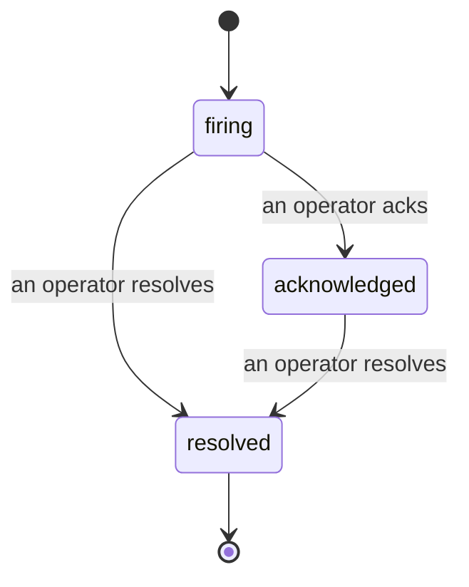

Cuando se dispara una alerta, la primera pregunta siempre es "¿quién lo está atendiendo?". Los incidentes responden esa pregunta: en el momento en que algo supera un umbral, todos pueden ver que el incidente está abierto, quién lo gestiona y exactamente qué ha ocurrido hasta ahora, con un registro limpio y atribuido que puedes entregar directamente a una revisión post-mortem.

*La bandeja agrupa los incidentes abiertos por estado y filtra por severidad y responsable, para que veas de inmediato qué requiere atención humana.*

## Saber quién lo tiene, de un vistazo

No más "¿alguien está mirando esto?" en un hilo de chat. Un incumplimiento abre un incidente automáticamente y lo coloca en una bandeja compartida, agrupada por estado. Acéptalo y tu nombre queda registrado, para que el resto del equipo sepa que está atendido. La aceptación es compartida: varios operadores pueden aceptar el mismo incidente y cada uno queda registrado de forma individual, de modo que todo el equipo de guardia aparece por nombre en lugar de pisarse unos a otros. Asigna un responsable para el triaje y filtra la bandeja por severidad o responsable para quedarte solo con lo que te corresponde.

## Toda la historia, en una sola línea de tiempo

Cuando el incidente termina, ya tienes el informe escrito. Abre cualquier incidente y verás la evidencia del incumplimiento, sus responsables y suscriptores, un hilo de comentarios para coordinar en el momento, y una línea de tiempo de actividad de solo escritura.

*Todo lo que ocurrió, en orden, cada línea firmada por quien lo hizo.*

Cada acción (abierto, aceptado, resuelto, etc.) queda registrada en esa línea de tiempo y nunca se edita ni elimina. Cada entrada está atribuida: al operador que la realizó, por correo electrónico, o a **automated** para cualquier cosa que FailproofAI Cloud hizo de forma autónoma, como abrir el incidente al detectar el incumplimiento. Nada es anónimo y nada se pierde, por lo que el post-mortem prácticamente se escribe solo.

## Cómo progresa un incidente

- **Abierto (firing):** el incumplimiento abre el incidente y notifica tus canales una sola vez. Los incumplimientos posteriores se agrupan en el mismo incidente y actualizan su evidencia en lugar de notificarte repetidamente.
- **Aceptado (acknowledged):** un operador lo toma. Permanece abierto, y los incumplimientos posteriores actualizan la evidencia sin generar ruido adicional.
- **Resuelto (resolved):** un operador lo cierra. La resolución automática cuando la condición se normaliza está planificada pero aún no está habilitada, por lo que un incidente permanece abierto hasta que un humano lo resuelva — lo que mantiene a todos honestos sobre qué es lo que realmente se ha resuelto. Un nuevo incidente puede abrirse sobre la misma alerta más adelante.

Una alerta puede tener como máximo un incidente abierto a la vez, por lo que una regla inestable no puede sepultarte en duplicados. También puedes abrir un incidente de forma manual: uno independiente para algo que ninguna alerta capturó, o uno vinculado a una alerta existente, si tienes el permiso `incidents:write`.

## Dónde encontrarlo

Los incidentes se encuentran en `/<org-slug>/incidents`. Para ver los incidentes se necesita **`incidents:read`**; para abrir un incidente manual se necesita **`incidents:write`**; aceptar, asignar, comentar y resolver requieren **`incidents:ack`**. Las claves antiguas que tenían el permiso retirado `alerts:ack` siguen funcionando, ya que se reconoce como `incidents:ack`, por lo que tu rotación de guardia no necesita ser reemitida.

## Relacionado

- [Alertas](/es/cloud/alerts): las reglas que abren estos incidentes cuando se supera un umbral.
- [Seguimiento de errores](/es/cloud/errors): ve todos los fallos en un solo lugar y promueve uno a alerta.
- [Auditorías](/es/cloud/audits): el analista programado que encuentra los fallos que ninguna regla estaba supervisando.