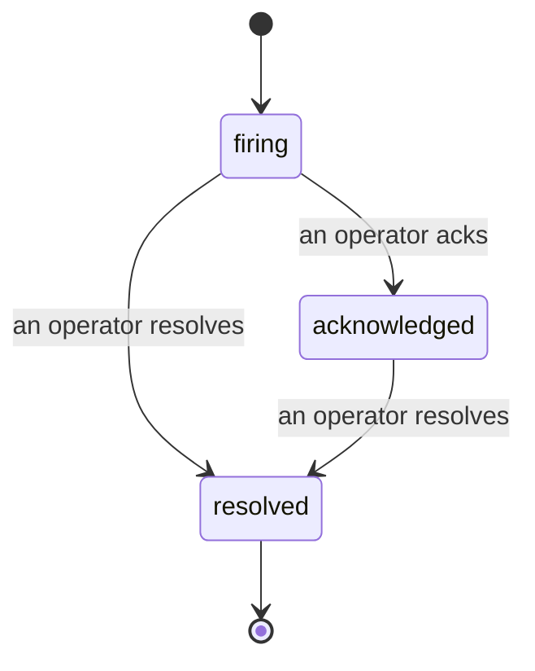

Dès qu'une alerte se déclenche, la première question est toujours « qui s'en occupe ? » Les incidents y répondent : à l'instant où un seuil est franchi, tout le monde peut voir que l'incident est ouvert, qui en est propriétaire, et exactement ce qui s'est passé jusqu'ici, avec un historique propre et attribué que vous pouvez transmettre directement à un post-mortem.

*La boîte de réception regroupe les incidents ouverts par état et permet de filtrer par sévérité et par assigné, afin que vous voyiez immédiatement ce qui nécessite une intervention humaine.*

## Savoir qui s'en occupe, d'un coup d'œil

Fini les « est-ce que quelqu'un regarde ça ? » dans un fil de discussion. Un dépassement ouvre automatiquement un incident et le dépose dans une boîte de réception partagée, regroupée par état. Acquittez-le et votre nom y est affiché, signalant au reste de l'équipe que c'est pris en charge. L'acquittement est partagé : plusieurs opérateurs peuvent acquitter le même incident, chacun étant enregistré séparément, de sorte qu'une salle de crise entière s'affiche par nom sans que les uns n'écrasent les autres. Assignez un seul propriétaire pour le triage, et filtrez la boîte de réception par sévérité ou par assigné pour n'afficher que ce qui vous concerne.

## Toute l'histoire, sur une seule chronologie

Quand l'incident est terminé, le compte rendu est déjà prêt. Ouvrez n'importe quel incident et vous obtenez les preuves du dépassement, ses assignés et abonnés, un fil de commentaires pour coordonner sur place, et une chronologie d'activité en ajout seul.

*Tout ce qui s'est passé, dans l'ordre, chaque ligne signée par celui qui l'a effectuée.*

Chaque action (ouverture, acquittement, résolution, etc.) est écrite dans cette chronologie et n'est jamais modifiée. Chaque entrée est attribuée : à l'opérateur qui l'a effectuée, par e-mail, ou à **automated** pour tout ce que FailproofAI Cloud a fait de manière autonome, comme l'ouverture de l'incident lors du dépassement. Rien n'est anonyme et rien n'est perdu, si bien que le post-mortem s'écrit en grande partie tout seul.

## Comment un incident évolue

- **Ouvert (firing) :** le dépassement ouvre l'incident et notifie vos canaux une seule fois. Les dépassements répétés sont regroupés dans le même incident et actualisent ses preuves au lieu de vous notifier encore et encore.
- **Acquitté (acknowledged) :** un opérateur le prend en charge. Il reste ouvert, et les dépassements ultérieurs mettent à jour les preuves discrètement.
- **Résolu (resolved) :** un opérateur le clôture. La résolution automatique lorsque la condition se dissipe est prévue mais pas encore activée, donc un incident reste ouvert jusqu'à ce qu'un humain le résolve — ce qui garantit une vision honnête de ce qui a réellement été réglé. Un nouvel incident peut s'ouvrir sur la même alerte ultérieurement.

Une alerte ne peut contenir qu'un seul incident ouvert à la fois, de sorte qu'une règle instable ne peut pas vous noyer sous des doublons. Vous pouvez également ouvrir un incident manuellement : un incident autonome pour quelque chose qu'aucune alerte n'a détecté, ou un incident rattaché à une alerte existante, si vous disposez de `incidents:write`.

## Où le trouver

Les incidents se trouvent à `/<org-slug>/incidents`. La consultation nécessite **`incidents:read`** ; l'ouverture d'un incident manuel nécessite **`incidents:write`** ; l'acquittement, l'assignation, les commentaires et la résolution nécessitent **`incidents:ack`**. Les anciennes clés ayant accordé le droit `alerts:ack` retraité continuent de fonctionner, car il est honoré en tant que `incidents:ack`, de sorte que votre rotation d'astreinte n'a pas besoin d'être réémise.

## Voir aussi

- [Alertes](/fr/cloud/alerts) : les règles qui ouvrent ces incidents lorsqu'un seuil est franchi.
- [Suivi des erreurs](/fr/cloud/errors) : consultez tous les échecs en un seul endroit et promouvez-en un en alerte.
- [Audits](/fr/cloud/audits) : l'analyste planifié qui détecte les défaillances qu'aucune règle ne surveillait.