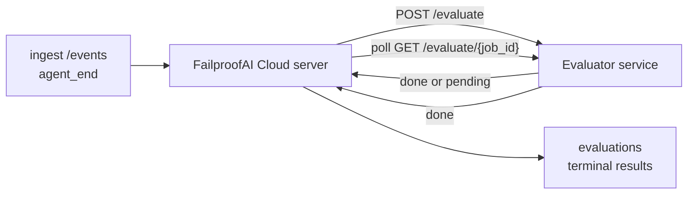

FailproofAI Cloud יכול לדרג באופן אוטומטי כל הרצה של סוכן שהסתיימה מבחינת איכות: אתה מספק שירות דירוג קטן, ו-FailproofAI Cloud מטפל בשאר. השתמש בו כדי לעקוב אחר הממדים שחשובים לך (עזרתיות, יעילות כלים, עובדתיות, בטיחות; אתה בוחר), לתפוס רגרסיות מוקדם, ולהשוות סוכנים או סביבות בהצצה. הדירוג הוא אופציונלי: הצינור לא עושה כלום עד שתגדיר את `EVALUATOR_ENDPOINT` בשרת.

> **הערה:** אתה מגדיר את ממדי הציון. ההערכה שלך יכולה להחזיר כל מפתחות מספריים שהיא רוצה; FailproofAI Cloud אחסן, טרנד ומציג כל מה שאתה שולח חזרה.

## במבט חטוף

1. **כתוב מדרג.** הקם שירות HTTP קטן שקורא תמליל של סשן ומחזיר ציונים. FailproofAI Cloud משלח התייחסות עובדת שאתה יכול להעתיק. ראה [כתיבת מעריך עם ה-SDK](#writing-an-evaluator-with-the-sdk).
2. **הצביע ל-FailproofAI Cloud על זה.** קבע את `EVALUATOR_ENDPOINT` (ו-`EVALUATOR_TOKEN` משותף) בתהליך השרת.
3. **צפה בציונים שנחתו.** כל סשן שהסתיים מדורג באופן אוטומטי; התוצאות מופיעות בעמוד פרטי הסשן, בגריד הסשנים ובלוחות שנשמרו.


*לאחר הגדרת מעריך, כל הרצה שהושלמה מדורגת והתוצאות מופיעות בפס הימני של הסשן: הסיכום בחלק העליון, ואחריו סרגלי ציון לממד עם נמקות.*

---

## איך זה עובד



כאשר FailproofAI Cloud SDK פולט אירוע `agent_end` לסשן, השרת מתכנן הערכה. לאחר מכן הוא עושה POST של תמליל האירוע המלא לשירות ההערכה שלך, שיכול:

- **להחזיר את התוצאה בשורה** עם `{"status":"done", "scores":{...}, "reasoning":{...}, "summary":"..."}`. התוצאה מנוספת לציר הזמן של ההערכה של הסשן. `reasoning` ו-`summary` הם אופציונליים.
- **לדחות** עם `{"status":"pending", "job_id":"abc-123"}`. FailproofAI Cloud ואז קורא `GET {EVALUATOR_ENDPOINT}/evaluate/abc-123` עד שההערכה שלך מחזירה `{"status":"done", ...}` או `{"status":"error", "error":"..."}`.

  קצב הסקר הוא לכל עבודה: תגובת `pending` עשויה לכלול `next_poll_secs` כדי לדרוג; אחרת FailproofAI Cloud משתמש בערך `default_poll_interval_secs` מ-`GET /config`; אחרת השרת חוזר אל `EVALUATOR_POLLING_INTERVAL_SECS` (ברירת מחדל 10 שניות). כל הערכים מוגבלים ל-[1 שניה, 1 שעה].

סשנים שלא פלטו `agent_end` (לדוגמה, תהליך סוכן שהתרסק) יכולים גם להיאסף: `GET /config` של ההערכה עשוי להחזיר `{"inactivity_timeout_secs": 1800}`, וה-FailproofAI Cloud יעריך כל סשן שנשמר בחוסר פעילות לפי זמן זה. קבע את השדה ל-`null` או השמיט אותו כדי להשבית את הנופל החלופי.

הצינור הוא כל ל-no-op כאשר `EVALUATOR_ENDPOINT` לא מוגדר.

סשן יכול להצטבר **הערכות מסוף מרובות לאורך זמן**: כל אירוע `agent_end` (וכל הערכה חוזרת ידנית מלוח המחוונים) מוסיף שורת הערכה חדשה. זוהי הדרך הנתמכת להערכת שיחה שנעתקה: משתמש מסיים סוכן, חוזר מאוחר יותר, שולח עוד אירועים, מסיים את הסוכן שוב, והערכה שנייה רצה כנגד התמליל המעודכן המלא. לוח המחוונים משרטט את ההערכה העדכנית ביותר כהכותרת והערכות הקודמות כציר זמן ניתן לצמצום. בזמן שהערכה אחת פועלת לסשן, אירועי `agent_end` נוספים עבור אותו סשן מתעלמים; האחד הבא לאחר השלמת ההערכה הפועלת יתור הערכה טרייה כרגיל.

הנופל החלופי של חוסר פעילות מחדש בסשנים שנעתקו: אם אירועים חדשים מגיעים לאחר הערכה סוף קודמת וסשן ואז הולך ללא פעילות בעבר `inactivity_timeout_secs`, הערכה טרייה מתורה.

כשלים חולפים (5xx, 429, timeouts, שגיאות רשת) מנסים שוב עם backoff אקספוננציאלי עד `EVALUATOR_MAX_ATTEMPTS`; תגובות 4xx הן סופיות. FailproofAI Cloud בטוח להריץ עם מספר מקבלות שרת במרובה; העבודה מחולקת כך שאותו סשן לעולם לא יישלח פעמיים במקביל.

---

## חוזה HTTP

כל מסלול מאומת משתמש **ב-Bearer Token Auth**. אותו ערך חייב להיות מוגדר משני הצדדים:

- שרת FailproofAI Cloud: משתנה env `EVALUATOR_TOKEN`
- שירות Evaluator: מוגדר באותו אופן (ה-SDK `agenteye-evaluator` קורא `EVALUATOR_TOKEN` לפי מוסכמה)

אם `EVALUATOR_TOKEN` לא מוגדר, השרת לא שולח כותרת `Authorization`; ההערכה עשויה לקבל בקשות אנונימיות, שזה בסדר לרשת פנימית בלבד אך מודחה באינטרנט הציבורי.

### נתיבים שההערכה חייבת להגיש

| נתיב | גוף / פרמטרים | תגובה |
|---|---|---|
| `GET /health` | ללא | `{"status":"ok"}` (פתוח, ללא auth) |
| `GET /config` | ללא | `{"inactivity_timeout_secs": <int> \| null, "default_poll_interval_secs": <int> \| omitted}` |
| `POST /evaluate` | `EvalRequest` JSON | `{"status":"done", ...}` או `{"status":"pending", "job_id":"..."}` |
| `GET /evaluate/{id}` | ללא | אותה צורת תגובה כמו `/evaluate` |

### גוף `EvalRequest` שנשלח על ידי השרת

```json
{
  "schema_version": "1",
  "session_id":     "session-abc123",
  "agent_id":       "planner",
  "environment":    "production",
  "started_at":     "2026-05-10T12:00:00Z",
  "ended_at":       "2026-05-10T12:05:00Z",
  "events": [
    { "id": 1234, "ts": "...", "event_type": "agent_start", "payload": { ... } },
    ...
  ]
}
```

### צורות תגובה

**סינכרוני (בוצע):**

```json
{
  "status": "done",
  "scores": { "helpfulness": 0.85, "tool_efficiency": 0.6 },
  "reasoning": {
    "helpfulness": "answered the question directly with citations",
    "tool_efficiency": "called list_files three times when one would have done"
  },
  "summary": "strong answer quality, weak tool selection"
}
```

`reasoning` (מפת הנמקה לכל ציון) ו-`summary` (נרטיב אחד-פסקה כולל) שניהם אופציונליים. מפתחות ב-`reasoning` צריכים לשקף מפתחות ב-`scores`; לוח המחוונים משרטט כל ערך בשורה מתחת לסרגל הציון שלו. הערכות ישנות יותר שמחזירות רק `scores` ממשיכות לעבוד ללא שינוי; `reasoning` ו-`summary` פשוט קוראים כ-null ויכולות ה-UI המתאימות מושמטות.

**אסינכרוני (דחוי):**

```json
{ "status": "pending", "job_id": "abc-123", "next_poll_secs": 30 }
```

`next_poll_secs` הוא אופציונלי; אם מושמט השרת חוזר ל-`default_poll_interval_secs` של ההערכה מ-`/config`, ואז ל-משתנה ה-env `EVALUATOR_POLLING_INTERVAL_SECS` שלו.

**שגיאה סופית בצד המעריך:**

```json
{ "status": "error", "error": "model service unavailable" }
```

השרת מתייחס לכל גוף 2xx אחר כשגיאת פרוטוקול ורושם `error` סופי לסשן.

---

## כתיבת מעריך עם ה-SDK

אתה לא חייב ליישם את חוזה HTTP ביד. החבילה Python `agenteye-evaluator` נותנת לך ליפוף FastAPI מוקלד שמטפל בהתאמה, ניתוב וצורות בקשה/תגובה בשבילך.

FailproofAI Cloud גם משלח **מעריך התייחסות עובד** שמדרג `helpfulness`, `tool_efficiency` ו-`factuality` מצורת התמליל. העתק אותו כנקודת התחלה וחליף בלוגיקה שלך: שופט LLM, מנוע כללים, כל מה שמתאים לסטנדרט האיכות שלך.

מעריך ברור ברירת מחדל:

```python
import os
from agenteye_evaluator import Evaluator, EvalRequest, EvalResponse

app = Evaluator(token=os.environ["EVALUATOR_TOKEN"])

@app.evaluator
def run(req: EvalRequest) -> EvalResponse:
    # Inspect req.events (the full session transcript) and return scores.
    tool_calls = sum(1 for e in req.events if e.event_type == "tool_use")
    return EvalResponse(
        scores={"tool_calls": float(tool_calls)},
        reasoning={"tool_calls": f"{tool_calls} tool invocations in the transcript"},
        summary="tight tool loop" if tool_calls < 5 else "agent looped on tools",
    )
```

מופע ה-`app` פועל תחת כל שרת ASGI, כך שתחילת `uvicorn module:app`.

עבור הערכות שצריכות לדחות עבודה יקרה, החזור ב-`JobPending` בעוד רושם `@app.job_lookup` handler; שרת FailproofAI Cloud סוקר `GET /evaluate/{job_id}` עד שתחזיר סטטוס סופי או עד שהמכסה `EVALUATOR_MAX_POLL_DURATION_SECS` (ברירת מחדל 1 שעה) חולפת.

ה-API reference המלא, דפוס אסינכרוני וסכמת אירועים תועדו ב-README של SDK ה-`agenteye-evaluator`.

---

## הרצת המעריך שלך

ההערכה היא **השירות שלך** — FailproofAI Cloud לא משלח מעריך ברירת מחדל, כך שאתה בונה והרץ אותו במקום שבו אתה מריץ את השירותים שלך. הוא פועל תחת כל שרת ASGI (לדוגמה `uvicorn my_evaluator:app`); הגיש את נתיבי `/health`, `/config` ו-`/evaluate` מ-[חוזה HTTP](#http-contract), ואז הצביע את השרת אליו (ראה [הגדרת השרת](#configuring-the-server)).

ברגע שההערכה ניתנת להשגה, `GET /health` מחזיר `{"status":"ok"}`. לאחר הרצה של סוכן מקצה לקצה, `GET /evaluations` בשרת מחזיר שורה עם `status: "done"` וציונים שההערכה שלך ייצרה.

---

## הגדרת השרת

קבע בתהליך השרת:

| Env var | משמעות |
|---|---|
| `EVALUATOR_ENDPOINT` | URL בסיסי של ההערכה שלך (`http://evaluator:9000`). לא מוגדר = צינור מנוטרל. |
| `EVALUATOR_TOKEN` | Bearer token. חייב להיות שווה לערך שהשירות ההערכה מוגדר איתו. |
| `EVALUATOR_WORKERS` | משימות עובדים לכל מופע שרת (ברירת מחדל 2). |
| `EVALUATOR_CLAIM_BATCH` | שורות שטענו לכל תיקיית עובדים (ברירת מחדל 4). אצוות מעובדות **במקביל**; תחולה אפקטיבית בנקודת ההערכה שלך היא `EVALUATOR_WORKERS × EVALUATOR_CLAIM_BATCH`. |
| `EVALUATOR_POLL_IDLE_SECS` | כמה זמן עובד ישן בין ניסיונות dispatч כאשר לא מוערך (ברירת מחדל 2 שניות). |
| `EVALUATOR_POLLING_INTERVAL_SECS` | נופל סופי ל-`GET /evaluate/{id}` קצב כאשר לא `next_poll_secs` ולא `default_poll_interval_secs` של ההערכה מוגדר (ברירת מחדל 10 שניות). |
| `EVALUATOR_REQUEST_TIMEOUT_MS` | קצבאו לכל בקשה (ברירת מחדל 30000). |
| `EVALUATOR_MAX_ATTEMPTS` | לאחר נסיונות חולפים רבים זה, התוצאה מוקלטת כ-`error` סופי (ברירת מחדל 5). |
| `EVALUATOR_CONFIG_REFRESH_SECS` | קצבאו של `GET /config` (ברירת מחדל 300). |
| `EVALUATOR_MAX_POLL_DURATION_SECS` | זמן קיר מקסימלי שסשן עשוי להישאר בתור הסקר לפני שהוא מסתיים כ-`timeout` (ברירת מחדל 3600 שניות). משמר כנגד מעריך שמחזיר `pending` לנצח. |

כדי להפעיל דירוג אוטומטי, קבע הן את `EVALUATOR_ENDPOINT` והן את `EVALUATOR_TOKEN` בשרת, ואז הפעל מחדש כדי להרים את השינוי. עם `EVALUATOR_ENDPOINT` לא מוגדר הצינור נשאר no-op.

כפתורי הכיול לעיל הם אופציונליים; קבע משתנים סביבה מתאימים בשרת רק אם אתה צריך לדרוג את ברירות המחדל.

---

## API reference

| שיטה | נתיב | הרשאה נדרשת | מטרה |
|---|---|---|---|
| `GET` | `/evaluations` | `evaluations:read` | תוצאות סופיות של שאילתה. תומך בـ `session_id`, `agent_id`, `environment`, `status` (`done`/`error`/`timeout`), `ts_from`, `ts_to`, `cursor`, `limit`, `score_filters`, `latest_per_session`. `limit` מכתת ל-50 וקצוב ב-200 (שימו לב זה שונה מ-`/events`, שקצוב ב-1000). `environment` מקבל רשימה המופרדת בפסיקים (למשל `environment=prod,staging`); ערכים יחידים עדיין פועלים. עם `latest_per_session=true` התגובה מכילה לכל היותר שורה אחת לכל `session_id` (ההאחרונה לפי `completed_at`) בשימוש בעמוד רשימת הסשנים כדי לצמצם ציר זמן הערכה של סשן לכותרת הנוכחית שלו. ברירת מחדל לשקר (מחזיר את ההיסטוריה המלאה). |
| `GET` | `/evaluations/aggregate` | `evaluations:read` | בריאות eval מצטברת עבור פרוסה מסוננת: ספירה כוללת, פירוט done/error/timeout, סטטיסטיקה לכל מפתח ציון (ספירה/ממוצע/דקות/מקס/p50 על פני מפתחות `scores` שרירותיים) וציר זמן מגודל זמן. מקבל **אותם פרמטרים סינון כמו `/evaluations`** בתוספת `featured_keys` (CSV של מפתחות ציון לטרנד) ו-`latest_per_session`. הנוסחאות לתכונת Dashboards; מדדים מדויקים על כל הסט התואם, לא דגום. |
| `GET` | `/evaluations/environments` | `evaluations:read` | ערכי סביבה מובחנים מטבלת ה-`evaluations`. משמש למילוי תפריטי סינון המתוגבלים לנתונים הניתנים לקריאה הערכה. |
| `GET` | `/evaluation-jobs` | `evaluations:read` | ראות להערכות בטיסה. סנן לפי `status` (`pending`/`polling`). |
| `GET` | `/events` | `events:read` | זרימת אירועים גולמיים של סשן. תומך ב-`session_id`, `agent_id`, `event_type` (CSV), `environment` (CSV), `ts_from`, `ts_to`, `cursor`, `limit` וכן `order`. `order` הוא `desc` (newest-first, ברירת מחדל) או `asc` (oldest-first); ערך לא מוכר חוזר אל `desc`. סמן עמוד דרך ה-`next_cursor` של התגובה (מזהה אירוע): העבור אותו חזרה כמו `cursor` כדי לקבל את העמוד הבא; עם `asc` העמוד הבא הוא האירועים לאחר מזהה זה, עם `desc` האירועים לפניו. `limit` מכתת ל-50 וקצוב ב-1000. |
| `GET` | `/sessions/:session_id/export` | `events:read` | מחזיר את גוף JSON המדוייק שההערכה תקבל לסשן זה, המוגש כקובץ הורדה בשם `session-<id>.json`. שימושי לניגון סשנים ייצור דרך `agenteye-evaluator` לבדיקה offline. הבתים זהים בדיוק לבתים שצינור ההערכה שולח. |
| `POST` | `/sessions/:session_id/re-evaluate` | `evaluations:trigger` | תור הערכה טרייה לסשן; רץ בין אם הערכה קודמת קיימת או לא. התוצאה החדשה היא **מוספת** לציר זמן ההערכה של הסשן ולא דורסת את הקודמת, כך ציונים קודמים נשארים גלויים כהיסטוריה. מחזיר `202` על תור, `404` לסשן לא ידוע, `409` אם הערכה כבר בטיסה. השתמש בזה לאחר פריסת מעריך חדש, או לסשנים שמעולם לא פלטו `agent_end`. |

### סינון לפי טווח ציון: `score_filters`

`GET /evaluations` מקבל פרמטר אופציונלי `score_filters` שמצמצם תוצאות לפי ערכים מספריים בתוך `scores` object. הפרמטר הוא רשימה המופרדת בפסיקים של ערכי `key:min..max`; כל קשר עשוי להיות מושמט. כניסות מרובות משלבות עם AND לוגי. שורות כאשר המפתח הנקוב חסר או לא מספרי מודדות. בקשה עשויה להכיל לכל היותר 20 ערכי סינון; חריגה מזה מחזיר HTTP 400.

דוגמאות:
```text
# helpfulness in [0.5, 0.8]
GET /evaluations?score_filters=helpfulness:0.5..0.8

# tool_efficiency at most 0.3 (no lower bound)
GET /evaluations?score_filters=tool_efficiency:..0.3

# helpfulness >= 0.5 AND factuality >= 0.9
GET /evaluations?score_filters=helpfulness:0.5..,factuality:0.9..
```

לכל אובייקט תגובה `/evaluations` יש שדות אלה:

| שדה | סוג | הערות |
|---|---|---|
| `evaluation_id` | string (UUID) | המזהה הקנוני להערכה סופית זו. כל הערכה סופית מקבלת UUID חדש; סשן אחד יכול להחזיק מרובות. |
| `id` | string (UUID) | כינוי backward-compatibility הנושא את אותו ערך כמו `evaluation_id`. |
| `session_id` | string | הסשן שהערכה זו רצה כנגדו. סשן יכול להיות הערכות מרובות בציר הזמן. |
| `agent_id` | string | מזהה את הסוכן שייצר את הסשן. |
| `environment` | string | תווית סביבה מעתקת מהסשן. |
| `status` | enum | אחד מ-`"done"`, `"error"`, `"timeout"`. |
| `scores` | object \| null | ציונים שהוחזרו על ידי ההערכה שלך. |
| `reasoning` | object \| null | מפת הנמקה אופציונלית לכל ציון שהוחזרה על ידי ההערכה שלך. מפתחות בדרך כלל משקפים אלה ב-`scores`. לוח המחוונים משרטט כל ערך מתחת לסרגל הציון שלו. |
| `summary` | string \| null | נרטיב אחד-פסקה כולל אופציונלי שהוחזר על ידי ההערכה שלך. לוח המחוונים משרטט זאת למעלה פירוק הציון לכל ציון כהערכה של ההערכה. |
| `error` | string \| null | למלא ב-`"error"` / `"timeout"` בלבד. |
| `attempt_count` | integer | מספר ניסיונות dispatch (≥ 1). |
| `duration_ms` | integer \| null | משך הניסיון הסופי. |
| `completed_at` | string (ISO 8601 UTC) | מתי התוצאה הסופית נוקדה. תוצאות מסודרות לפי `completed_at` (newest first). |
| `created_at` | string (ISO 8601 UTC) | נושא את אותו חותם זמן כמו `completed_at` (semantics write-once). |

---

## הרשאות

| הרשאה | מיוחסות |
|---|---|
| `evaluations:read` | רשימת תוצאות הערכה, צפייה בציונים בלוח המחוונים וטעינת מדדי בריאות לוח המחוונים. |
| `evaluations:trigger` | תור ידנית של הערכה לסשן דרך `POST /sessions/:session_id/re-evaluate` או כפתור re-evaluate של לוח המחוונים. |
| `dashboards:read` | צפייה בלוחות שמורים (גם צריך `evaluations:read` כדי לטעון את המדדים שלהם). |
| `dashboards:write` | יצירה ועריכת לוחות. |
| `dashboards:delete` | מחיקת לוחות. |

ה-bootstrap admin (`ADMIN_KEY`, `ADMIN_EMAIL`) מקבל אלה באופן אוטומטי.

---

## צפייה בתוצאות

- **`/sessions/<id>`**: אירועים ציר זמן + פס ימני המציג את ציוני הסשן וכל שגיאה מניסיון ה-dispatch. אם המפתח שלך כולל `evaluations:trigger`, כפתור **re-evaluate** מופיע ליד כפתור ה-export, שימושי לסשנים שמעולם לא פלטו `agent_end`, או להרעיש ציונים לאחר פריסת מעריך חדש. לוח המחוונים סוקר את התוצאה החדשה ומעדכן את פס הימני כאשר הוא נוחת.
- **`/sessions`**: גריד סשנים ניתן לסינון; עמודת הציון מציגה את סטטוס ההערכה וציונים של כל סשן בהצצה.
- **`/dashboards`**: צפיות בריאות eval שמורה (ראה [לוחות](#dashboards) להלן).


*גריד הסשנים מציג את סטטוס ההערכה וציונים של כל הרצה בהצצה; תגים אדומים/כהים/ירוקים גורמים לציונים נמוכים לקפוץ החוצה.*

---

## לוחות

דף **Dashboards** (`/dashboards`) מאפשר לך שמירה של שילוב של סינני הערכה כתצוגה בשם וניתנת לשימוש חוזר וצפייה כיצד האות פרוסה של הערכות עושה בהצצה. לוחות הם **משותפים בכל הארגון שלך**; כולם עם `dashboards:read` רואים את אותה סט.

כל לוח משמירה:

- **סינונים**: אותם בקרים כמו עמוד הסשנים: סביבה, סטטוס, סוכן, חלון זמן מתגלגל וסינני טווח ציון (`key:min..max`).
- **תצורת תצוגה**: איזה מפתחות ציון לתכונה, סף בריאות ירוק/כהה/אדום, איזה פנלים להציג והאם לצמצם לאחרון הערכה לכל סשן.

כל כרטיס מציג את מספר הסשנים התואמים, פירוט done/error/timeout, ממוצע של כל ציון בתכונה וטרנדלין ספארק קטן. פתיחת לוח מציגה את הפנלים במלוא הגודל; **"פתח בסשנים"** מושיב אותך לעמוד הסשנים מקדים מסונן לאותה פרוסה בדיוק. מדדים מחושבים בצד שרת על פני כל הסט התואם (דרך `GET /evaluations/aggregate`), כך המספרים מדויקים ולא דגומים.


**הרשאות:** צפייה צריכה הן `dashboards:read` והן `evaluations:read`; יצירה ועריכה צריכה `dashboards:write`; מחיקה צריכה `dashboards:delete`. ה-bootstrap admin מקבל את כל אלה באופן אוטומטי.

---

## פתרון בעיות

**סשנים קיימים אך לא נוצרות הערכות.** אשר כי `EVALUATOR_ENDPOINT` מוגדר בתהליך השרת, שהשרת וההערכה משתפים אותו ערך `EVALUATOR_TOKEN` וכי נקודת הסוף `/health` של ההערכה ניתנת להשגה מהשרת. עם `EVALUATOR_ENDPOINT` לא מוגדר הצינור הוא no-op.

**הערכות בטיסה צוברות.** שאילתה `GET /evaluation-jobs` כדי לראות את התור בטיסה. בדוק את `attempt_count`, `next_attempt_at` ו-`last_error` על כל שורה. סיבות נפוצות: שירות ההערכה לא ניתן להשגה או מחזיר 5xx (מנסה שוב עם backoff), `EVALUATOR_TOKEN` שגוי (401 סופי) או מעריך אסינכרוני שמחזיר `pending` לנצח (ראה להלן).

**סשנים הושלמו אך לא הערכה סופית.** שאילתה `GET /evaluation-jobs?status=polling`; התוצאה עדיין עשויה להיות בטיסה. אם עבודה תקועה ב-`pending`, לשרת יש בעיה להשגת ההערכה; בדוק שהערכה מעלה וכי `EVALUATOR_TOKEN` משחק.

**`HTTP 401 from evaluator: invalid bearer token`.** ה-`EVALUATOR_TOKEN` בשרת לא משחק עם הערך שהשירות ההערכה מוגדר איתו. הם חייבים להיות זהים.

**מעריך אסינכרוני מחזיר `pending` לנצח.** השרת סוקר `GET /evaluate/{job_id}` עד שההערכה מחזירה `done` או `error`, או עד ש-`EVALUATOR_MAX_POLL_DURATION_SECS` (ברירת מחדל 1 שעה) חולפת. לאחר הכובע ההערכה מוקלטת כ-`timeout` והוסרת מתור הבטיסה. הרם את `EVALUATOR_MAX_POLL_DURATION_SECS` אם ההערכה שלך בחוקיות צריכה יותר מברירת המחדל.

---

## שלבים הבאים

- [מיומנות סוכן Evaluator](/he/cloud/agent-skills): יש לסוכן קידוד עיצוב הממדים שלך כנגד סשנים אמיתיים וביצוע שירות זה בשבילך.
- [Python SDK](/he/cloud/sdk): פלטו את אירועי `agent_end` שמפעילים דירוג.
- [API keys](/he/cloud/access): הרשאות `evaluations:read` ו-`evaluations:trigger`.
- [Audits](/he/cloud/audits): תכונת בריאות אוטומטית נוספת של FailproofAI Cloud, לבדיקה מבוססת מדיניות.