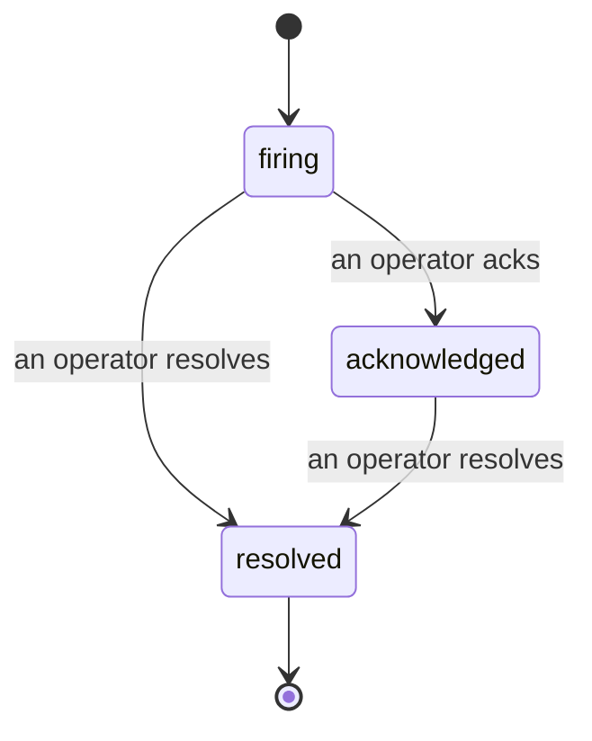

כאשר התראה משתלחת, השאלה הראשונה היא תמיד "מי עוסק בזה?" תקריות עונות לזה: ברגע שמשהו חורץ, כולם יכולים לראות שהתקרית פתוחה, מי בעלות עליה, בדיוק מה קרה עד כה, עם רשומה נקייה ומיוחסת שאתה יכול להעביר ישירות לניתוח-פוסט-מורטם.

*תיבת הנכנסים מקבצת תקריות פתוחות לפי מצב ומסננת לפי חומרה ו-assignee, כך שאתה רואה מה זקוק לתשומת לב אנושית כעת.*

## דע מי בעלות, במבט אחד

לא עוד "האם מישהו בודק את זה?" בשרשור צ'אט. הפרה פותחת תקרית באופן אוטומטי ותופלת אותה לתיבה משותפת, מקובצת לפי מצב. אשר עליה והשם שלך עליו, כך ששאר הצוות יודע שהיא מטופלת. אישור משותף: מספר אופרטורים יכולים לאשר אותה תקרית ואישורו של כל אחד מהם מתועד בנפרד, כך שחדר מלחמה שלם מופיע בשמות במקום להעלות אחד על השני. הקצה בעלים אחד לפחיתות, וסנן את תיבת הנכנסים לפי חומרה או assignee כדי לצמצם לזה שלך.

## כל הסיפור, בציר זמן אחד

כשהתקרית מסתיימת, כבר יש לך את הכתיבה. פתח כל תקרית ותקבל את ראיות ההפרה, את ה-assignees והמנויים שלה, שרשור הערות לתיאום במקום, וציר זמן פעילות יחיד-כיווני.

*כל מה שקרה, בסדר, כל שורה חתומה על ידי מי שעשה זאת.*

כל פעולה (פתוח, אושר, פתור וכו') נכתבת לציר הזמן הזה ולעולם לא עורכה. כל ערך מיוחס: לאופרטור שלקח אותו, לפי דוא"ל, או ל**automated** עבור כל מה ש-FailproofAI Cloud עשה בעצמו, כמו פתיחת התקרית בהפרה. שום דבר אינו אנונימי ושום דבר לא אבד, כך שניתוח-פוסט-מורטם כתוב לעצמו בערך.

## איך תקרית זז

- **Open (firing):** ההפרה פותחת את התקרית ודפה את הערוצים שלך פעם אחת. הפרות חוזרות מתקפלות לאותה תקרית ומרעננות את הראיות שלה במקום לדפק אותך שוב ושוב.
- **Acknowledged:** אופרטור קוטף אותה. היא נשארת פתוחה, והפרות מאוחרות מרעננות את הראיות בשקט.
- **Resolved:** אופרטור סוגר אותה. רזולוציה אוטומטית כשהתנאי מתברר מתוכננת אך עדיין לא מופעלת, כך שתקרית נשארת פתוחה עד שאדם פותר אותה, מה שמשמר את כולם כנים לגבי מה באמת התברר. תקרית טרייה יכולה להיפתח באותה התראה מאוחר יותר.

התראה אחת מחזיקה לכל היותר תקרית פתוחה אחת בכל פעם, כך ששלטון דש לא יכול להטביע אותך בשכפולים. אתה יכול גם לפתוח תקרית ביד: אחת סטנדאלון לעשsomething שלא התראה תפסה, או אחת המוגבלת להתראה קיימת, אם יש לך `incidents:write`.

## איפה למצוא את זה

תקריות חיות ב-`/<org-slug>/incidents`. הצפייה זקוקה **`incidents:read`**; פתיחת תקרית ידנית זקוקה **`incidents:write`**; אישור, הקצאה, הערות, ופתרון זקוקים **`incidents:ack`**. מפתחות ישנים יותר שהעניקו את ה-`alerts:ack` המושכת לפנסיון ממשיכים לעבוד, מכיוון שהוא מכובד כ-`incidents:ack`, כך שסיבוב on-call שלך לא צריך הוצאה מחדש.

## קשור

- [Alerts](/he/cloud/alerts): הכללים שפותחים תקריות אלה כאשר סף חורץ.
- [Error tracking](/he/cloud/errors): ראה כל כישלון במקום אחד והעלה אחד להתראה.
- [Audits](/he/cloud/audits): האנליסט המתוכנן שמוצא את הכישלונות שלא היה שום כלל צפה בהם.