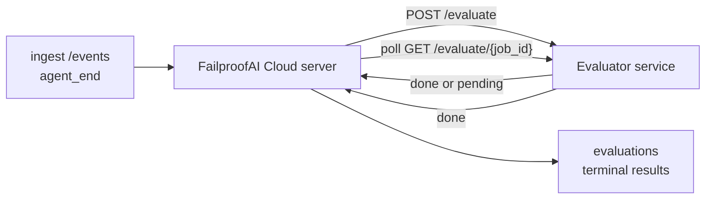

FailproofAI Cloud प्रत्येक पूर्ण agent run को गुणवत्ता के लिए स्वचालित रूप से स्कोर कर सकता है: आप एक छोटी स्कोरिंग सेवा प्रदान करते हैं, और FailproofAI Cloud बाकी को संभालता है। इसका उपयोग उन आयामों को ट्रैक करने के लिए करें जिनकी आपको परवाह है (सहायकता, tool efficiency, तथ्यात्मकता, सुरक्षा; आप चुनते हैं), regression को जल्दी पकड़ें, और agents या environments की तुलना एक नज़र में करें। स्कोरिंग opt-in है: pipeline तब तक कुछ नहीं करता जब तक आप server पर `EVALUATOR_ENDPOINT` सेट नहीं करते।

> **नोट:** आप स्कोर आयाम परिभाषित करते हैं। आपका evaluator किसी भी संख्यात्मक keys को return कर सकता है; FailproofAI Cloud जो भी आप भेजते हैं उसे store, trend, और display करता है।

## एक नज़र में

1. **एक scorer लिखें।** एक छोटी HTTP सेवा स्थापित करें जो एक session transcript पढ़ता है और scores return करता है। FailproofAI Cloud एक कार्यशील reference ships करता है जिसे आप copy कर सकते हैं। [SDK के साथ एक evaluator लिखना](/hi/cloud/evaluators) देखें।
2. **FailproofAI Cloud को इसकी ओर निर्देशित करें।** Server process पर `EVALUATOR_ENDPOINT` (और एक साझा `EVALUATOR_TOKEN`) सेट करें।
3. **Scores को उतरते देखें।** प्रत्येक पूर्ण session स्वचालित रूप से स्कोर किया जाता है; results session detail page, sessions grid, और saved dashboards पर दिखाई देते हैं।


*एक बार evaluator configure हो जाने के बाद, प्रत्येक पूर्ण run को स्कोर किया जाता है और results session के right rail में दिखाई देते हैं: शीर्ष पर summary, फिर reasoning के साथ per-dimension score bars।*

---

## यह कैसे काम करता है



जब FailproofAI Cloud SDK एक session के लिए `agent_end` event emit करता है, server एक evaluation को schedule करता है। फिर यह full event transcript को आपकी evaluator सेवा में POST करता है, जो निम्नलिखित में से कर सकता है:

- **Inline result return करें** `{"status":"done", "scores":{...}, "reasoning":{...}, "summary":"..."}` के साथ। Result को session के evaluation timeline में append किया जाता है। `reasoning` और `summary` optional हैं।
- **Defer करें** `{"status":"pending", "job_id":"abc-123"}` के साथ। FailproofAI Cloud फिर `GET {EVALUATOR_ENDPOINT}/evaluate/abc-123` को तब तक call करता है जब तक आपका evaluator `{"status":"done", ...}` या `{"status":"error", "error":"..."}` return नहीं करता।

  Polling cadence per-job है: एक `pending` response में `next_poll_secs` शामिल हो सकता है को override करने के लिए; अन्यथा FailproofAI Cloud `GET /config` से `default_poll_interval_secs` value का उपयोग करता है; अन्यथा server `EVALUATOR_POLLING_INTERVAL_SECS` (default 10s) पर fallback करता है। सभी values को [1s, 1h] में clamp किया जाता है।

जो sessions कभी `agent_end` emit नहीं करते (उदाहरण के लिए, एक crashed agent process) को भी pick up किया जा सकता है: evaluator का `GET /config` `{"inactivity_timeout_secs": 1800}` return कर सकता है, और FailproofAI Cloud किसी भी session को evaluate करेगा जो उतने समय के लिए idle गया हो। इस fallback को disable करने के लिए field को `null` सेट करें या इसे omit करें।

`EVALUATOR_ENDPOINT` unset होने पर pipeline पूरी तरह no-op है।

एक session समय के साथ **multiple terminal evaluations को accumulate कर सकता है**: प्रत्येक `agent_end` event (और dashboard से प्रत्येक manual re-eval) एक fresh evaluation row को append करता है। यह एक resumed conversation को evaluate करने का supported तरीका है: एक user एक agent को end करता है, बाद में वापस आता है, अधिक events भेजता है, agent को फिर से end करता है, और एक दूसरा evaluation पूरे updated transcript के विरुद्ध चलता है। Dashboard सबसे हाल के evaluation को headline के रूप में render करता है और prior evaluations को एक collapsible timeline के रूप में। जब एक session के लिए एक evaluation चल रहा होता है, उस session के लिए अतिरिक्त `agent_end` events को ignore किया जाता है; चलाए गए evaluation के complete होने के बाद अगला एक fresh evaluation को queue करेगा जैसा कि usual है।

Inactivity fallback भी resumed sessions पर re-engages करता है: यदि नए events पहले के terminal evaluation के बाद आते हैं और session फिर `inactivity_timeout_secs` के पिछले idle जाता है, तो एक fresh evaluation को enqueue किया जाता है।

Transient failures (5xx, 429, timeouts, network errors) को `EVALUATOR_MAX_ATTEMPTS` तक exponential backoff के साथ retry किया जाता है; 4xx responses terminal होते हैं। FailproofAI Cloud multiple horizontally-scaled server instances के साथ चलाने के लिए safe है; work को partition किया जाता है इसलिए एक ही session को कभी concurrently दो बार dispatch नहीं किया जाता।

---

## HTTP contract

प्रत्येक authenticated route **bearer token auth** का उपयोग करता है। एक ही value दोनों sides पर configure की जानी चाहिए:

- FailproofAI Cloud server: env var `EVALUATOR_TOKEN`
- Evaluator service: एक ही तरीके से configure किया गया (the `agenteye-evaluator` SDK convention के अनुसार `EVALUATOR_TOKEN` को read करता है)

यदि `EVALUATOR_TOKEN` unset है, तो server कोई `Authorization` header नहीं भेजता है; evaluator फिर anonymous requests को accept कर सकता है, जो internal-only network के लिए ठीक है लेकिन public internet पर discouraged है।

### Routes जो evaluator को serve करना चाहिए

| Route | Body / params | Response |
|---|---|---|
| `GET /health` | none | `{"status":"ok"}` (open, no auth) |
| `GET /config` | none | `{"inactivity_timeout_secs": <int> \| null, "default_poll_interval_secs": <int> \| omitted}` |
| `POST /evaluate` | `EvalRequest` JSON | `{"status":"done", ...}` or `{"status":"pending", "job_id":"..."}` |
| `GET /evaluate/{id}` | none | same response shape as `/evaluate` |

### Server द्वारा भेजा गया `EvalRequest` body

```json
{
  "schema_version": "1",
  "session_id":     "session-abc123",
  "agent_id":       "planner",
  "environment":    "production",
  "started_at":     "2026-05-10T12:00:00Z",
  "ended_at":       "2026-05-10T12:05:00Z",
  "events": [
    { "id": 1234, "ts": "...", "event_type": "agent_start", "payload": { ... } },
    ...
  ]
}
```

### Response shapes

**Sync (done):**

```json
{
  "status": "done",
  "scores": { "helpfulness": 0.85, "tool_efficiency": 0.6 },
  "reasoning": {
    "helpfulness": "answered the question directly with citations",
    "tool_efficiency": "called list_files three times when one would have done"
  },
  "summary": "strong answer quality, weak tool selection"
}
```

`reasoning` (एक per-score justification map) और `summary` (एक overall one-paragraph narrative) दोनों optional हैं। `reasoning` में keys को `scores` में keys को mirror करना चाहिए; dashboard प्रत्येक entry को अपने score bar के अंतर्गत render करता है। Older evaluators जो केवल `scores` return करते हैं वह unchanged continue करते हैं; `reasoning` और `summary` बस null के रूप में read करते हैं और corresponding UI affordances को omit किया जाता है।

**Async (deferred):**

```json
{ "status": "pending", "job_id": "abc-123", "next_poll_secs": 30 }
```

`next_poll_secs` optional है; यदि omitted है तो server `/config` से evaluator के `default_poll_interval_secs` पर fallback करता है, फिर अपने `EVALUATOR_POLLING_INTERVAL_SECS` env var पर।

**Terminal evaluator-side error:**

```json
{ "status": "error", "error": "model service unavailable" }
```

Server किसी अन्य 2xx body को protocol error के रूप में treat करता है और session के लिए एक terminal `error` को record करता है।

---

## SDK के साथ एक evaluator लिखना

आपको HTTP contract को manually implement नहीं करना है। `agenteye-evaluator` Python package आपको एक typed FastAPI wrapper देता है जो auth, routing, और request/response shapes को आपके लिए handle करता है।

FailproofAI Cloud एक **कार्यशील reference evaluator** भी ships करता है जो transcript के shape से `helpfulness`, `tool_efficiency`, और `factuality` को score करता है। इसे starting point के रूप में copy करें और अपने स्वयं के logic को swap करें: एक LLM judge, एक rule engine, कुछ भी जो आपकी quality bar को fit करता है।

Minimum viable evaluator:

```python
import os
from agenteye_evaluator import Evaluator, EvalRequest, EvalResponse

app = Evaluator(token=os.environ["EVALUATOR_TOKEN"])

@app.evaluator
def run(req: EvalRequest) -> EvalResponse:
    # Inspect req.events (the full session transcript) and return scores.
    tool_calls = sum(1 for e in req.events if e.event_type == "tool_use")
    return EvalResponse(
        scores={"tool_calls": float(tool_calls)},
        reasoning={"tool_calls": f"{tool_calls} tool invocations in the transcript"},
        summary="tight tool loop" if tool_calls < 5 else "agent looped on tools",
    )
```

`app` instance किसी भी ASGI server के अंतर्गत चलता है, इसलिए `uvicorn module:app` इसे start करता है।

उन evaluators के लिए जिन्हें expensive work को defer करने की आवश्यकता है, `JobPending` को instead return करें और एक `@app.job_lookup` handler को register करें; FailproofAI Cloud server `GET /evaluate/{job_id}` को तब तक poll करता है जब तक आप एक terminal status return नहीं करते या `EVALUATOR_MAX_POLL_DURATION_SECS` cap (default 1 h) elapse न हो।

Full API reference, async pattern, और event schema को `agenteye-evaluator` SDK के README में document किया गया है।

---

## अपने evaluator को चलाना

Evaluator **आपकी सेवा** है — FailproofAI Cloud एक default evaluator ship नहीं करता है, इसलिए आप इसे जहां अपनी सेवाओं को चलाते हैं वहां build और run करते हैं। यह किसी भी ASGI server के अंतर्गत चलता है (उदाहरण के लिए `uvicorn my_evaluator:app`); [HTTP contract](#http-contract) से `/health`, `/config`, और `/evaluate` routes को serve करें, फिर server को इसकी ओर निर्देशित करें (देखें [Server को configure करना](/hi/cloud/evaluators))।

एक बार evaluator reachable हो जाने के बाद, `GET /health` `{"status":"ok"}` return करता है। एक agent को end-to-end चलाने के बाद, server पर `GET /evaluations` एक row return करता है `status: "done"` के साथ और scores जो आपका evaluator produce किया।

---

## Server को configure करना

Server process पर सेट करें:

| Env var | Meaning |
|---|---|
| `EVALUATOR_ENDPOINT` | आपके evaluator का base URL (`http://evaluator:9000`)। Unset = pipeline disabled। |
| `EVALUATOR_TOKEN` | Bearer token। Evaluator सेवा को configure किए गए value के बराबर होना चाहिए। |
| `EVALUATOR_WORKERS` | Server instance per worker tasks (default 2)। |
| `EVALUATOR_CLAIM_BATCH` | Per worker tick rows claimed (default 4)। Batches को **concurrently** process किया जाता है; आपके evaluator endpoint पर effective concurrency `EVALUATOR_WORKERS × EVALUATOR_CLAIM_BATCH` है। |
| `EVALUATOR_POLL_IDLE_SECS` | कब तक एक worker dispatch attempts के बीच sleep करता है जब कोई evaluation due नहीं होता (default 2s)। |
| `EVALUATOR_POLLING_INTERVAL_SECS` | `GET /evaluate/{id}` cadence के लिए final fallback जब न तो per-response `next_poll_secs` न ही evaluator का `default_poll_interval_secs` set हो (default 10s)। |
| `EVALUATOR_REQUEST_TIMEOUT_MS` | Per-request timeout (default 30000)। |
| `EVALUATOR_MAX_ATTEMPTS` | इस कई transient failures के बाद result को terminal `error` के रूप में record किया जाता है (default 5)। |
| `EVALUATOR_CONFIG_REFRESH_SECS` | `GET /config` cadence (default 300)। |
| `EVALUATOR_MAX_POLL_DURATION_SECS` | Maximum wallclock time जो एक session polling queue में रह सकता है इससे पहले कि यह `timeout` के रूप में terminated हो (default 3600s)। एक evaluator के विरुद्ध guards जो forever `pending` को return करता रहता है। |

Automatic scoring को turn on करने के लिए, server पर `EVALUATOR_ENDPOINT` और `EVALUATOR_TOKEN` दोनों सेट करें, फिर change को pick up करने के लिए इसे restart करें। `EVALUATOR_ENDPOINT` unset होने पर pipeline एक no-op रहता है।

ऊपर की tuning knobs optional हैं; केवल यदि आप defaults को override करना चाहते हैं तो server पर corresponding environment variables सेट करें।

---

## API reference

| Method | Path | Required permission | Purpose |
|---|---|---|---|
| `GET` | `/evaluations` | `evaluations:read` | Terminal results को query करें। `session_id`, `agent_id`, `environment`, `status` (`done`/`error`/`timeout`), `ts_from`, `ts_to`, `cursor`, `limit`, `score_filters`, `latest_per_session` को support करता है। `limit` default 50 है और 200 पर capped है (ध्यान दें कि यह `/events` से भिन्न है, जो 1000 पर caps करता है)। `environment` comma-separated list accept करता है (उदा. `environment=prod,staging`); single values अभी भी काम करते हैं। `latest_per_session=true` के साथ response में प्रति `session_id` अधिकतम एक row होता है (the most recent by `completed_at`) sessions-list page द्वारा उपयोग किया जाता है एक session के evaluation timeline को इसकी current headline में collapse करने के लिए। Default false है (पूरा history return करता है)। |
| `GET` | `/evaluations/aggregate` | `evaluations:read` | एक filtered slice के लिए rolled-up eval health: total count, एक done/error/timeout breakdown, per-score-key stats (count/avg/min/max/p50 arbitrary `scores` keys पर), और एक time-bucketed timeline। **`/evaluations` के रूप में ही filter params accept करता है** plus `featured_keys` (trend करने के लिए score keys का CSV) और `latest_per_session`। Dashboards feature को power करता है; metrics पूरे matching set पर exact हैं, sampled नहीं। |
| `GET` | `/evaluations/environments` | `evaluations:read` | `evaluations` table से distinct environment values। Evaluation-readable data के लिए scoped filter dropdowns को populate करने के लिए उपयोग किया जाता है। |
| `GET` | `/evaluation-jobs` | `evaluations:read` | In-flight evaluations में visibility। `status` (`pending`/`polling`) के अनुसार filter करें। |
| `GET` | `/events` | `events:read` | एक session के raw events को stream करें। `session_id`, `agent_id`, `event_type` (CSV), `environment` (CSV), `ts_from`, `ts_to`, `cursor`, `limit`, और `order` को support करता है। `order` `desc` (newest-first, the default) या `asc` (oldest-first) है; एक unrecognized value `desc` पर fallback करता है। Response के `next_cursor` (एक event id) के माध्यम से cursor-paginate करें: अगला page get करने के लिए इसे `cursor` के रूप में pass करें; `asc` के साथ अगला page उस id के बाद events हैं, `desc` के साथ उससे पहले events हैं। `limit` default 50 है और 1000 पर capped है। |
| `GET` | `/sessions/:session_id/export` | `events:read` | Exact JSON body return करता है जो evaluator को इस session के लिए प्राप्त होगा, `session-<id>.json` नामित एक downloadable attachment के रूप में served। Production sessions को offline testing के लिए `agenteye-evaluator` के माध्यम से replay करने के लिए उपयोगी। Bytes evaluator pipeline भेजता है जो byte-identical हैं। |
| `POST` | `/sessions/:session_id/re-evaluate` | `evaluations:trigger` | एक session के लिए एक fresh evaluation को enqueue करें; चाहे prior evaluation exist करे या नहीं। नया result session के evaluation timeline में **appended** होता है rather than overwriting previous one को, इसलिए prior scores history के रूप में visible रहते हैं। Enqueue पर `202` return करता है, unknown session के लिए `404`, यदि एक evaluation पहले से in flight है तो `409`। यह एक नए evaluator को deploy करने के बाद use करें, या ऐसे sessions के लिए जिन्होंने कभी `agent_end` emit नहीं किया। |

### Score range के अनुसार filtering: `score_filters`

`GET /evaluations` एक optional `score_filters` parameter accept करता है जो results को `scores` object के अंदर numeric values के अनुसार narrow करता है। Parameter एक comma-separated list है `key:min..max` entries का; किसी भी bound को omit किया जा सकता है। Multiple entries logical AND के साथ combine होते हैं। Rows जहां named key absent या non-numeric है को exclude किया जाता है। एक request में अधिकतम 20 filter entries हो सकते हैं; exceeding that HTTP 400 return करता है।

उदाहरण:
```text
# helpfulness in [0.5, 0.8]
GET /evaluations?score_filters=helpfulness:0.5..0.8

# tool_efficiency at most 0.3 (no lower bound)
GET /evaluations?score_filters=tool_efficiency:..0.3

# helpfulness >= 0.5 AND factuality >= 0.9
GET /evaluations?score_filters=helpfulness:0.5..,factuality:0.9..
```

प्रत्येक `/evaluations` response object के ये fields हैं:

| Field | Type | Notes |
|---|---|---|
| `evaluation_id` | string (UUID) | इस terminal evaluation के लिए canonical identifier। प्रत्येक terminal evaluation को एक नया UUID मिलता है; एक single session में multiple हो सकते हैं। |
| `id` | string (UUID) | Backwards-compatibility alias `evaluation_id` के समान value को carry करता है। |
| `session_id` | string | Session जिसके विरुद्ध यह evaluation चलाया गया। एक session के timeline में multiple evaluations हो सकते हैं। |
| `agent_id` | string | Agent को identify करता है जो session produce किया। |
| `environment` | string | Environment label जो session से copy किया गया। |
| `status` | enum | `"done"`, `"error"`, `"timeout"` में से एक। |
| `scores` | object \| null | आपके evaluator द्वारा return किए गए Scores। |
| `reasoning` | object \| null | Optional per-score justification map आपके evaluator द्वारा return किया गया। Keys typically `scores` में उन keys को mirror करते हैं। Dashboard प्रत्येक entry को अपने score bar के अंतर्गत render करता है। |
| `summary` | string \| null | Optional one-paragraph overall narrative आपके evaluator द्वारा return किया गया। Dashboard इसे per-score breakdown के ऊपर render करता है evaluation के headline के रूप में। |
| `error` | string \| null | केवल `"error"` / `"timeout"` पर populated। |
| `attempt_count` | integer | Dispatch attempts की संख्या (≥ 1)। |
| `duration_ms` | integer \| null | Final attempt की duration। |
| `completed_at` | string (ISO 8601 UTC) | जब terminal result को record किया गया। Results को `completed_at` (newest first) के अनुसार order किया जाता है। |
| `created_at` | string (ISO 8601 UTC) | `completed_at` के समान timestamp carry करता है (write-once semantics)। |

---

## Permissions

| Permission | Grants |
|---|---|
| `evaluations:read` | Evaluation results को list करें, dashboard में scores को view करें, और dashboard health metrics को load करें। |
| `evaluations:trigger` | Manually `POST /sessions/:session_id/re-evaluate` के माध्यम से एक session के लिए एक evaluation को enqueue करें या dashboard के re-evaluate button का। |
| `dashboards:read` | Saved dashboards को view करें (उनके metrics को load करने के लिए `evaluations:read` भी चाहिए)। |
| `dashboards:write` | Dashboards को create और edit करें। |
| `dashboards:delete` | Dashboards को delete करें। |

Bootstrap admin (`ADMIN_KEY`, `ADMIN_EMAIL`) स्वचालित रूप से ये सभी receive करता है।

---

## Results को देखना

- **`/sessions/<id>`**: events timeline + एक right rail जो session के scores और dispatch attempt से कोई error दिखाता है। यदि आपकी key के पास `evaluations:trigger` है, तो एक **re-evaluate** button export button के आगे दिखाई देता है, उन sessions के लिए उपयोगी जिन्होंने कभी `agent_end` emit नहीं किया, या एक नए evaluator को deploy करने के बाद scores को refresh करने के लिए। Dashboard नए result के लिए polls करता है और इसे जब land करता है तो right rail को update करता है।
- **`/sessions`**: filterable session grid; score column प्रत्येक session की evaluation status और scores को एक नज़र में दिखाता है।
- **`/dashboards`**: saved eval-health views (देखें [Dashboards](#dashboards) नीचे)।


*Sessions grid प्रत्येक run की evaluation status और scores को एक नज़र में दिखाता है; red/amber/green badges low scores को jump out करते हैं।*

---

## Dashboards

**Dashboards** page (`/dashboards`) आपको evaluation filters के एक combination को एक named, reusable view के रूप में save करने देता है और watch करता है कि evaluations का यह slice एक नज़र में कैसे कर रहा है। Dashboards **आपके पूरे organization में shared** हैं; `dashboards:read` के साथ सभी को same set दिखाई देता है।

प्रत्येक dashboard pins करता है:

- **Filters**: sessions page के समान controls: environment, status, agent, एक rolling time window, और score-range filters (`key:min..max`)।
- **एक display configuration**: कौन से score keys feature करें, green/amber/red health thresholds, कौन से panels दिखाएं, और latest evaluation per session को collapse करना है या नहीं।

प्रत्येक card matching sessions की संख्या दिखाता है, एक done/error/timeout breakdown, प्रत्येक featured score का average, और एक छोटा trend sparkline। एक dashboard को open करने से full-size panels दिखते हैं; **"open in sessions"** आपको sessions page में drop करता है उसी slice के लिए pre-filtered। Metrics को server-side पर पूरे matching set पर compute किया जाता है (`GET /evaluations/aggregate` के माध्यम से), इसलिए numbers exact हैं rather than sampled।


**Permissions:** viewing के लिए `dashboards:read` और `evaluations:read` दोनों चाहिए; creating और editing के लिए `dashboards:write` चाहिए; deleting के लिए `dashboards:delete` चाहिए। Bootstrap admin को automatically ये सभी मिलते हैं।

---

## Troubleshooting

**Sessions exist लेकिन कोई evaluations create नहीं हो रहे।** Confirm करें कि `EVALUATOR_ENDPOINT` server process पर set है, कि server और evaluator same `EVALUATOR_TOKEN` value share करते हैं, और कि evaluator का `/health` endpoint server से reachable है। `EVALUATOR_ENDPOINT` unset होने पर pipeline एक no-op है।

**In-flight evaluations pile up होते हैं।** `GET /evaluation-jobs` को query करें in-flight queue को देखने के लिए। प्रत्येक row पर `attempt_count`, `next_attempt_at`, और `last_error` को inspect करें। Common causes: evaluator सेवा unreachable या 5xx return कर रही है (backoff के साथ retry), गलत `EVALUATOR_TOKEN` (401 terminal है), या एक async evaluator जो `pending` को indefinitely return करता है (नीचे देखें)।

**Sessions completed लेकिन कोई terminal evaluation नहीं।** `GET /evaluation-jobs?status=polling` को query करें; result अभी भी in flight हो सकता है। यदि एक job `pending` में stuck है, तो server को evaluator तक पहुंचने में trouble है; check करें कि evaluator up है और कि `EVALUATOR_TOKEN` matches है।

**`HTTP 401 from evaluator: invalid bearer token`।** Server पर `EVALUATOR_TOKEN` evaluator सेवा को configure किए गए value से match नहीं करता। उन्हें identical होना चाहिए।

**Async evaluator `pending` को forever return करता है।** Server `GET /evaluate/{job_id}` को तब तक poll करता है जब तक evaluator `done` या `error` return नहीं करता, या जब तक `EVALUATOR_MAX_POLL_DURATION_SECS` (default 1 h) elapse नहीं हो। Cap के बाद evaluation को `timeout` के रूप में record किया जाता है और in-flight queue से remove किया जाता है। यदि आपका evaluator legitimate रूप से default से लंबे समय की आवश्यकता है तो `EVALUATOR_MAX_POLL_DURATION_SECS` को raise करें।

---

## अगले कदम

- [Evaluator agent skill](/hi/cloud/agent-skills): एक coding agent को real sessions के विरुद्ध आपके dimensions को design करने और यह सेवा build करने दें।
- [Python SDK](/hi/cloud/sdk): `agent_end` events emit करें जो scoring को trigger करते हैं।
- [API keys](/hi/cloud/access): the `evaluations:read` और `evaluations:trigger` permissions।
- [Audits](/hi/cloud/audits): FailproofAI Cloud का अन्य automated quality feature, policy-based review के लिए।