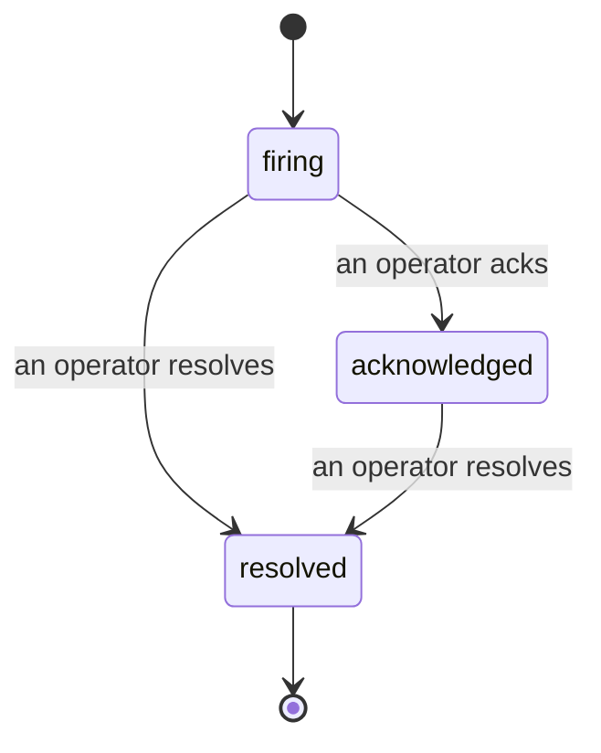

जब कोई alert trigger होता है, तो पहला सवाल हमेशा यही होता है "इस पर कौन काम कर रहा है?" Incidents इसका जवाब देते हैं: जिस पल कोई breach होता है, सभी को दिखता है कि incident खुला है, इसका मालिक कौन है, और अब तक बिल्कुल क्या हुआ है, साथ ही एक स्वच्छ, attributed record जिसे आप सीधे post-mortem को दे सकते हैं।

*The inbox open incidents को state के अनुसार grouped करता है और severity और assignee के अनुसार filter करता है, इसलिए आप वह देखते हैं जिसे अभी किसी की ज़रूरत है।*

## एक नज़र में जानें कि किसके पास है

चैट thread में "क्या कोई इस पर नज़र रख रहा है?" के सवाल का कोई और ज़वाब नहीं। एक breach automatically एक incident खोलता है और इसे shared inbox में डालता है, जो state के अनुसार grouped होता है। इसे acknowledge करें और आपका नाम इस पर होगा, इसलिए बाकी टीम को पता चलेगा कि इसे संभाला जा रहा है। Acknowledgement shared है: कई operators एक ही incident को ack कर सकते हैं और हर एक को अलग से record किया जाता है, इसलिए पूरा war room नामों से दिखता है, न कि एक दूसरे के ऊपर। Triage के लिए एक मालिक assign करें, और inbox को severity या assignee के अनुसार filter करें ताकि आप सिर्फ अपना काम देखें।

## पूरी कहानी, एक ही timeline में

जब incident ख़त्म हो जाता है, तो आपके पास पहले से ही write-up होता है। कोई भी incident खोलें और आपको breach का सबूत, इसके assignees और subscribers, coordinating के लिए एक comment thread, और एक append-only activity timeline मिलता है।

*सब कुछ जो हुआ, क्रम में, हर पंक्ति इस पर हस्ताक्षर की गई है कि किसने इसे किया।*

हर action (opened, acknowledged, resolved, आदि) उस timeline पर लिखा जाता है और कभी संपादित नहीं किया जाता। हर entry को attribute किया जाता है: उस operator को जिसने इसे किया, email से, या **automated** को उन चीज़ों के लिए जो FailproofAI Cloud ने अपने आप की हैं, जैसे breach पर incident को खोलना। कुछ भी anonymous नहीं है और कुछ भी नष्ट नहीं होता, इसलिए post-mortem कम या ज़्यादा अपने आप लिख जाता है।

## एक incident कैसे आगे बढ़ता है

- **Open (firing):** breach incident को खोलता है और आपके channels को एक बार page करता है। Repeated breaches एक ही incident में fold हो जाते हैं और इसके बजाय evidence को refresh करते हैं कि बार-बार आपको page न करें।
- **Acknowledged:** एक operator इसे उठाता है। यह खुला रहता है, और बाद में breaches quietly evidence को update करते हैं।
- **Resolved:** एक operator इसे बंद करता है। जब condition clear हो जाती है तो automatic resolution की योजना है लेकिन अभी enabled नहीं है, इसलिए एक incident तब तक खुला रहता है जब तक कोई इंसान इसे resolve न करे, जो सभी को ईमानदार रखता है कि वास्तव में क्या clear हुआ है। एक नया incident बाद में एक ही alert पर खुल सकता है।

एक alert के पास एक बार में सबसे ज़्यादा एक open incident हो सकता है, इसलिए एक flapping rule आपको duplicates में दफ़न नहीं कर सकता। आप manually भी एक incident खोल सकते हैं: कोई alert न पकड़ने वाली चीज़ के लिए एक standalone, या एक existing alert के लिए एक, अगर आपके पास `incidents:write` है।

## इसे कहाँ खोजें

Incidents `/<org-slug>/incidents` पर रहते हैं। Viewing के लिए **`incidents:read`** की ज़रूरत है; manual incident खोलने के लिए **`incidents:write`** की ज़रूरत है; acknowledging, assigning, commenting, और resolving के लिए **`incidents:ack`** की ज़रूरत है। पुरानी keys जिन्होंने retired `alerts:ack` को granted किया है काम करती रहती हैं, क्योंकि इसे `incidents:ack` के रूप में honored किया जाता है, इसलिए आपके on-call rotation को re-issue करने की ज़रूरत नहीं है।

## संबंधित

- [Alerts](/hi/cloud/alerts): वह नियम जो threshold breach होने पर ये incidents खोलते हैं।
- [Error tracking](/hi/cloud/errors): हर failure को एक जगह देखें और एक को एक alert में promote करें।
- [Audits](/hi/cloud/audits): scheduled analyst जो उन failures को खोजता है जिन पर कोई rule नज़र नहीं रख रहा था।