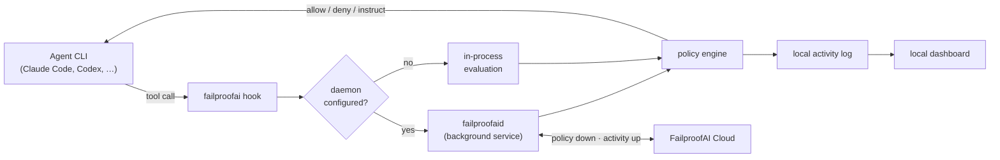
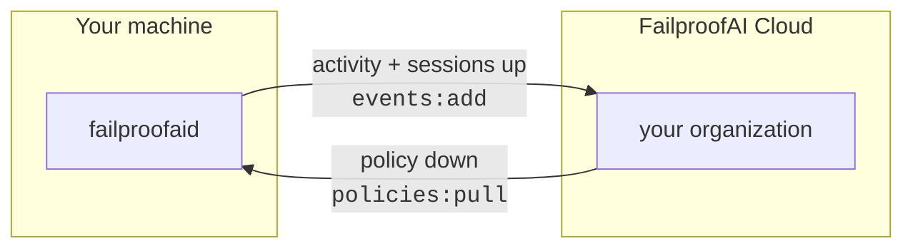

You can use FailproofAI without reading this page. Read it when you want to know *why* a
decision came back the way it did, what happens when something in the chain is down, or
what exactly is on the wire between a machine and the cloud.

---

## The one-paragraph version

Every supported agent CLI can run an external command at fixed points in its loop —
before a tool call, after it, when the turn ends. FailproofAI installs itself at those
points. When the agent tries to do something, your machine evaluates the active policies
against that exact tool call and answers **allow**, **deny**, or **instruct** in a shape
the agent understands. The decision is recorded locally. If the machine is connected to
FailproofAI Cloud, the decision and the session go up, and centrally-managed policy comes
down.



---

## Step 1 — The agent hands over the tool call

Each CLI has its own hook contract, and FailproofAI speaks all of them. Three shapes exist
in the wild:

| Shape | CLIs | How FailproofAI attaches |
|---|---|---|
| **External command** | Claude Code, Codex, Copilot, Cursor, Hermes, Factory Droid, Devin, Antigravity, Goose | A hook entry in the CLI's settings file runs `failproofai --hook <Event> --cli <name>` and passes the event as JSON on stdin. |
| **In-process plugin** | OpenCode, OpenClaw | A small generated plugin the CLI loads at startup; it calls the FailproofAI binary and translates the answer back into the plugin's own return shape. |
| **Extension package** | Pi | A bundled extension the CLI loads at startup, which shells out per event. |

The payload carries the session id, the working directory, the tool name, and the tool's
input:

```json
{
  "session_id": "abc123",
  "transcript_path": "/home/you/.claude/projects/myproject/sessions/abc123.jsonl",
  "cwd": "/home/you/myproject",
  "hook_event_name": "PreToolUse",
  "tool_name": "Bash",
  "tool_input": { "command": "sudo apt install nodejs" }
}
```

Not every CLI spells those fields the same way. Copilot sends `path` where Claude sends
`file_path`; Antigravity sends camelCase protojson; Goose sends `working_dir` instead of
`cwd`. FailproofAI **canonicalizes all of it** — event names, tool names, and tool-input
keys — before a single policy runs. That is what lets one policy set work identically
across 12 CLIs, and why a rule you write for Claude Code also fires on Cursor.

Payloads are capped at 1 MB. Anything larger is discarded and every policy implicitly
allows, rather than stalling the agent on a pathological input.

---

## Step 2 — The machine decides who evaluates

There are two evaluation paths, and which one runs is decided by a single flag on the
machine: whether setup configured the daemon.

### On a machine that completed setup: the daemon evaluates

`failproofaid` is a background service that stays warm. The hook connects to it over a
Unix socket in `~/.failproofai/run/`, hands over the event, and gets the decision back.
Two separate budgets apply, and the split matters:

- **~150 ms to connect.** This is the "is anything listening?" probe. A dead daemon must
  never add latency to a tool call.
- **30 s for the answer** once connected. A policy is allowed to do real work — shell out
  to `git`, call an API, ask an LLM — and a correct-but-slow evaluation must not be
  mistaken for a dead service.

**If the daemon cannot answer, the tool call is denied.** Not allowed — denied. There is
no in-process fallback on this path, and that is the entire point: a second policy engine
reachable by stopping the first is not a guarantee, and a machine where killing a service
silently disables every guardrail is not a guarded machine. A protocol-version mismatch
denies too, with a message naming the version and telling you to run `failproofai config`,
because the fix is different from "the daemon is down."

[More on the daemon, including how it is supervised →](/daemon)

### On a machine that has not: in-process evaluation

Exactly two situations reach this path, and neither is a configured user machine:

1. **The machine is not set up yet.** No hooks are installed either, so nothing is
   evaluating anything.
2. **This repository's own development configs.** FailproofAI's contributors run the
   policy engine in-process against the package they are editing, deliberately.

---

## Step 3 — Policies run, in order

The engine loads and merges configuration for the working directory, registers every
enabled policy, and evaluates them in a fixed order:

<Steps>
  <Step title="Built-in policies">
    In definition order, with each policy's parameters resolved from your config merged
    over its schema defaults.
  </Step>
  <Step title="Cloud-managed policies">
    Whatever your organization deployed to this machine. Each artifact's SHA-256 is
    verified immediately before it is loaded, so a modified file is refused rather than
    executed. Policies deployed in `observe` mode are evaluated exactly like any other,
    then have their verdict discarded — that is how you measure a rollout against real
    traffic before it can block anyone's work.
  </Step>
  <Step title="Explicit custom policies">
    Files you named with `--custom`, in configured order.
  </Step>
  <Step title="Convention policies">
    `*policies.{js,mjs,ts}` from the project's `.failproofai/policies/`, then from
    `~/.failproofai/policies/`. Alphabetical within each directory.
  </Step>
</Steps>

Three rules govern the result:

- **The first `deny` short-circuits.** Nothing after it runs, and its reason is the answer.
- **`instruct` messages accumulate.** All of them are delivered together.
- **`allow` messages accumulate too.** A policy can permit an action *and* tell the model
  something useful ("all CI checks passed on this branch").

Custom policies are **fail-open by design**: a syntax error, a missing file, a thrown
exception, or a function that runs longer than 10 seconds is logged and treated as allow.
Your own broken rule never takes the built-ins down with it.

---

## Step 4 — The decision goes back in the CLI's own dialect

Each CLI honors a different channel, and getting this wrong is the difference between a
real block and a warning nobody reads. FailproofAI emits the right one per CLI and per event:

| Channel | Used by |
|---|---|
| `{hookSpecificOutput:{permissionDecision:"deny"}}` JSON | Claude Code, Copilot, Codex |
| `{decision:"block", reason}` JSON on stdout | Devin, Goose, Hermes, Factory Droid (turn-end only) |
| Exit code 2 + stderr | Factory Droid (tool events), Claude Code `Stop` |
| `{decision:"deny"}` / `{decision:"continue"}` | Antigravity |
| `{followup_message}` | Cursor turn-end |
| Plugin return values (`{block:true}`, `{action:"revise"}`, thrown errors) | OpenCode, OpenClaw, Pi |

The one that surprises people is the **turn-end gate**. Policies like
`require-commit-before-stop` do not block a tool — they refuse to let the agent *finish*.
Where a CLI supports it, a deny at turn end forces another turn with the reason as the
prompt, so the agent goes back and finishes the job. Where a CLI has no turn-end event
(Hermes, Goose), those policies simply do not apply — [the support
matrix](/agent-support) says exactly which is which, per CLI, rather than leaving you to
find out from a rule that quietly never fired.

---

## Step 5 — Everything is recorded

After each event, one line per non-allow decision is appended to
`~/.failproofai/hook-activity/`:

```json
{
  "timestamp": "2026-08-12T12:34:56.789Z",
  "sessionId": "abc123",
  "eventType": "PreToolUse",
  "toolName": "Bash",
  "policyName": "block-sudo",
  "decision": "deny",
  "reason": "sudo command blocked by failproofai",
  "durationMs": 12
}
```

Plain allows are not logged — that keeps the file small enough to stay honest. This log is
what the [local dashboard's activity view](/dashboard) reads, and what the daemon ships to
the cloud when a machine is connected.

The agent CLIs write their own session transcripts, in their own formats and locations.
FailproofAI reads them — never modifies, moves, or deletes them — to render session
replays, to run the [audit](/audit), and, on a connected machine, to give the cloud a full
picture of the run.

---

## Step 6 — On a connected machine, two streams open

Connecting is one command with one URL and one key, and it configures **two independent
capabilities**:



- **Policy down.** The daemon polls for this machine's desired state, downloads any
  policy artifacts it does not have, verifies each one's digest, and writes a manifest the
  hook path reads. A machine that goes offline keeps enforcing the last deployment it
  successfully fetched.
- **Activity up.** Hook decisions and — unless you passed `--no-transcripts` — session
  transcripts are spooled to disk and uploaded in batches. If the network is down, the
  spool grows and drains later; nothing is dropped on the floor.

The two are verified and reported **separately**, because a key can carry one permission
and not the other. That is a real, supported state, not a broken setup: connecting with a
`policies:pull`-only key gives you enforcement with an empty dashboard, and the CLI says
exactly that instead of letting you discover it a week later.

[Connecting a machine, in detail →](/cloud/connect)

---

## Configuration, and how it merges

Three files, evaluated in priority order:

```text
[1] {cwd}/.failproofai/policies-config.json        ← project  (committed)
[2] {cwd}/.failproofai/policies-config.local.json  ← local    (gitignored)
[3] ~/.failproofai/policies-config.json            ← global
```

- `enabledPolicies` — the **deduplicated union** of all three. A policy switched on
  anywhere is on.
- `policyParams` — **first file that defines a policy's params wins entirely.** There is
  no deep merge inside a policy's parameter block.
- `customPoliciesPaths`, `llm` — first file that defines it wins.
- `disabledCustomPolicies` — union across all scopes.

Changes take effect on the next hook event. Nothing to restart.

[Full configuration reference →](/configuration)

---

## Failure modes, in one table

The useful thing about a guardrail is knowing what it does when *it* breaks.

| What breaks | What happens |
|---|---|
| The daemon is down, on a configured machine | **Tool call denied.** Fail-closed by design. |
| Daemon and CLI versions disagree on the protocol | **Denied**, with a message naming the version and pointing at `failproofai config`. |
| A custom policy throws, times out, or fails to parse | Logged; treated as **allow**. Built-ins are unaffected. |
| The payload exceeds 1 MB | Discarded; every policy implicitly allows. |
| A cloud-managed artifact fails its digest check | The deployment is **refused** rather than partially applied. |
| The cloud is unreachable | Enforcement continues on the last deployment. Activity spools locally and uploads when the network returns. |
| The agent CLI has no turn-end event | `require-*-before-stop` policies do not apply there. Stated per CLI in [the matrix](/agent-support). |

---

## Performance

The hook sits on the critical path of every tool call, so its cost is a product decision,
not an implementation detail:

- The daemon **pre-warms its evaluation worker** as soon as it starts, off the hook path,
  so the first real tool call of a session never pays a cold start.
- Typical evaluations with no external calls complete in well under 100 ms.
- Policies that shell out (`git`, `gh`) or call an LLM cost what those calls cost — which
  is why the response budget is 30 seconds and the connect probe is 150 ms.
- Pattern matching inside policies runs against **parsed command tokens**, not raw
  strings. An allowlist entry for `sudo systemctl status *` cannot be bypassed by
  appending `; rm -rf /`.

---

## Next

<CardGroup cols={2}>

<Card title="The daemon" icon="server" href="/daemon">
  What `failproofaid` is, how it is supervised, and how it reaches your machine.
</Card>

<Card title="Agent support matrix" icon="table" href="/agent-support">
  Every CLI, every event, and what can actually be blocked where.
</Card>

<Card title="Concepts" icon="book" href="/concepts">
  Every term in these docs, defined once.
</Card>

<Card title="Custom policies" icon="code" href="/custom-policies">
  The context object, the decision helpers, and the loading rules.
</Card>

</CardGroup>
