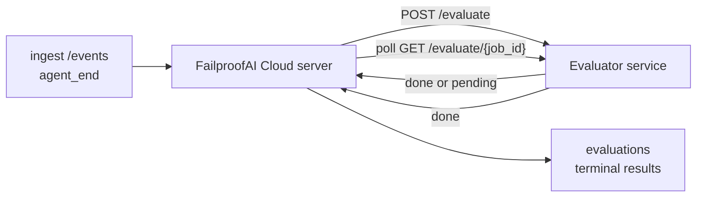

FailproofAI Cloud può valutare automaticamente ogni esecuzione di agent completata per la qualità: tu fornisci un piccolo servizio di scoring e FailproofAI Cloud gestisce il resto. Usalo per tracciare le dimensioni che ti interessano (utilità, efficienza degli strumenti, fattualità, sicurezza; scegli tu), rilevare regressioni in anticipo e confrontare agent o ambienti a colpo d'occhio. Lo scoring è facoltativo: la pipeline non fa nulla finché non imposti `EVALUATOR_ENDPOINT` sul server.

> **Nota:** Tu definisci le dimensioni del punteggio. Il tuo valutatore può restituire qualsiasi chiave numerica desideri; FailproofAI Cloud memorizza, tende alla tendenza e visualizza tutto quello che invii.

## In sintesi

1. **Scrivi uno scorer.** Crea un piccolo servizio HTTP che legge una trascrizione della sessione e restituisce i punteggi. FailproofAI Cloud fornisce un riferimento funzionante che puoi copiare. Vedi [Scrivere un valutatore con l'SDK](#writing-an-evaluator-with-the-sdk).
2. **Punta FailproofAI Cloud su di esso.** Imposta `EVALUATOR_ENDPOINT` (e un `EVALUATOR_TOKEN` condiviso) sul processo server.
3. **Guarda i punteggi arrivare.** Ogni sessione completata viene valutata automaticamente; i risultati appaiono nella pagina dei dettagli della sessione, nella griglia delle sessioni e nei dashboard salvati.


*Una volta configurato un valutatore, ogni esecuzione completata viene valutata e i risultati appaiono nella barra laterale destra della sessione: il riepilogo in alto, poi barre dei punteggi per dimensione con ragionamento.*

---

## Come funziona



Quando l'SDK di FailproofAI Cloud emette un evento `agent_end` per una sessione, il server pianifica una valutazione. Quindi invia un POST della trascrizione completa degli eventi al tuo servizio di valutazione, che può:

- **Restituire il risultato inline** con `{"status":"done", "scores":{...}, "reasoning":{...}, "summary":"..."}`. Il risultato viene aggiunto alla timeline di valutazione della sessione. `reasoning` e `summary` sono facoltativi.
- **Rimandare** con `{"status":"pending", "job_id":"abc-123"}`. FailproofAI Cloud poi chiama `GET {EVALUATOR_ENDPOINT}/evaluate/abc-123` finché il tuo valutatore non restituisce `{"status":"done", ...}` o `{"status":"error", "error":"..."}`.

  La cadenza di polling è per job: una risposta `pending` può includere `next_poll_secs` per sovrascrivere; altrimenti FailproofAI Cloud usa il valore `default_poll_interval_secs` da `GET /config`; altrimenti il server ricade su `EVALUATOR_POLLING_INTERVAL_SECS` (default 10s). Tutti i valori sono limitati a [1s, 1h].

Anche le sessioni che non emettono mai `agent_end` (ad esempio, un processo agent che si è bloccato) possono essere rilevate: il `GET /config` del valutatore può restituire `{"inactivity_timeout_secs": 1800}`, e FailproofAI Cloud valuterà qualsiasi sessione rimasta inattiva per quel tempo. Imposta il campo a `null` oppure omettilo per disabilitare questo fallback.

La pipeline è completamente non operativa quando `EVALUATOR_ENDPOINT` non è impostato.

Una sessione può accumulare **più valutazioni terminali nel tempo**: ogni evento `agent_end` (e ogni rivalutazione manuale dal dashboard) aggiunge una riga di valutazione nuova. Questo è il modo supportato per valutare una conversazione ripresa: un utente termina un agent, ritorna più tardi, invia altri eventi, termina di nuovo l'agent, e viene eseguita una seconda valutazione sulla trascrizione completa aggiornata. Il dashboard rende la valutazione più recente come titolo principale e le valutazioni precedenti come timeline collapsible. Mentre una valutazione è in esecuzione per una sessione, gli ulteriori eventi `agent_end` per quella sessione vengono ignorati; il prossimo dopo il completamento della valutazione in esecuzione metterà in coda una nuova valutazione come al solito.

Il fallback di inattività si riattiva anche nelle sessioni riprese: se arrivano nuovi eventi dopo una precedente valutazione terminale e la sessione poi rimane inattiva oltre `inactivity_timeout_secs`, una nuova valutazione viene messa in coda.

I guasti transitori (5xx, 429, timeout, errori di rete) vengono ritentati con backoff esponenziale fino a `EVALUATOR_MAX_ATTEMPTS`; le risposte 4xx sono terminali. FailproofAI Cloud è sicuro da eseguire con più istanze di server scalate orizzontalmente; il lavoro è partizionato in modo che la stessa sessione non venga mai inviata due volte contemporaneamente.

---

## Contratto HTTP

Ogni rotta autenticata usa **autenticazione bearer token**. Lo stesso valore deve essere configurato su entrambi i lati:

- Server FailproofAI Cloud: variabile di ambiente `EVALUATOR_TOKEN`
- Servizio di valutazione: configurato allo stesso modo (l'SDK `agenteye-evaluator` legge `EVALUATOR_TOKEN` per convenzione)

Se `EVALUATOR_TOKEN` non è impostato, il server non invia l'header `Authorization`; il valutatore può quindi accettare richieste anonime, il che va bene per una rete interna ma è sconsigliato su internet pubblico.

### Rotte che il valutatore deve servire

| Rotta | Body / params | Risposta |
|---|---|---|
| `GET /health` | nessuno | `{"status":"ok"}` (aperto, nessuna autenticazione) |
| `GET /config` | nessuno | `{"inactivity_timeout_secs": <int> \| null, "default_poll_interval_secs": <int> \| omesso}` |
| `POST /evaluate` | JSON `EvalRequest` | `{"status":"done", ...}` o `{"status":"pending", "job_id":"..."}` |
| `GET /evaluate/{id}` | nessuno | stessa forma di risposta di `/evaluate` |

### Body `EvalRequest` inviato dal server

```json
{
  "schema_version": "1",
  "session_id":     "session-abc123",
  "agent_id":       "planner",
  "environment":    "production",
  "started_at":     "2026-05-10T12:00:00Z",
  "ended_at":       "2026-05-10T12:05:00Z",
  "events": [
    { "id": 1234, "ts": "...", "event_type": "agent_start", "payload": { ... } },
    ...
  ]
}
```

### Forme di risposta

**Sincrona (done):**

```json
{
  "status": "done",
  "scores": { "helpfulness": 0.85, "tool_efficiency": 0.6 },
  "reasoning": {
    "helpfulness": "answered the question directly with citations",
    "tool_efficiency": "called list_files three times when one would have done"
  },
  "summary": "strong answer quality, weak tool selection"
}
```

`reasoning` (una mappa di giustificazione per punteggio) e `summary` (una narrazione complessiva di un paragrafo) sono entrambi facoltativi. Le chiavi in `reasoning` dovrebbero specchiare le chiavi in `scores`; il dashboard rende ogni voce in linea sotto la sua barra dei punteggi. I valutatori più vecchi che restituiscono solo `scores` continuano a funzionare senza modifiche; `reasoning` e `summary` semplicemente leggono come null e le corrispondenti funzioni UI sono omesse.

**Asincrona (rimanda):**

```json
{ "status": "pending", "job_id": "abc-123", "next_poll_secs": 30 }
```

`next_poll_secs` è facoltativo; se omesso il server ricade su `default_poll_interval_secs` del valutatore da `/config`, poi su la propria variabile di ambiente `EVALUATOR_POLLING_INTERVAL_SECS`.

**Errore terminale lato valutatore:**

```json
{ "status": "error", "error": "model service unavailable" }
```

Il server tratta qualsiasi altro body 2xx come un errore di protocollo e registra un `error` terminale per la sessione.

---

## Scrivere un valutatore con l'SDK

Non devi implementare il contratto HTTP a mano. Il pacchetto Python `agenteye-evaluator` ti fornisce un wrapper FastAPI tipizzato che gestisce l'autenticazione, il routing e le forme di richiesta/risposta per te.

FailproofAI Cloud fornisce anche un **valutatore di riferimento funzionante** che valuta `helpfulness`, `tool_efficiency` e `factuality` dalla forma della trascrizione. Copialo come punto di partenza e sostituisci la tua logica: un giudice LLM, un motore di regole, qualsiasi cosa si adatti al tuo standard di qualità.

Valutatore minimo praticabile:

```python
import os
from agenteye_evaluator import Evaluator, EvalRequest, EvalResponse

app = Evaluator(token=os.environ["EVALUATOR_TOKEN"])

@app.evaluator
def run(req: EvalRequest) -> EvalResponse:
    # Inspect req.events (the full session transcript) and return scores.
    tool_calls = sum(1 for e in req.events if e.event_type == "tool_use")
    return EvalResponse(
        scores={"tool_calls": float(tool_calls)},
        reasoning={"tool_calls": f"{tool_calls} tool invocations in the transcript"},
        summary="tight tool loop" if tool_calls < 5 else "agent looped on tools",
    )
```

L'istanza `app` gira sotto qualsiasi server ASGI, così `uvicorn module:app` lo avvia.

Per i valutatori che devono rimandare lavoro costoso, restituisci `JobPending` e registra un gestore `@app.job_lookup`; il server FailproofAI Cloud polling `GET /evaluate/{job_id}` finché non restituisci uno stato terminale o il cap `EVALUATOR_MAX_POLL_DURATION_SECS` (default 1 h) trascorre.

Il riferimento API completo, il modello asincrono e lo schema degli eventi sono documentati nel README dell'SDK `agenteye-evaluator`.

---

## Eseguire il tuo valutatore

Il valutatore è **il tuo servizio** — FailproofAI Cloud non fornisce un valutatore predefinito, quindi lo crei e lo esegui dove esegui i tuoi servizi. Viene eseguito sotto qualsiasi server ASGI (ad esempio `uvicorn my_evaluator:app`); servi le rotte `/health`, `/config` e `/evaluate` dal [contratto HTTP](#http-contract), poi punta il server su di esso (vedi [Configurare il server](#configuring-the-server)).

Una volta che il valutatore è raggiungibile, `GET /health` restituisce `{"status":"ok"}`. Dopo che un agent viene eseguito end-to-end, `GET /evaluations` sul server restituisce una riga con `status: "done"` e i punteggi prodotti dal tuo valutatore.

---

## Configurare il server

Imposta sul processo server:

| Variabile di ambiente | Significato |
|---|---|
| `EVALUATOR_ENDPOINT` | URL di base del tuo valutatore (`http://evaluator:9000`). Non impostato = pipeline disabilitata. |
| `EVALUATOR_TOKEN` | Bearer token. Deve essere uguale al valore con cui è configurato il servizio di valutazione. |
| `EVALUATOR_WORKERS` | Attività worker per istanza di server (default 2). |
| `EVALUATOR_CLAIM_BATCH` | Righe rivendicate per tick di worker (default 4). I batch vengono elaborati **contemporaneamente**; la concorrenza effettiva sul tuo endpoint di valutazione è `EVALUATOR_WORKERS × EVALUATOR_CLAIM_BATCH`. |
| `EVALUATOR_POLL_IDLE_SECS` | Quanto a lungo un worker dorme tra i tentativi di invio quando nessuna valutazione è dovuta (default 2s). |
| `EVALUATOR_POLLING_INTERVAL_SECS` | Fallback finale per la cadenza `GET /evaluate/{id}` quando né il `next_poll_secs` per risposta né il `default_poll_interval_secs` del valutatore è impostato (default 10s). |
| `EVALUATOR_REQUEST_TIMEOUT_MS` | Timeout per richiesta (default 30000). |
| `EVALUATOR_MAX_ATTEMPTS` | Dopo questo numero di guasti transitori il risultato viene registrato come `error` terminale (default 5). |
| `EVALUATOR_CONFIG_REFRESH_SECS` | Cadenza `GET /config` (default 300). |
| `EVALUATOR_MAX_POLL_DURATION_SECS` | Tempo massimo da parete che una sessione può rimanere nella coda di polling prima di essere terminata come `timeout` (default 3600s). Protegge contro un valutatore che continua a restituire `pending` per sempre. |

Per attivare lo scoring automatico, imposta sia `EVALUATOR_ENDPOINT` che `EVALUATOR_TOKEN` sul server, quindi riavvialo per applicare le modifiche. Con `EVALUATOR_ENDPOINT` non impostato la pipeline rimane non operativa.

I pulsanti di regolazione sopra sono facoltativi; imposta le variabili di ambiente corrispondenti sul server solo se hai bisogno di sovrascrivere i default.

---

## Riferimento API

| Metodo | Percorso | Permesso richiesto | Scopo |
|---|---|---|---|
| `GET` | `/evaluations` | `evaluations:read` | Interrogare i risultati terminali. Supporta `session_id`, `agent_id`, `environment`, `status` (`done`/`error`/`timeout`), `ts_from`, `ts_to`, `cursor`, `limit`, `score_filters`, `latest_per_session`. `limit` di default è 50 ed è limitato a 200 (nota che questo differisce da `/events`, che ha limite a 1000). `environment` accetta un elenco separato da virgole (ad es. `environment=prod,staging`); i valori singoli funzionano ancora. Con `latest_per_session=true` la risposta contiene al massimo una riga per `session_id` (la più recente per `completed_at`) usata dalla pagina dell'elenco sessioni per collassare la timeline di valutazione di una sessione al suo titolo corrente. Default false (restituisce la cronologia completa). |
| `GET` | `/evaluations/aggregate` | `evaluations:read` | Salute eval riepilogata per una sezione filtrata: conteggio totale, disaggregazione done/error/timeout, statistiche per chiave di punteggio (count/avg/min/max/p50 sulle chiavi `scores` arbitrarie), e una timeline con bucket temporale. Accetta **gli stessi parametri di filtro di `/evaluations`** più `featured_keys` (CSV di chiavi di punteggio da tracciare) e `latest_per_session`. Potenzia la funzione Dashboards; le metriche sono esatte su tutto il set di corrispondenza, non campionate. |
| `GET` | `/evaluations/environments` | `evaluations:read` | Valori di ambiente distinti dalla tabella `evaluations`. Usato per popolare i dropdown dei filtri scoped ai dati leggibili dalla valutazione. |
| `GET` | `/evaluation-jobs` | `evaluations:read` | Visibilità nelle valutazioni in corso. Filtra per `status` (`pending`/`polling`). |
| `GET` | `/events` | `events:read` | Trasmetti gli eventi raw di una sessione. Supporta `session_id`, `agent_id`, `event_type` (CSV), `environment` (CSV), `ts_from`, `ts_to`, `cursor`, `limit` e `order`. `order` è `desc` (più recente per primo, il default) o `asc` (più vecchio per primo); un valore non riconosciuto ricade a `desc`. Pagina con cursore tramite il `next_cursor` della risposta (un id evento): passalo come `cursor` per ottenere la pagina successiva; con `asc` la pagina successiva è gli eventi dopo quell'id, con `desc` gli eventi prima di esso. `limit` di default è 50 ed è limitato a 1000. |
| `GET` | `/sessions/:session_id/export` | `events:read` | Restituisce il body JSON esatto che il valutatore riceverebbe per questa sessione, servito come allegato scaricabile nominato `session-<id>.json`. Utile per riprodurre sessioni di produzione attraverso `agenteye-evaluator` per test offline. I byte sono byte-identici a quello che la pipeline del valutatore invia. |
| `POST` | `/sessions/:session_id/re-evaluate` | `evaluations:trigger` | Metti in coda una nuova valutazione per una sessione; viene eseguita indipendentemente dal fatto che una valutazione precedente esista. Il nuovo risultato è **aggiunto** alla timeline di valutazione della sessione anziché sovrascrivere quella precedente, quindi i punteggi precedenti rimangono visibili come cronologia. Restituisce `202` in coda, `404` per una sessione sconosciuta, `409` se una valutazione è già in corso. Usa questo dopo aver distribuito un nuovo valutatore, o per sessioni che non hanno mai emesso `agent_end`. |

### Filtrare per intervallo di punteggi: `score_filters`

`GET /evaluations` accetta un parametro `score_filters` facoltativo che restringe i risultati per valori numerici dentro l'oggetto `scores`. Il parametro è un elenco separato da virgole di voci `key:min..max`; entrambi i limiti possono essere omessi. Più voci si combinano con AND logico. Le righe dove la chiave denominata è assente o non numerica sono escluse. Una richiesta può portare al massimo 20 voci di filtro; superare questo restituisce HTTP 400.

Esempi:
```text
# helpfulness in [0.5, 0.8]
GET /evaluations?score_filters=helpfulness:0.5..0.8

# tool_efficiency at most 0.3 (no lower bound)
GET /evaluations?score_filters=tool_efficiency:..0.3

# helpfulness >= 0.5 AND factuality >= 0.9
GET /evaluations?score_filters=helpfulness:0.5..,factuality:0.9..
```

Ogni oggetto di risposta `/evaluations` ha questi campi:

| Campo | Tipo | Note |
|---|---|---|
| `evaluation_id` | string (UUID) | L'identificatore canonico per questa valutazione terminale. Ogni valutazione terminale ottiene un nuovo UUID; una singola sessione può contenerne più di uno. |
| `id` | string (UUID) | Alias di retrocompatibilità con lo stesso valore di `evaluation_id`. |
| `session_id` | string | La sessione su cui è stata eseguita questa valutazione. Una sessione può avere più valutazioni nella timeline. |
| `agent_id` | string | Identifica l'agent che ha prodotto la sessione. |
| `environment` | string | Etichetta di ambiente copiata dalla sessione. |
| `status` | enum | Uno di `"done"`, `"error"`, `"timeout"`. |
| `scores` | object \| null | Punteggi restituiti dal tuo valutatore. |
| `reasoning` | object \| null | Mappa di giustificazione facoltativa per punteggio restituita dal tuo valutatore. Le chiavi tipicamente specchiano quelle in `scores`. Il dashboard rende ogni voce sotto la sua barra dei punteggi. |
| `summary` | string \| null | Narrazione complessiva facoltativa di un paragrafo restituita dal tuo valutatore. Il dashboard rende questo sopra la disaggregazione per punteggio come titolo della valutazione. |
| `error` | string \| null | Popolato solo su `"error"` / `"timeout"`. |
| `attempt_count` | integer | Numero di tentativi di invio (≥ 1). |
| `duration_ms` | integer \| null | Durata del tentativo finale. |
| `completed_at` | string (ISO 8601 UTC) | Quando il risultato terminale è stato registrato. I risultati sono ordinati per `completed_at` (più recente per primo). |
| `created_at` | string (ISO 8601 UTC) | Porta lo stesso timestamp di `completed_at` (semantica write-once). |

---

## Permessi

| Permesso | Concede |
|---|---|
| `evaluations:read` | Elencare i risultati della valutazione, visualizzare i punteggi nel dashboard e caricare le metriche di salute del dashboard. |
| `evaluations:trigger` | Metti in coda manualmente una valutazione per una sessione via `POST /sessions/:session_id/re-evaluate` o dal pulsante di rivalutazione del dashboard. |
| `dashboards:read` | Visualizzare i dashboard salvati (ha anche bisogno di `evaluations:read` per caricare le loro metriche). |
| `dashboards:write` | Creare e modificare i dashboard. |
| `dashboards:delete` | Eliminare i dashboard. |

L'admin bootstrap (`ADMIN_KEY`, `ADMIN_EMAIL`) riceve automaticamente questi.

---

## Visualizzare i risultati

- **`/sessions/<id>`**: timeline degli eventi + una barra laterale destra che mostra i punteggi della sessione e qualsiasi errore dal tentativo di invio. Se la tua chiave ha `evaluations:trigger`, appare un pulsante **re-evaluate** accanto al pulsante di esportazione, utile per sessioni che non hanno mai emesso `agent_end`, o per aggiornare i punteggi dopo aver distribuito un nuovo valutatore. Il dashboard effettua il poll per il nuovo risultato e aggiorna la barra laterale destra quando arriva.
- **`/sessions`**: griglia di sessione filtrabile; la colonna dei punteggi mostra lo stato di valutazione e i punteggi di ogni sessione a colpo d'occhio.
- **`/dashboards`**: viste di salute eval salvate (vedi [Dashboard](#dashboards) sotto).


*La griglia di sessioni mostra lo stato di valutazione e i punteggi di ogni esecuzione a colpo d'occhio; i badge rosso/ambra/verde rendono i punteggi bassi evidenti.*

---

## Dashboard

La pagina **Dashboard** (`/dashboards`) ti consente di salvare una combinazione di filtri di valutazione come una vista denominata e riutilizzabile e osservare come quella sezione di valutazioni sta andando a colpo d'occhio. I dashboard sono **condivisi in tutta la tua intera organizzazione**; chiunque abbia `dashboards:read` vede lo stesso set.

Ogni dashboard fissa:

- **Filtri**: gli stessi controlli della pagina delle sessioni: ambiente, stato, agent, una finestra di tempo mobile e filtri di intervallo di punteggi (`key:min..max`).
- **Una configurazione di visualizzazione**: quali chiavi di punteggio presentare, le soglie di salute rosso/ambra/verde, quali pannelli mostrare e se collassare alla valutazione più recente per sessione.

Ogni card mostra il numero di sessioni corrispondenti, una disaggregazione done/error/timeout, la media di ogni punteggio presentato e un piccolo sparkline di tendenza. Aprire un dashboard mostra i pannelli a dimensione intera; **open in sessions** ti porta alla pagina delle sessioni prefiltrrata esattamente a quella sezione. Le metriche sono calcolate lato server su tutto il set di corrispondenza (via `GET /evaluations/aggregate`), così i numeri sono esatti piuttosto che campionati.


**Permessi:** visualizzare richiede sia `dashboards:read` che `evaluations:read`; creare e modificare richiede `dashboards:write`; eliminare richiede `dashboards:delete`. L'admin bootstrap riceve tutti questi automaticamente.

---

## Risoluzione dei problemi

**Le sessioni esistono ma non vengono create valutazioni.** Conferma che `EVALUATOR_ENDPOINT` è impostato sul processo server, che il server e il valutatore condividono lo stesso valore `EVALUATOR_TOKEN`, e che l'endpoint `/health` del valutatore è raggiungibile dal server. Con `EVALUATOR_ENDPOINT` non impostato la pipeline è non operativa.

**Le valutazioni in corso si accumulano.** Interroga `GET /evaluation-jobs` per vedere la coda in corso. Ispeziona `attempt_count`, `next_attempt_at` e `last_error` su ogni riga. Cause comuni: servizio di valutazione non raggiungibile o che restituisce 5xx (ritentato con backoff), `EVALUATOR_TOKEN` errato (401 è terminale), o un valutatore asincrono che restituisce `pending` indefinitamente (vedi sotto).

**Le sessioni completate ma nessuna valutazione terminale.** Interroga `GET /evaluation-jobs?status=polling`; il risultato potrebbe ancora essere in corso. Se un job è bloccato in `pending`, il server ha problemi a raggiungere il valutatore; controlla che il valutatore sia in esecuzione e che `EVALUATOR_TOKEN` corrisponda.

**`HTTP 401 from evaluator: invalid bearer token`.** Il `EVALUATOR_TOKEN` sul server non corrisponde al valore con cui è configurato il servizio di valutazione. Devono essere identici.

**Il valutatore asincrono restituisce `pending` per sempre.** Il server effettua il polling di `GET /evaluate/{job_id}` finché il valutatore non restituisce `done` o `error`, o finché il cap `EVALUATOR_MAX_POLL_DURATION_SECS` (default 1 h) non trascorre. Dopo il cap la valutazione viene registrata come `timeout` e rimossa dalla coda in corso. Alza `EVALUATOR_MAX_POLL_DURATION_SECS` se il tuo valutatore ha legittimamente bisogno di più tempo del default.

---

## Prossimi passi

- [Skill agent valutatore](/it/cloud/agent-skills): fai progettare a un agent di codifica le tue dimensioni in base a sessioni reali e costruisci questo servizio per te.
- [Python SDK](/it/cloud/sdk): emetti gli eventi `agent_end` che attivano lo scoring.
- [Chiavi API](/it/cloud/access): i permessi `evaluations:read` e `evaluations:trigger`.
- [Audit](/it/cloud/audits): l'altra funzione di qualità automatizzata di FailproofAI Cloud, per la revisione basata su policy.