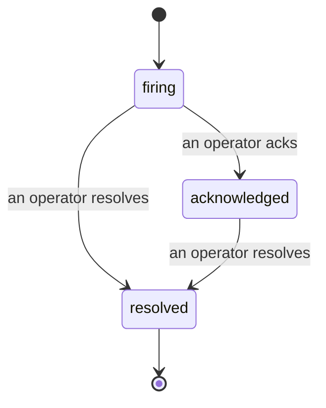

Quando scatta un alert, la prima domanda è sempre "chi se ne occupa?". Gli Incidents rispondono a questa domanda: nel momento in cui qualcosa viene rilevato, tutti possono vedere che l'incident è aperto, chi lo gestisce, e esattamente cosa è successo finora, con un registro pulito e attribuito che puoi usare direttamente in una post-mortem.

*La inbox raggruppa gli incident aperti per stato e filtra per severità e assegnatario, così vedi cosa ha bisogno di un intervento umano adesso.*

## Sapere chi se ne occupa, a colpo d'occhio

Niente più "qualcuno sta guardando questo?" in un thread di chat. Una rilevazione apre un incident automaticamente e lo inserisce in una inbox condivisa, raggruppato per stato. Riconoscilo e il tuo nome è su di esso, così il resto del team sa che è gestito. Il riconoscimento è condiviso: diversi operatori possono riconoscere lo stesso incident e ognuno viene registrato a parte, quindi un'intera war room appare per nome invece di calpestarvisi addosso. Assegna un proprietario per il triage, e filtra la inbox per severità o assegnatario per ridurla a quello che è tuo.

## L'intera storia, in una sola timeline

Quando l'incident è finito, hai già il rapporto. Apri un incident qualsiasi e ottieni l'evidenza della rilevazione, i suoi assegnatari e sottoscrittori, un thread di commenti per coordinare sul posto, e una timeline di attività in sola aggiunta.

*Tutto ciò che è accaduto, in ordine, ogni riga firmata da chi l'ha fatto.*

Ogni azione (aperto, riconosciuto, risolto, e così via) viene scritta in quella timeline e non viene mai modificata. Ogni entry è attribuita: all'operatore che l'ha eseguita, via email, o a **automated** per tutto ciò che FailproofAI Cloud ha fatto da solo, come aprire l'incident sulla rilevazione. Nulla è anonimo e nulla va perso, quindi la post-mortem più o meno si scrive da sola.

## Come si muove un incident

- **Open (firing):** la rilevazione apre l'incident e pagina i tuoi canali una volta. Rilevazioni ripetute si uniscono allo stesso incident e aggiornano l'evidenza invece di pagarti ancora e ancora.
- **Acknowledged:** un operatore se ne occupa. Rimane aperto, e successivamente le rilevazioni aggiornano l'evidenza silenziosamente.
- **Resolved:** un operatore lo chiude. La risoluzione automatica quando la condizione si cancella è pianificata ma non ancora abilitata, quindi un incident rimane aperto fino a quando un umano lo risolve, il che tiene tutti onesti riguardo a ciò che è effettivamente stato cancellato. Un incident nuovo può aprirsi sulla stessa regola in seguito.

Un alert contiene al massimo un incident aperto alla volta, quindi una regola instabile non può sommergerti di duplicati. Puoi anche aprire un incident manualmente: uno autonomo per qualcosa che nessun alert ha catturato, oppure uno collegato a un alert esistente, se hai `incidents:write`.

## Dove trovarlo

Gli Incidents si trovano a `/<org-slug>/incidents`. La visualizzazione richiede **`incidents:read`**; aprire un incident manuale richiede **`incidents:write`**; riconoscere, assegnare, commentare e risolvere richiedono **`incidents:ack`**. Le vecchie chiavi che hanno concesso il deprecated `alerts:ack` continuano a funzionare, poiché viene onorato come `incidents:ack`, quindi la tua rotazione on-call non ha bisogno di essere re-emessa.

## Correlati

- [Alerts](/it/cloud/alerts): le regole che aprono questi incident quando una soglia viene superata.
- [Error tracking](/it/cloud/errors): vedi ogni errore in un unico posto e promuovi uno a alert.
- [Audits](/it/cloud/audits): l'analista programmato che trova i guasti che nessuna regola stava controllando.