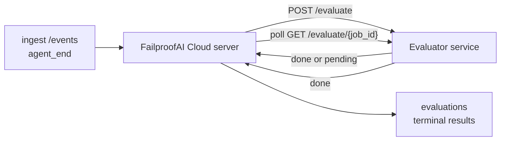

FailproofAI Cloud は、完了したすべてのエージェント実行を自動的に品質スコアリングできます。小さなスコアリングサービスを用意するだけで、あとは FailproofAI Cloud が処理します。追跡したい指標（有用性、ツール効率、事実性、安全性など、選択は自由）を管理し、品質低下を早期に検知し、エージェントや環境を一目で比較できます。スコアリングはオプトイン式です。サーバーに `EVALUATOR_ENDPOINT` を設定するまでパイプラインは何もしません。

> **注意:** スコアの次元はご自身が定義します。評価器はお好きな数値キーを返せます。FailproofAI Cloud は送り返された内容をそのまま保存・トレンド表示・ダッシュボード表示します。

## 概要

1. **スコアラーを作成する。** セッションのトランスクリプトを読み込んでスコアを返す小さな HTTP サービスを立ち上げます。FailproofAI Cloud には動作するリファレンス実装が含まれているのでコピーして使えます。[SDK を使った評価器の作成](#writing-an-evaluator-with-the-sdk) を参照してください。
2. **FailproofAI Cloud にエンドポイントを設定する。** サーバープロセスに `EVALUATOR_ENDPOINT`（および共有の `EVALUATOR_TOKEN`）を設定します。
3. **スコアを確認する。** 完了したセッションはすべて自動的にスコアリングされ、セッション詳細ページ・セッション一覧グリッド・保存済みダッシュボードに結果が表示されます。


*評価器を設定すると、完了した各実行がスコアリングされ、結果がセッションの右ペインに表示されます。上部にサマリー、続いて各次元のスコアバーと推論テキストが表示されます。*

---

## 仕組み



FailproofAI Cloud SDK がセッションの `agent_end` イベントを送出すると、サーバーは評価をスケジュールします。次に、完全なイベントトランスクリプトを評価器サービスに POST します。評価器は次のどちらかを行えます。

- **インラインで結果を返す:** `{"status":"done", "scores":{...}, "reasoning":{...}, "summary":"..."}` を返します。結果はセッションの評価タイムラインに追記されます。`reasoning` と `summary` はオプションです。
- **処理を遅延させる:** `{"status":"pending", "job_id":"abc-123"}` を返します。FailproofAI Cloud は評価器が `{"status":"done", ...}` または `{"status":"error", "error":"..."}` を返すまで `GET {EVALUATOR_ENDPOINT}/evaluate/abc-123` をポーリングします。

  ポーリング間隔はジョブごとに設定できます。`pending` レスポンスに `next_poll_secs` を含めると間隔を上書きできます。省略した場合、FailproofAI Cloud は `GET /config` の `default_poll_interval_secs` を使用し、それもなければ `EVALUATOR_POLLING_INTERVAL_SECS`（デフォルト 10 秒）にフォールバックします。すべての値は [1 秒、1 時間] にクランプされます。

`agent_end` を送出しないセッション（クラッシュしたエージェントプロセスなど）もピックアップできます。評価器の `GET /config` が `{"inactivity_timeout_secs": 1800}` を返すと、FailproofAI Cloud はその時間アイドル状態になったセッションを評価します。このフォールバックを無効にするには、フィールドを `null` に設定するか省略してください。

`EVALUATOR_ENDPOINT` が未設定の場合、パイプラインは完全に no-op になります。

セッションは時間の経過とともに**複数の終端評価を蓄積できます**。各 `agent_end` イベント（およびダッシュボードからの手動再評価）ごとに新しい評価行が追記されます。これは再開された会話を評価するサポート方式です。ユーザーがエージェントを終了し、後で戻ってさらにイベントを送信し、再度エージェントを終了すると、更新された完全なトランスクリプトに対して2回目の評価が実行されます。ダッシュボードは最新の評価をヘッドラインとして表示し、以前の評価は折りたたみ可能なタイムラインとして表示します。あるセッションに対して評価が実行中の間、そのセッションの追加 `agent_end` イベントは無視されます。実行中の評価が完了した後の次のイベントで、通常どおり新しい評価がエンキューされます。

アイドル状態フォールバックは再開されたセッションでも再び動作します。以前の終端評価後に新しいイベントが届き、その後セッションが `inactivity_timeout_secs` を超えてアイドル状態になった場合、新しい評価がエンキューされます。

一時的な障害（5xx、429、タイムアウト、ネットワークエラー）は `EVALUATOR_MAX_ATTEMPTS` に達するまで指数バックオフで再試行されます。4xx レスポンスは終端扱いです。FailproofAI Cloud は水平スケールされた複数のサーバーインスタンスで安全に実行できます。同じセッションが同時に2回ディスパッチされないようにワークが分割されます。

---

## HTTP コントラクト

認証が必要なすべてのルートは**ベアラートークン認証**を使用します。両側で同じ値を設定する必要があります。

- FailproofAI Cloud サーバー: 環境変数 `EVALUATOR_TOKEN`
- 評価器サービス: 同じ方法で設定（`agenteye-evaluator` SDK は慣例として `EVALUATOR_TOKEN` を読み込みます）

`EVALUATOR_TOKEN` が未設定の場合、サーバーは `Authorization` ヘッダーを送信しません。評価器は匿名リクエストを受け付けることができますが、内部ネットワーク専用であれば問題ありませんが、公開インターネット上では非推奨です。

### 評価器が提供するルート

| ルート | ボディ / パラメータ | レスポンス |
|---|---|---|
| `GET /health` | なし | `{"status":"ok"}` （オープン、認証不要） |
| `GET /config` | なし | `{"inactivity_timeout_secs": <int> \| null, "default_poll_interval_secs": <int> \| omitted}` |
| `POST /evaluate` | `EvalRequest` JSON | `{"status":"done", ...}` または `{"status":"pending", "job_id":"..."}` |
| `GET /evaluate/{id}` | なし | `/evaluate` と同じレスポンス形式 |

### サーバーが送信する `EvalRequest` ボディ

```json
{
  "schema_version": "1",
  "session_id":     "session-abc123",
  "agent_id":       "planner",
  "environment":    "production",
  "started_at":     "2026-05-10T12:00:00Z",
  "ended_at":       "2026-05-10T12:05:00Z",
  "events": [
    { "id": 1234, "ts": "...", "event_type": "agent_start", "payload": { ... } },
    ...
  ]
}
```

### レスポンス形式

**同期（done）:**

```json
{
  "status": "done",
  "scores": { "helpfulness": 0.85, "tool_efficiency": 0.6 },
  "reasoning": {
    "helpfulness": "answered the question directly with citations",
    "tool_efficiency": "called list_files three times when one would have done"
  },
  "summary": "strong answer quality, weak tool selection"
}
```

`reasoning`（スコアごとの根拠マップ）と `summary`（全体の概要段落）はどちらもオプションです。`reasoning` のキーは `scores` のキーと一致させてください。ダッシュボードは各エントリをスコアバーの下にインライン表示します。`scores` のみを返す旧来の評価器もそのまま動作します。`reasoning` と `summary` は null として扱われ、対応する UI 要素は省略されます。

**非同期（遅延）:**

```json
{ "status": "pending", "job_id": "abc-123", "next_poll_secs": 30 }
```

`next_poll_secs` はオプションです。省略した場合、サーバーは `/config` の `default_poll_interval_secs`、次に独自の `EVALUATOR_POLLING_INTERVAL_SECS` 環境変数にフォールバックします。

**評価器側の終端エラー:**

```json
{ "status": "error", "error": "model service unavailable" }
```

サーバーはその他の 2xx ボディをプロトコルエラーとして扱い、セッションに終端 `error` を記録します。

---

## SDK を使った評価器の作成

HTTP コントラクトを手動で実装する必要はありません。`agenteye-evaluator` Python パッケージは、認証・ルーティング・リクエスト/レスポンス形式を処理する型付き FastAPI ラッパーを提供します。

FailproofAI Cloud には、トランスクリプトの形状から `helpfulness`、`tool_efficiency`、`factuality` をスコアリングする**動作するリファレンス評価器**も含まれています。出発点としてコピーし、独自のロジック（LLM ジャッジ、ルールエンジンなど、品質基準に合ったもの）に置き換えてください。

最小限の評価器:

```python
import os
from agenteye_evaluator import Evaluator, EvalRequest, EvalResponse

app = Evaluator(token=os.environ["EVALUATOR_TOKEN"])

@app.evaluator
def run(req: EvalRequest) -> EvalResponse:
    # Inspect req.events (the full session transcript) and return scores.
    tool_calls = sum(1 for e in req.events if e.event_type == "tool_use")
    return EvalResponse(
        scores={"tool_calls": float(tool_calls)},
        reasoning={"tool_calls": f"{tool_calls} tool invocations in the transcript"},
        summary="tight tool loop" if tool_calls < 5 else "agent looped on tools",
    )
```

`app` インスタンスはあらゆる ASGI サーバーで動作するため、`uvicorn module:app` で起動できます。

重い処理を遅延させる必要がある評価器では、代わりに `JobPending` を返し、`@app.job_lookup` ハンドラーを登録してください。FailproofAI Cloud サーバーは評価器が終端ステータスを返すか、`EVALUATOR_MAX_POLL_DURATION_SECS` の上限（デフォルト 1 時間）に達するまで `GET /evaluate/{job_id}` をポーリングします。

完全な API リファレンス、非同期パターン、イベントスキーマは `agenteye-evaluator` SDK の README に記載されています。

---

## 評価器の実行

評価器は**ご自身のサービス**です。FailproofAI Cloud はデフォルトの評価器を提供しないため、ご自身のサービスを実行している場所でビルドして実行してください。任意の ASGI サーバー（例: `uvicorn my_evaluator:app`）で動作します。[HTTP コントラクト](#http-contract) の `/health`、`/config`、`/evaluate` ルートを提供し、サーバーからアクセスできるように設定してください（[サーバーの設定](#configuring-the-server) を参照）。

評価器に到達できるようになると、`GET /health` が `{"status":"ok"}` を返します。エージェントがエンドツーエンドで実行された後、サーバーの `GET /evaluations` は `status: "done"` と評価器が生成したスコアを含む行を返します。

---

## サーバーの設定

サーバープロセスに設定する環境変数:

| 環境変数 | 意味 |
|---|---|
| `EVALUATOR_ENDPOINT` | 評価器のベース URL（`http://evaluator:9000`）。未設定の場合、パイプラインは無効化されます。 |
| `EVALUATOR_TOKEN` | ベアラートークン。評価器サービスに設定された値と一致する必要があります。 |
| `EVALUATOR_WORKERS` | サーバーインスタンスあたりのワーカータスク数（デフォルト 2）。 |
| `EVALUATOR_CLAIM_BATCH` | ワーカーティックごとにクレームする行数（デフォルト 4）。バッチは**並行して**処理されます。評価器エンドポイントへの実効並行数は `EVALUATOR_WORKERS × EVALUATOR_CLAIM_BATCH` になります。 |
| `EVALUATOR_POLL_IDLE_SECS` | 評価が不要なときにワーカーがディスパッチ試行の間にスリープする時間（デフォルト 2 秒）。 |
| `EVALUATOR_POLLING_INTERVAL_SECS` | レスポンスごとの `next_poll_secs` も評価器の `default_poll_interval_secs` も設定されていない場合の `GET /evaluate/{id}` ポーリング間隔の最終フォールバック（デフォルト 10 秒）。 |
| `EVALUATOR_REQUEST_TIMEOUT_MS` | リクエストごとのタイムアウト（デフォルト 30000）。 |
| `EVALUATOR_MAX_ATTEMPTS` | この回数の一時的な障害後、結果が終端 `error` として記録されます（デフォルト 5）。 |
| `EVALUATOR_CONFIG_REFRESH_SECS` | `GET /config` のポーリング間隔（デフォルト 300）。 |
| `EVALUATOR_MAX_POLL_DURATION_SECS` | セッションがポーリングキューに残れる最大ウォールクロック時間。この時間を超えると `timeout` として終了されます（デフォルト 3600 秒）。永遠に `pending` を返し続ける評価器を防ぎます。 |

自動スコアリングを有効にするには、サーバーに `EVALUATOR_ENDPOINT` と `EVALUATOR_TOKEN` の両方を設定し、サーバーを再起動して変更を反映させてください。`EVALUATOR_ENDPOINT` が未設定の場合、パイプラインは no-op のままです。

上記のチューニングパラメータはオプションです。デフォルト値を変更する必要がある場合のみ、対応する環境変数をサーバーに設定してください。

---

## API リファレンス

| メソッド | パス | 必要な権限 | 目的 |
|---|---|---|---|
| `GET` | `/evaluations` | `evaluations:read` | 終端結果を照会します。`session_id`、`agent_id`、`environment`、`status`（`done`/`error`/`timeout`）、`ts_from`、`ts_to`、`cursor`、`limit`、`score_filters`、`latest_per_session` をサポートします。`limit` のデフォルトは 50 で上限は 200 です（1000 が上限の `/events` とは異なります）。`environment` はカンマ区切りリストを受け付けます（例: `environment=prod,staging`）。単一の値も引き続き使用できます。`latest_per_session=true` にすると、レスポンスには `session_id` ごとに最大 1 行（`completed_at` が最新のもの）が含まれます。セッションの評価タイムラインを現在のヘッドラインに折りたたむためにセッション一覧ページで使用されます。デフォルトは false（完全な履歴を返します）。 |
| `GET` | `/evaluations/aggregate` | `evaluations:read` | フィルタリングされたスライスの評価ヘルスをロールアップします。総数、done/error/timeout の内訳、スコアキーごとの統計（任意の `scores` キーにわたる count/avg/min/max/p50）、時間バケット化されたタイムラインを返します。**`/evaluations` と同じフィルターパラメータ**に加えて `featured_keys`（トレンド表示するスコアキーの CSV）と `latest_per_session` を受け付けます。ダッシュボード機能を動かします。メトリクスはサンプリングではなく、マッチするセットの全体にわたって正確です。 |
| `GET` | `/evaluations/environments` | `evaluations:read` | `evaluations` テーブルから個別の環境値を返します。評価可能データにスコープされたフィルタードロップダウンの入力に使用されます。 |
| `GET` | `/evaluation-jobs` | `evaluations:read` | 処理中の評価の可視性を提供します。`status`（`pending`/`polling`）でフィルタリングできます。 |
| `GET` | `/events` | `events:read` | セッションの生イベントをストリームします。`session_id`、`agent_id`、`event_type`（CSV）、`environment`（CSV）、`ts_from`、`ts_to`、`cursor`、`limit`、`order` をサポートします。`order` は `desc`（新しい順、デフォルト）または `asc`（古い順）です。認識されない値は `desc` にフォールバックします。レスポンスの `next_cursor`（イベント ID）でカーソルページネーションします。`cursor` として渡すと次のページを取得できます。`asc` ではそのID以降のイベント、`desc` ではそのID以前のイベントが返されます。`limit` のデフォルトは 50 で上限は 1000 です。 |
| `GET` | `/sessions/:session_id/export` | `events:read` | このセッションで評価器が受け取る正確な JSON ボディを `session-<id>.json` という名前のダウンロード可能な添付ファイルとして返します。本番セッションを `agenteye-evaluator` でオフラインテストするためのリプレイに便利です。バイトは評価器パイプラインが送信するものとバイト単位で同一です。 |
| `POST` | `/sessions/:session_id/re-evaluate` | `evaluations:trigger` | セッションの新しい評価をエンキューします。以前の評価が存在するかどうかに関係なく実行されます。新しい結果は前の結果を上書きするのではなく、セッションの評価タイムラインに**追記**されるため、以前のスコアは履歴として残ります。エンキュー成功時は `202`、不明なセッションには `404`、評価がすでに進行中の場合は `409` を返します。新しい評価器をデプロイした後や、`agent_end` を送出しなかったセッションに使用してください。 |

### スコア範囲でのフィルタリング: `score_filters`

`GET /evaluations` はオプションの `score_filters` パラメータを受け付けます。これにより `scores` オブジェクト内の数値で結果を絞り込めます。パラメータは `key:min..max` エントリのカンマ区切りリストです。どちらの境界も省略できます。複数のエントリは論理 AND で結合されます。指定したキーが存在しない行や非数値の行は除外されます。リクエストには最大 20 のフィルターエントリを含められます。超過した場合は HTTP 400 が返されます。

例:
```text
# helpfulness が [0.5, 0.8] の範囲
GET /evaluations?score_filters=helpfulness:0.5..0.8

# tool_efficiency が最大 0.3（下限なし）
GET /evaluations?score_filters=tool_efficiency:..0.3

# helpfulness >= 0.5 かつ factuality >= 0.9
GET /evaluations?score_filters=helpfulness:0.5..,factuality:0.9..
```

各 `/evaluations` レスポンスオブジェクトには以下のフィールドが含まれます:

| フィールド | 型 | 備考 |
|---|---|---|
| `evaluation_id` | string (UUID) | この終端評価の標準識別子。各終端評価に新しい UUID が割り当てられます。1 つのセッションが複数持てます。 |
| `id` | string (UUID) | `evaluation_id` と同じ値を持つ後方互換エイリアス。 |
| `session_id` | string | この評価が実行されたセッション。セッションはタイムライン内に複数の評価を持てます。 |
| `agent_id` | string | セッションを生成したエージェントを識別します。 |
| `environment` | string | セッションからコピーされた環境ラベル。 |
| `status` | enum | `"done"`、`"error"`、`"timeout"` のいずれか。 |
| `scores` | object \| null | 評価器が返したスコア。 |
| `reasoning` | object \| null | 評価器が返したオプションのスコアごとの根拠マップ。キーは通常 `scores` のキーと一致します。ダッシュボードは各エントリをスコアバーの下に表示します。 |
| `summary` | string \| null | 評価器が返したオプションの全体概要段落。ダッシュボードはこれをスコア内訳の上に評価のヘッドラインとして表示します。 |
| `error` | string \| null | `"error"` / `"timeout"` 時のみ設定されます。 |
| `attempt_count` | integer | ディスパッチ試行回数（1 以上）。 |
| `duration_ms` | integer \| null | 最終試行の所要時間。 |
| `completed_at` | string (ISO 8601 UTC) | 終端結果が記録された時刻。結果は `completed_at` の降順（新しい順）でソートされます。 |
| `created_at` | string (ISO 8601 UTC) | `completed_at` と同じタイムスタンプ（書き込み一度のセマンティクス）。 |

---

## 権限

| 権限 | 付与される操作 |
|---|---|
| `evaluations:read` | 評価結果の一覧表示、ダッシュボードでのスコア閲覧、ダッシュボードヘルスメトリクスの読み込み。 |
| `evaluations:trigger` | `POST /sessions/:session_id/re-evaluate` またはダッシュボードの再評価ボタンからセッションの評価を手動でエンキュー。 |
| `dashboards:read` | 保存済みダッシュボードの閲覧（メトリクスの読み込みには `evaluations:read` も必要）。 |
| `dashboards:write` | ダッシュボードの作成と編集。 |
| `dashboards:delete` | ダッシュボードの削除。 |

ブートストラップ管理者（`ADMIN_KEY`、`ADMIN_EMAIL`）はこれらすべてを自動的に受け取ります。

---

## 結果の閲覧

- **`/sessions/<id>`**: イベントタイムラインと、セッションのスコアおよびディスパッチ試行からのエラーを表示する右ペイン。キーに `evaluations:trigger` 権限がある場合、エクスポートボタンの横に**再評価**ボタンが表示されます。`agent_end` を送出しなかったセッションや、新しい評価器をデプロイした後にスコアを更新する際に便利です。ダッシュボードは新しい結果をポーリングし、届いた時点で右ペインを更新します。
- **`/sessions`**: フィルタリング可能なセッション一覧グリッド。スコア列で各セッションの評価ステータスとスコアを一目で確認できます。
- **`/dashboards`**: 保存済みの評価ヘルスビュー（以下の[ダッシュボード](#dashboards)を参照）。


*セッション一覧グリッドでは各実行の評価ステータスとスコアを一目で確認できます。赤/黄/緑のバッジで低スコアをすぐに発見できます。*

---

## ダッシュボード

**ダッシュボード**ページ（`/dashboards`）では、評価フィルターの組み合わせを名前付きの再利用可能なビューとして保存し、そのスライスの評価状態を一目で確認できます。ダッシュボードは**組織全体で共有されます**。`dashboards:read` 権限を持つ全員が同じセットを閲覧できます。

各ダッシュボードが保持する内容:

- **フィルター**: セッションページと同じコントロール（環境、ステータス、エージェント、ローリング時間ウィンドウ、スコア範囲フィルター（`key:min..max`））。
- **表示設定**: 表示するスコアキー、緑/黄/赤のヘルスしきい値、表示するパネル、セッションごとに最新の評価に折りたたむかどうか。

各カードにはマッチするセッション数、done/error/timeout の内訳、各注目スコアの平均、小さなトレンドスパークラインが表示されます。ダッシュボードを開くとフルサイズのパネルが表示されます。**セッションで開く**をクリックすると、そのスライスに絞り込まれた状態でセッションページが開きます。メトリクスはサーバーサイドでマッチするセット全体にわたって計算されます（`GET /evaluations/aggregate` 経由）。そのため数値はサンプリングではなく正確です。


**権限:** 閲覧には `dashboards:read` と `evaluations:read` の両方が必要です。作成と編集には `dashboards:write`、削除には `dashboards:delete` が必要です。ブートストラップ管理者はこれらすべてを自動的に受け取ります。

---

## トラブルシューティング

**セッションは存在するが評価が作成されない。** サーバープロセスに `EVALUATOR_ENDPOINT` が設定されていること、サーバーと評価器が同じ `EVALUATOR_TOKEN` の値を共有していること、評価器の `/health` エンドポイントがサーバーから到達可能であることを確認してください。`EVALUATOR_ENDPOINT` が未設定の場合、パイプラインは no-op です。

**処理中の評価が積み上がる。** `GET /evaluation-jobs` でインフライトキューを確認してください。各行の `attempt_count`、`next_attempt_at`、`last_error` を確認してください。よくある原因: 評価器サービスに到達できないか 5xx を返している（バックオフで再試行）、`EVALUATOR_TOKEN` が間違っている（401 は終端）、`pending` を無限に返す非同期評価器（以下を参照）。

**セッションが完了したが終端評価がない。** `GET /evaluation-jobs?status=polling` を照会してください。まだ処理中かもしれません。ジョブが `pending` のままスタックしている場合、サーバーが評価器に到達できていません。評価器が起動していること、`EVALUATOR_TOKEN` が一致していることを確認してください。

**`評価器からの HTTP 401: 無効なベアラートークン`。** サーバーの `EVALUATOR_TOKEN` が評価器サービスに設定された値と一致していません。両方が同一である必要があります。

**非同期評価器が永遠に `pending` を返す。** サーバーは評価器が `done` または `error` を返すか、`EVALUATOR_MAX_POLL_DURATION_SECS`（デフォルト 1 時間）が経過するまで `GET /evaluate/{job_id}` をポーリングします。上限を超えると評価は `timeout` として記録され、インフライトキューから削除されます。評価器が正当にデフォルトより長い時間を必要とする場合は `EVALUATOR_MAX_POLL_DURATION_SECS` を増やしてください。

---

## 次のステップ

- [評価器エージェントスキル](/ja/cloud/agent-skills): コーディングエージェントに、実際のセッションに対して次元を設計し、このサービスを構築させる。
- [Python SDK](/ja/cloud/sdk): スコアリングをトリガーする `agent_end` イベントを送出する。
- [API キー](/ja/cloud/access): `evaluations:read` と `evaluations:trigger` 権限。
- [監査](/ja/cloud/audits): FailproofAI Cloud のもう一つの自動品質機能、ポリシーベースのレビュー。