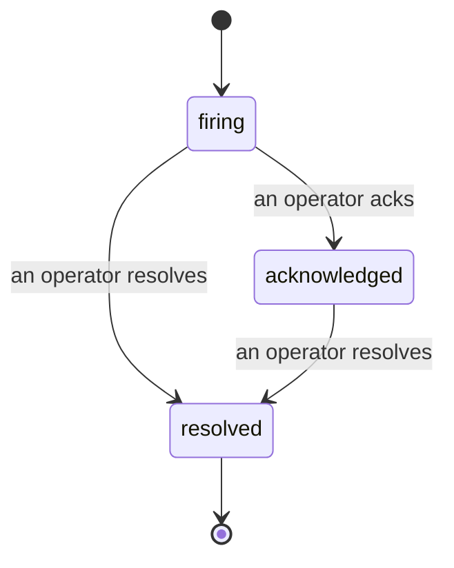

アラートが発火したとき、最初に浮かぶ疑問は常に「誰が対応しているのか?」です。インシデントはその答えを提供します。何かが閾値を超えた瞬間に、全員がインシデントの発生、担当者、そしてこれまでの経緯を正確に把握できます。また、ポストモーテムにそのまま活用できる、クリーンで帰属情報付きの記録が残ります。

*受信トレイはオープンなインシデントを状態別にグループ化し、重大度や担当者でフィルタリングできるため、今すぐ人が対応すべきものを一目で確認できます。*

## 誰が担当しているか、一目でわかる

チャットスレッドで「誰か見ていますか?」とやり取りする必要はもうありません。閾値を超えるとインシデントが自動的に作成され、状態ごとにグループ化された共有受信トレイに表示されます。対応を宣言すると名前が表示され、チームの他のメンバーは対応中であることを把握できます。宣言はチームで共有されます。複数のオペレーターが同じインシデントを宣言でき、それぞれが個別に記録されるため、ウォールームのメンバー全員が名前で識別され、互いに情報が上書きされることはありません。トリアージ担当者を一人アサインし、重大度や担当者で受信トレイをフィルタリングして、自分が担当するものだけに絞り込めます。

## 全経緯を、一つのタイムラインで

インシデントが解決したとき、ドキュメントはすでに出来上がっています。任意のインシデントを開くと、閾値超過の証拠、担当者とサブスクライバー、その場での連携用コメントスレッド、そして追記のみ可能なアクティビティタイムラインが表示されます。

*起きたことすべてが時系列で並び、各行には実行した担当者の名前が付いています。*

すべてのアクション（作成、宣言、解決など）はタイムラインに書き込まれ、後から編集されることはありません。各エントリには帰属情報が付きます。アクションを実行したオペレーターのメールアドレス、または FailproofAI Cloud が自律的に行った処理（閾値超過時のインシデント作成など）の場合は **automated** と表示されます。匿名のものも、失われるものも一切ありません。ポストモーテムはほぼ自動的に出来上がります。

## インシデントの状態遷移

- **オープン (firing):** 閾値超過によりインシデントが作成され、通知チャンネルに一度だけページングされます。繰り返し発生した閾値超過は同じインシデントにまとめられ、何度もページングされる代わりに証拠が更新されます。
- **宣言済み (acknowledged):** オペレーターが対応を引き受けます。インシデントはオープンのまま維持され、その後の閾値超過は静かに証拠を更新します。
- **解決済み (resolved):** オペレーターがクローズします。条件が解消されたときの自動解決は計画中ですが、まだ有効になっていません。そのため、インシデントは人間が解決するまでオープンのまま残り、実際に何が解消されたかについて全員が誠実に向き合えます。同じアラートで後から新たなインシデントが作成されることもあります。

一つのアラートに対して同時にオープンできるインシデントは最大一つです。そのため、ルールがフラッピングしても重複したインシデントに埋もれることはありません。アラートが検知できなかった事象に対してスタンドアロンのインシデントを手動で作成したり、既存のアラートに紐づけたりすることも可能です（`incidents:write` 権限が必要です）。

## アクセス方法

インシデントは `/<org-slug>/incidents` にあります。閲覧には **`incidents:read`**、手動インシデントの作成には **`incidents:write`**、宣言・アサイン・コメント・解決には **`incidents:ack`** が必要です。廃止された `alerts:ack` を付与された古いキーも引き続き動作します。`incidents:ack` として認識されるため、オンコールローテーションを再発行する必要はありません。

## 関連項目

- [アラート](/ja/cloud/alerts): 閾値を超えたときにインシデントを作成するルール。
- [エラートラッキング](/ja/cloud/errors): すべての障害を一か所で確認し、アラートに昇格させる。
- [監査](/ja/cloud/audits): どのルールも監視していなかった障害を発見する、スケジュール済みアナリスト。