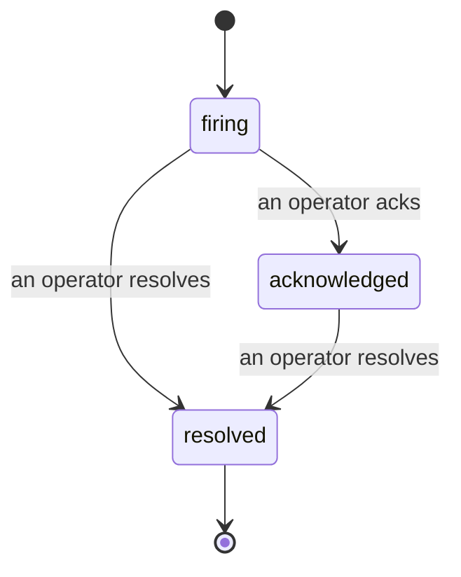

알림이 발생했을 때 가장 먼저 드는 질문은 언제나 "누가 담당하고 있나요?"입니다. 인시던트가 그 답을 제공합니다. 무언가 임계값을 초과하는 순간, 누구나 인시던트가 열려 있다는 사실, 담당자가 누구인지, 지금까지 정확히 어떤 일이 있었는지를 확인할 수 있습니다. 사후 검토(post-mortem)에 바로 활용할 수 있는 깔끔하고 귀속된 기록과 함께요.

*인박스는 열린 인시던트를 상태별로 그룹화하고 심각도 및 담당자로 필터링하므로, 지금 즉시 사람이 처리해야 할 것이 무엇인지 바로 확인할 수 있습니다.*

## 담당자를 한눈에 파악하세요

채팅 스레드에서 "누가 보고 있나요?"라고 묻는 일은 이제 없습니다. 임계값이 초과되면 인시던트가 자동으로 열리고 공유 인박스에 상태별로 그룹화되어 추가됩니다. 인시던트를 확인(acknowledge)하면 여러분의 이름이 붙어 나머지 팀원들이 처리되고 있다는 것을 알 수 있습니다. 확인은 공유 방식으로 이루어집니다. 여러 명의 운영자가 동일한 인시던트를 확인할 수 있으며, 각각이 개별적으로 기록되기 때문에 대규모 대응 상황에서도 서로 겹치지 않고 이름별로 표시됩니다. 트리아지(triage)를 위한 단일 담당자를 지정하고, 심각도 또는 담당자로 인박스를 필터링해서 자신이 처리해야 할 항목만 볼 수 있습니다.

## 전체 경과를 하나의 타임라인으로

인시던트가 종료되면 이미 보고서가 완성되어 있습니다. 인시던트를 열면 임계값 초과 증거, 담당자 및 구독자, 현장에서 협업을 위한 댓글 스레드, 그리고 추가 전용(append-only) 활동 타임라인을 확인할 수 있습니다.

*발생한 모든 일이 순서대로 기록되며, 각 항목마다 실행한 담당자의 서명이 붙습니다.*

모든 액션(열림, 확인, 해결 등)은 해당 타임라인에 기록되며 절대 수정되거나 삭제되지 않습니다. 각 항목은 귀속됩니다. 액션을 취한 운영자의 이메일로, 또는 임계값 초과 시 인시던트를 여는 것처럼 FailproofAI Cloud가 자체적으로 수행한 작업에는 **automated**로 표시됩니다. 익명 처리되거나 손실되는 것은 없으므로, 사후 검토가 거의 자동으로 완성됩니다.

## 인시던트의 상태 전환

- **열림(firing):** 임계값 초과 시 인시던트가 열리고 채널에 한 번 알림이 전송됩니다. 반복적인 임계값 초과는 동일한 인시던트에 통합되며, 반복 알림 대신 증거만 갱신됩니다.
- **확인됨(acknowledged):** 운영자가 인시던트를 담당합니다. 인시던트는 열린 상태를 유지하며, 이후 임계값 초과 발생 시 증거가 조용히 업데이트됩니다.
- **해결됨(resolved):** 운영자가 인시던트를 종료합니다. 조건이 해소될 때 자동으로 해결되는 기능은 계획 중이지만 아직 활성화되지 않았습니다. 따라서 인시던트는 사람이 해결할 때까지 열린 상태로 유지되어, 실제로 무엇이 해소되었는지에 대한 책임이 명확히 유지됩니다. 이후 동일한 알림에서 새로운 인시던트가 다시 열릴 수 있습니다.

하나의 알림에는 최대 하나의 열린 인시던트만 존재할 수 있으므로, 불안정하게 반복되는 규칙으로 인해 중복 인시던트가 쌓이는 일은 없습니다. `incidents:write` 권한이 있다면 수동으로 인시던트를 열 수도 있습니다. 어떤 알림도 감지하지 못한 상황을 위한 독립 인시던트, 또는 기존 알림에 연결된 인시던트를 생성할 수 있습니다.

## 위치

인시던트는 `/<org-slug>/incidents`에 있습니다. 조회에는 **`incidents:read`**, 수동 인시던트 생성에는 **`incidents:write`**, 확인·담당자 지정·댓글·해결에는 **`incidents:ack`** 권한이 필요합니다. 이전에 발급된 키로 부여된 `alerts:ack` 권한은 `incidents:ack`와 동일하게 처리되므로, 온콜 로테이션을 위해 키를 재발급할 필요가 없습니다.

## 관련 항목

- [알림](/ko/cloud/alerts): 임계값이 초과될 때 인시던트를 여는 규칙입니다.
- [오류 추적](/ko/cloud/errors): 모든 장애를 한 곳에서 확인하고 알림으로 승격시킵니다.
- [감사](/ko/cloud/audits): 어떤 규칙도 감지하지 못한 장애를 찾아내는 예약된 분석기입니다.