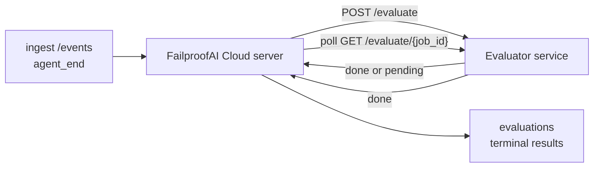

O FailproofAI Cloud pode pontuar automaticamente cada execução de agente concluída em termos de qualidade: você fornece um pequeno serviço de pontuação e o FailproofAI Cloud cuida do restante. Use-o para acompanhar as dimensões que importam para você (utilidade, eficiência de ferramentas, veracidade, segurança — você escolhe), identificar regressões cedo e comparar agentes ou ambientes de forma rápida. A pontuação é opcional: o pipeline não faz nada até que você defina `EVALUATOR_ENDPOINT` no servidor.

> **Nota:** Você define as dimensões de pontuação. Seu avaliador pode retornar quaisquer chaves numéricas que desejar; o FailproofAI Cloud armazena, acompanha tendências e exibe tudo o que você enviar.

## Resumo

1. **Escreva um avaliador.** Suba um pequeno serviço HTTP que leia a transcrição de uma sessão e retorne pontuações. O FailproofAI Cloud inclui um exemplo funcional que você pode copiar. Veja [Escrevendo um avaliador com o SDK](/pt-br/cloud/evaluators).
2. **Aponte o FailproofAI Cloud para ele.** Defina `EVALUATOR_ENDPOINT` (e um `EVALUATOR_TOKEN` compartilhado) no processo do servidor.
3. **Acompanhe as pontuações.** Cada sessão concluída é pontuada automaticamente; os resultados aparecem na página de detalhes da sessão, na grade de sessões e nos dashboards salvos.


*Após configurar um avaliador, cada execução concluída é pontuada e os resultados aparecem no painel direito da sessão: o resumo no topo, seguido pelas barras de pontuação por dimensão com o raciocínio correspondente.*

---

## Como funciona



Quando o SDK do FailproofAI Cloud emite um evento `agent_end` para uma sessão, o servidor
agenda uma avaliação. Em seguida, ele envia via POST a transcrição completa de eventos para o
seu serviço avaliador, que pode:

- **Retornar o resultado inline** com `{"status":"done", "scores":{...}, "reasoning":{...}, "summary":"..."}`. O
  resultado é anexado à linha do tempo de avaliações da sessão. `reasoning` e
  `summary` são opcionais.
- **Adiar** com `{"status":"pending", "job_id":"abc-123"}`. O FailproofAI Cloud então
  chama `GET {EVALUATOR_ENDPOINT}/evaluate/abc-123` até que seu avaliador
  retorne `{"status":"done", ...}` ou `{"status":"error", "error":"..."}`.

  O intervalo de polling é por job: uma resposta `pending` pode incluir
  `next_poll_secs` para sobrescrever o valor padrão; caso contrário, o FailproofAI Cloud usa o
  valor `default_poll_interval_secs` de `GET /config`; caso contrário, o servidor
  recorre a `EVALUATOR_POLLING_INTERVAL_SECS` (padrão: 10s). Todos os valores
  são limitados ao intervalo [1s, 1h].

Sessões que nunca emitem `agent_end` (por exemplo, um processo de agente que travou)
também podem ser processadas: o `GET /config` do avaliador pode retornar
`{"inactivity_timeout_secs": 1800}`, e o FailproofAI Cloud avaliará qualquer sessão
que estiver inativa por esse tempo. Defina o campo como `null` ou omita-o para
desabilitar esse fallback.

O pipeline é completamente inativo quando `EVALUATOR_ENDPOINT` não está definido.

Uma sessão pode acumular **múltiplas avaliações terminais ao longo do tempo**: cada
evento `agent_end` (e cada re-avaliação manual pelo dashboard) acrescenta uma
nova linha de avaliação. Esta é a forma recomendada de avaliar uma conversa retomada:
um usuário encerra um agente, volta mais tarde, envia mais eventos,
encerra o agente novamente, e uma segunda avaliação é executada contra a transcrição
completa atualizada. O dashboard exibe a avaliação mais recente como título
e as avaliações anteriores como uma linha do tempo recolhível. Enquanto uma
avaliação está em andamento para uma sessão, eventos `agent_end` adicionais para essa
sessão são ignorados; o próximo evento após a conclusão da avaliação em andamento
enfileirará uma nova avaliação normalmente.

O fallback por inatividade também se aplica a sessões retomadas: se novos eventos
chegarem após uma avaliação terminal anterior e a sessão ficar inativa
além de `inactivity_timeout_secs`, uma nova avaliação é enfileirada.

Falhas transitórias (5xx, 429, timeouts, erros de rede) são repetidas com
backoff exponencial até `EVALUATOR_MAX_ATTEMPTS`; respostas 4xx são
terminais. O FailproofAI Cloud pode ser executado com múltiplas instâncias de servidor
com escalonamento horizontal; o trabalho é particionado para que a mesma sessão nunca seja
despachada duas vezes simultaneamente.

---

## Contrato HTTP

Todas as rotas autenticadas usam **autenticação por bearer token**. O mesmo valor deve ser
configurado nos dois lados:

- Servidor do FailproofAI Cloud: variável de ambiente `EVALUATOR_TOKEN`
- Serviço avaliador: configurado da mesma forma (o SDK `agenteye-evaluator`
  lê `EVALUATOR_TOKEN` por convenção)

Se `EVALUATOR_TOKEN` não estiver definido, o servidor não envia o cabeçalho `Authorization`; o
avaliador pode então aceitar requisições anônimas, o que é aceitável para uma
rede interna, mas não é recomendado na internet pública.

### Rotas que o avaliador deve servir

| Rota | Corpo / parâmetros | Resposta |
|---|---|---|
| `GET /health` | nenhum | `{"status":"ok"}` (aberta, sem autenticação) |
| `GET /config` | nenhum | `{"inactivity_timeout_secs": <int> \| null, "default_poll_interval_secs": <int> \| omitted}` |
| `POST /evaluate` | JSON `EvalRequest` | `{"status":"done", ...}` ou `{"status":"pending", "job_id":"..."}` |
| `GET /evaluate/{id}` | nenhum | mesmo formato de resposta que `/evaluate` |

### Corpo `EvalRequest` enviado pelo servidor

```json
{
  "schema_version": "1",
  "session_id":     "session-abc123",
  "agent_id":       "planner",
  "environment":    "production",
  "started_at":     "2026-05-10T12:00:00Z",
  "ended_at":       "2026-05-10T12:05:00Z",
  "events": [
    { "id": 1234, "ts": "...", "event_type": "agent_start", "payload": { ... } },
    ...
  ]
}
```

### Formatos de resposta

**Síncrono (done):**

```json
{
  "status": "done",
  "scores": { "helpfulness": 0.85, "tool_efficiency": 0.6 },
  "reasoning": {
    "helpfulness": "answered the question directly with citations",
    "tool_efficiency": "called list_files three times when one would have done"
  },
  "summary": "strong answer quality, weak tool selection"
}
```

`reasoning` (um mapa de justificativa por pontuação) e `summary` (uma narrativa
geral em um parágrafo) são ambos opcionais. As chaves em `reasoning` devem
espelhar as chaves em `scores`; o dashboard renderiza cada entrada inline abaixo
da barra de pontuação correspondente. Avaliadores mais antigos que retornam apenas `scores` continuam
funcionando sem alterações; `reasoning` e `summary` simplesmente são lidos como null e
os elementos visuais correspondentes na interface são omitidos.

**Assíncrono (adiado):**

```json
{ "status": "pending", "job_id": "abc-123", "next_poll_secs": 30 }
```

`next_poll_secs` é opcional; se omitido, o servidor recorre ao
`default_poll_interval_secs` do avaliador em `/config` e, em seguida, à sua própria
variável de ambiente `EVALUATOR_POLLING_INTERVAL_SECS`.

**Erro terminal no lado do avaliador:**

```json
{ "status": "error", "error": "model service unavailable" }
```

O servidor trata qualquer outro corpo 2xx como um erro de protocolo e registra um
`error` terminal para a sessão.

---

## Escrevendo um avaliador com o SDK

Você não precisa implementar o contrato HTTP manualmente. O pacote Python `agenteye-evaluator`
fornece um wrapper FastAPI tipado que cuida da autenticação, roteamento e
dos formatos de requisição/resposta por você.

O FailproofAI Cloud também inclui um **avaliador de referência funcional** que
pontua `helpfulness`, `tool_efficiency` e `factuality` a partir do formato da
transcrição. Copie-o como ponto de partida e substitua pela sua própria lógica: um
juiz LLM, um motor de regras, o que melhor se adequar ao seu padrão de qualidade.

Avaliador mínimo viável:

```python
import os
from agenteye_evaluator import Evaluator, EvalRequest, EvalResponse

app = Evaluator(token=os.environ["EVALUATOR_TOKEN"])

@app.evaluator
def run(req: EvalRequest) -> EvalResponse:
    # Inspect req.events (the full session transcript) and return scores.
    tool_calls = sum(1 for e in req.events if e.event_type == "tool_use")
    return EvalResponse(
        scores={"tool_calls": float(tool_calls)},
        reasoning={"tool_calls": f"{tool_calls} tool invocations in the transcript"},
        summary="tight tool loop" if tool_calls < 5 else "agent looped on tools",
    )
```

A instância `app` roda sob qualquer servidor ASGI, portanto `uvicorn module:app` a inicializa.

Para avaliadores que precisam adiar trabalho pesado, retorne `JobPending`
em vez disso e registre um handler `@app.job_lookup`; o servidor do FailproofAI Cloud
faz polling em `GET /evaluate/{job_id}` até que você retorne um status terminal ou o
limite `EVALUATOR_MAX_POLL_DURATION_SECS` (padrão: 1 h) seja atingido.

A referência completa da API, o padrão assíncrono e o esquema de eventos estão documentados no
README do SDK `agenteye-evaluator`.

---

## Executando seu avaliador

O avaliador é **seu serviço** — o FailproofAI Cloud não inclui um
avaliador padrão, então você o constrói e executa onde preferir.
Ele roda sob qualquer servidor ASGI (por exemplo, `uvicorn my_evaluator:app`); sirva
as rotas `/health`, `/config` e `/evaluate` conforme o
[contrato HTTP](/pt-br/cloud/evaluators) e então aponte o servidor para ele (veja
[Configurando o servidor](/pt-br/cloud/evaluators)).

Quando o avaliador estiver acessível, `GET /health` retorna `{"status":"ok"}`. Após
uma execução completa do agente, `GET /evaluations` no servidor retorna uma linha com
`status: "done"` e as pontuações produzidas pelo seu avaliador.

---

## Configurando o servidor

Defina no processo do servidor:

| Variável de ambiente | Significado |
|---|---|
| `EVALUATOR_ENDPOINT` | URL base do seu avaliador (`http://evaluator:9000`). Sem definição = pipeline desabilitado. |
| `EVALUATOR_TOKEN` | Bearer token. Deve ser igual ao valor configurado no serviço avaliador. |
| `EVALUATOR_WORKERS` | Tarefas de worker por instância do servidor (padrão: 2). |
| `EVALUATOR_CLAIM_BATCH` | Linhas processadas por tick do worker (padrão: 4). Os lotes são processados **de forma concorrente**; a concorrência efetiva no endpoint do avaliador é `EVALUATOR_WORKERS × EVALUATOR_CLAIM_BATCH`. |
| `EVALUATOR_POLL_IDLE_SECS` | Quanto tempo um worker dorme entre tentativas de despacho quando nenhuma avaliação está pendente (padrão: 2s). |
| `EVALUATOR_POLLING_INTERVAL_SECS` | Fallback final para o intervalo de `GET /evaluate/{id}` quando nem `next_poll_secs` por resposta nem `default_poll_interval_secs` do avaliador estão definidos (padrão: 10s). |
| `EVALUATOR_REQUEST_TIMEOUT_MS` | Timeout por requisição (padrão: 30000). |
| `EVALUATOR_MAX_ATTEMPTS` | Após esse número de falhas transitórias, o resultado é registrado como `error` terminal (padrão: 5). |
| `EVALUATOR_CONFIG_REFRESH_SECS` | Intervalo de `GET /config` (padrão: 300). |
| `EVALUATOR_MAX_POLL_DURATION_SECS` | Tempo máximo de relógio que uma sessão pode permanecer na fila de polling antes de ser encerrada como `timeout` (padrão: 3600s). Protege contra avaliadores que ficam retornando `pending` indefinidamente. |

Para ativar a pontuação automática, defina tanto `EVALUATOR_ENDPOINT` quanto
`EVALUATOR_TOKEN` no servidor e, em seguida, reinicie-o para aplicar a mudança. Com
`EVALUATOR_ENDPOINT` não definido, o pipeline permanece inativo.

Os ajustes acima são opcionais; defina as variáveis de ambiente correspondentes
no servidor somente se precisar sobrescrever os valores padrão.

---

## Referência da API

| Método | Caminho | Permissão necessária | Finalidade |
|---|---|---|---|
| `GET` | `/evaluations` | `evaluations:read` | Consultar resultados terminais. Suporta `session_id`, `agent_id`, `environment`, `status` (`done`/`error`/`timeout`), `ts_from`, `ts_to`, `cursor`, `limit`, `score_filters`, `latest_per_session`. `limit` tem padrão 50 e máximo 200 (diferente de `/events`, que tem máximo 1000). `environment` aceita uma lista separada por vírgula (ex.: `environment=prod,staging`); valores únicos também funcionam. Com `latest_per_session=true`, a resposta contém no máximo uma linha por `session_id` (a mais recente por `completed_at`), usada pela página de lista de sessões para condensar a linha do tempo de avaliações de uma sessão ao seu título atual. O padrão é false (retorna o histórico completo). |
| `GET` | `/evaluations/aggregate` | `evaluations:read` | Métricas consolidadas de saúde de avaliação para um subconjunto filtrado: contagem total, breakdown de done/error/timeout, estatísticas por chave de pontuação (contagem/média/mín/máx/p50 sobre as chaves arbitrárias de `scores`) e uma linha do tempo por intervalos de tempo. Aceita os **mesmos parâmetros de filtro que `/evaluations`** mais `featured_keys` (CSV de chaves de pontuação para tendências) e `latest_per_session`. Alimenta o recurso de Dashboards; as métricas são exatas sobre todo o conjunto correspondente, sem amostragem. |
| `GET` | `/evaluations/environments` | `evaluations:read` | Valores distintos de environment da tabela `evaluations`. Usado para preencher dropdowns de filtro com escopo de dados legíveis por avaliação. |
| `GET` | `/evaluation-jobs` | `evaluations:read` | Visibilidade sobre avaliações em andamento. Filtre por `status` (`pending`/`polling`). |
| `GET` | `/events` | `events:read` | Transmitir os eventos brutos de uma sessão. Suporta `session_id`, `agent_id`, `event_type` (CSV), `environment` (CSV), `ts_from`, `ts_to`, `cursor`, `limit` e `order`. `order` é `desc` (mais recente primeiro, padrão) ou `asc` (mais antigo primeiro); um valor não reconhecido recorre a `desc`. Pagine via cursor usando o `next_cursor` da resposta (um id de evento): passe-o de volta como `cursor` para obter a próxima página; com `asc` a próxima página contém eventos após esse id, com `desc` os eventos antes dele. `limit` tem padrão 50 e máximo 1000. |
| `GET` | `/sessions/:session_id/export` | `events:read` | Retorna o corpo JSON exato que o avaliador receberia para esta sessão, servido como um anexo para download chamado `session-<id>.json`. Útil para reproduzir sessões de produção pelo `agenteye-evaluator` em testes offline. Os bytes são idênticos ao que o pipeline do avaliador envia. |
| `POST` | `/sessions/:session_id/re-evaluate` | `evaluations:trigger` | Enfileirar uma nova avaliação para uma sessão; executa independentemente de uma avaliação anterior existir. O novo resultado é **anexado** à linha do tempo de avaliações da sessão em vez de sobrescrever o anterior, para que as pontuações anteriores permaneçam visíveis como histórico. Retorna `202` ao enfileirar, `404` para uma sessão desconhecida, `409` se uma avaliação já estiver em andamento. Use isso após implantar um novo avaliador ou para sessões que nunca emitiram `agent_end`. |

### Filtragem por intervalo de pontuação: `score_filters`

`GET /evaluations` aceita um parâmetro opcional `score_filters` que
restringe resultados por valores numéricos dentro do objeto `scores`. O
parâmetro é uma lista separada por vírgula de entradas `chave:mín..máx`; qualquer
um dos limites pode ser omitido. Múltiplas entradas são combinadas com AND lógico. Linhas
onde a chave nomeada está ausente ou não é numérica são excluídas. Uma requisição pode
ter no máximo 20 entradas de filtro; exceder isso retorna HTTP 400.

Exemplos:
```text
# helpfulness em [0.5, 0.8]
GET /evaluations?score_filters=helpfulness:0.5..0.8

# tool_efficiency no máximo 0.3 (sem limite inferior)
GET /evaluations?score_filters=tool_efficiency:..0.3

# helpfulness >= 0.5 E factuality >= 0.9
GET /evaluations?score_filters=helpfulness:0.5..,factuality:0.9..
```

Cada objeto de resposta de `/evaluations` tem os seguintes campos:

| Campo | Tipo | Notas |
|---|---|---|
| `evaluation_id` | string (UUID) | O identificador canônico desta avaliação terminal. Cada avaliação terminal recebe um novo UUID; uma única sessão pode ter múltiplas. |
| `id` | string (UUID) | Alias de compatibilidade retroativa com o mesmo valor que `evaluation_id`. |
| `session_id` | string | A sessão contra a qual esta avaliação foi executada. Uma sessão pode ter múltiplas avaliações na linha do tempo. |
| `agent_id` | string | Identifica o agente que produziu a sessão. |
| `environment` | string | Rótulo de ambiente copiado da sessão. |
| `status` | enum | Um de `"done"`, `"error"`, `"timeout"`. |
| `scores` | object \| null | Pontuações retornadas pelo seu avaliador. |
| `reasoning` | object \| null | Mapa opcional de justificativa por pontuação retornado pelo seu avaliador. As chaves geralmente espelham as de `scores`. O dashboard renderiza cada entrada abaixo da barra de pontuação correspondente. |
| `summary` | string \| null | Narrativa geral opcional em um parágrafo retornada pelo seu avaliador. O dashboard a renderiza acima do detalhamento por pontuação como título da avaliação. |
| `error` | string \| null | Preenchido somente em `"error"` / `"timeout"`. |
| `attempt_count` | integer | Número de tentativas de despacho (≥ 1). |
| `duration_ms` | integer \| null | Duração da tentativa final. |
| `completed_at` | string (ISO 8601 UTC) | Quando o resultado terminal foi registrado. Os resultados são ordenados por `completed_at` (mais recente primeiro). |
| `created_at` | string (ISO 8601 UTC) | Carrega o mesmo timestamp que `completed_at` (semântica de escrita única). |

---

## Permissões

| Permissão | Concede |
|---|---|
| `evaluations:read` | Listar resultados de avaliação, visualizar pontuações no dashboard e carregar métricas de saúde do dashboard. |
| `evaluations:trigger` | Enfileirar manualmente uma avaliação para uma sessão via `POST /sessions/:session_id/re-evaluate` ou pelo botão de re-avaliação no dashboard. |
| `dashboards:read` | Visualizar dashboards salvos (também requer `evaluations:read` para carregar suas métricas). |
| `dashboards:write` | Criar e editar dashboards. |
| `dashboards:delete` | Excluir dashboards. |

O admin bootstrap (`ADMIN_KEY`, `ADMIN_EMAIL`) recebe todas essas permissões automaticamente.

---

## Visualizando resultados

- **`/sessions/<id>`**: linha do tempo de eventos + painel direito exibindo as pontuações
  da sessão e qualquer erro da tentativa de despacho. Se sua chave tiver
  `evaluations:trigger`, um botão de **re-avaliar** aparece ao lado do botão de exportar,
  útil para sessões que nunca emitiram `agent_end` ou para atualizar
  pontuações após implantar um novo avaliador. O dashboard faz polling pelo
  novo resultado e atualiza o painel direito quando ele chegar.
- **`/sessions`**: grade de sessões filtráveis; a coluna de pontuação exibe o
  status de avaliação e as pontuações de cada sessão de forma rápida.
- **`/dashboards`**: visualizações salvas de saúde de avaliação (veja [Dashboards](#dashboards) abaixo).


*A grade de sessões exibe o status de avaliação e as pontuações de cada execução de forma rápida; emblemas em vermelho/âmbar/verde destacam pontuações baixas.*

---

## Dashboards

A página **Dashboards** (`/dashboards`) permite salvar uma combinação de
filtros de avaliação como uma visualização nomeada e reutilizável, e acompanhar como esse
subconjunto de avaliações está se saindo de forma rápida. Os dashboards são **compartilhados em toda a sua organização**;
todos com `dashboards:read` veem o mesmo conjunto.

Cada dashboard fixa:

- **Filtros**: os mesmos controles da página de sessões: ambiente, status,
  agente, uma janela de tempo rolante e filtros de intervalo de pontuação (`chave:mín..máx`).
- **Uma configuração de exibição**: quais chaves de pontuação destacar, os limites de saúde
  verde/âmbar/vermelho, quais painéis exibir e se deve condensar à avaliação mais recente
  por sessão.

Cada card exibe o número de sessões correspondentes, um breakdown de done/error/timeout,
a média de cada pontuação destacada e um pequeno sparkline de tendência. Ao abrir um
dashboard, os painéis são exibidos em tamanho completo; **"abrir em sessões"** leva você à
página de sessões pré-filtrada exatamente para aquele subconjunto. As métricas são calculadas
no servidor sobre todo o conjunto correspondente (via `GET /evaluations/aggregate`), portanto
os números são exatos em vez de amostrados.


**Permissões:** visualizar requer tanto `dashboards:read` quanto `evaluations:read`;
criar e editar requer `dashboards:write`; excluir requer `dashboards:delete`.
O admin bootstrap recebe todas essas permissões automaticamente.

---

## Solução de problemas

**Sessões existem, mas nenhuma avaliação é criada.** Confirme que `EVALUATOR_ENDPOINT`
está definido no processo do servidor, que o servidor e o avaliador compartilham o mesmo
valor de `EVALUATOR_TOKEN` e que o endpoint `/health` do avaliador está
acessível a partir do servidor. Com `EVALUATOR_ENDPOINT` não definido, o pipeline é inativo.

**Avaliações em andamento se acumulam.** Consulte `GET /evaluation-jobs` para ver a
fila em andamento. Inspecione `attempt_count`, `next_attempt_at` e `last_error`
em cada linha. Causas comuns: serviço avaliador inacessível ou retornando 5xx
(repetido com backoff), `EVALUATOR_TOKEN` incorreto (401 é terminal) ou um
avaliador assíncrono que retorna `pending` indefinidamente (veja abaixo).

**Sessões concluídas, mas sem avaliação terminal.** Consulte
`GET /evaluation-jobs?status=polling`; o resultado pode ainda estar em andamento.
Se um job estiver preso em `pending`, o servidor está tendo dificuldade para alcançar o
avaliador; verifique se o avaliador está em execução e se `EVALUATOR_TOKEN` corresponde.

**`HTTP 401 from evaluator: invalid bearer token`.** O `EVALUATOR_TOKEN`
no servidor não corresponde ao valor configurado no serviço avaliador.
Eles devem ser idênticos.

**O avaliador assíncrono retorna `pending` indefinidamente.** O servidor faz polling em
`GET /evaluate/{job_id}` até que o avaliador retorne `done` ou `error`, ou
até que `EVALUATOR_MAX_POLL_DURATION_SECS` (padrão: 1 h) expire. Após o limite,
a avaliação é registrada como `timeout` e removida da fila em andamento.
Aumente `EVALUATOR_MAX_POLL_DURATION_SECS` se seu avaliador legitimamente precisar
de mais tempo do que o padrão.

---

## Próximos passos

- [Habilidade de agente avaliador](/pt-br/cloud/agent-skills): tenha um agente de código projetando suas dimensões a partir de sessões reais e construindo este serviço para você.
- [SDK Python](/pt-br/cloud/sdk): emita os eventos `agent_end` que acionam a pontuação.
- [Chaves de API](/pt-br/cloud/access): as permissões `evaluations:read` e `evaluations:trigger`.
- [Auditorias](/pt-br/cloud/audits): o outro recurso de qualidade automatizado do FailproofAI Cloud, para revisão baseada em políticas.