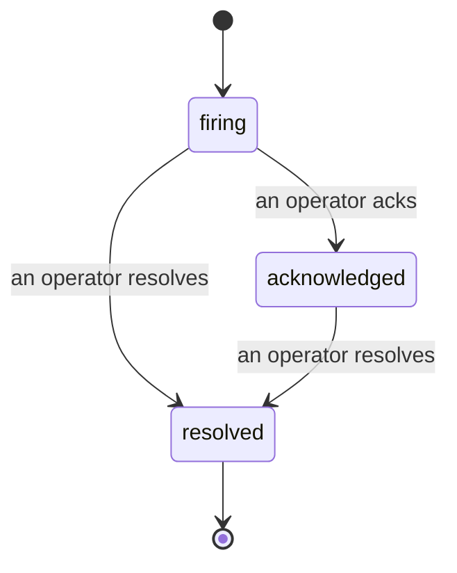

Quando um alerta dispara, a primeira pergunta é sempre "quem está cuidando disso?" Os incidentes respondem a essa questão: no momento em que algo ultrapassa um limiar, todos podem ver que o incidente está aberto, quem é o responsável e exatamente o que aconteceu até agora, com um registro limpo e atribuído que pode ser entregue diretamente para uma análise pós-incidente.

*A caixa de entrada agrupa os incidentes abertos por estado e filtra por severidade e responsável, para que você veja o que precisa de atenção humana agora.*

## Saiba quem está cuidando, de relance

Chega de "alguém está olhando para isso?" em uma thread de chat. Uma violação abre um incidente automaticamente e o coloca em uma caixa de entrada compartilhada, agrupada por estado. Reconheça-o e seu nome estará nele, para que o restante da equipe saiba que está sendo tratado. O reconhecimento é compartilhado: vários operadores podem reconhecer o mesmo incidente e cada um é registrado individualmente, para que uma equipe completa de resposta apareça por nome em vez de se sobrepor. Atribua um único responsável pelo triagem e filtre a caixa de entrada por severidade ou responsável para reduzir ao que é seu.

## Toda a história, em uma única linha do tempo

Quando o incidente termina, você já tem o relatório. Abra qualquer incidente e você terá as evidências da violação, seus responsáveis e assinantes, uma thread de comentários para coordenação no local e uma linha do tempo de atividade somente de acréscimo.

*Tudo o que aconteceu, em ordem, cada linha assinada por quem fez a ação.*

Cada ação (aberto, reconhecido, resolvido, e assim por diante) é gravada nessa linha do tempo e nunca é editada. Cada entrada é atribuída: ao operador que a executou, por e-mail, ou como **automatizado** para qualquer coisa que o FailproofAI Cloud fez por conta própria, como abrir o incidente na violação. Nada é anônimo e nada se perde, então a análise pós-incidente praticamente se escreve sozinha.

## Como um incidente evolui

- **Aberto (firing):** a violação abre o incidente e notifica seus canais uma vez. Violações repetidas são incorporadas ao mesmo incidente e atualizam suas evidências em vez de notificá-lo repetidamente.
- **Reconhecido (acknowledged):** um operador assume o incidente. Ele permanece aberto, e violações posteriores atualizam as evidências silenciosamente.
- **Resolvido (resolved):** um operador encerra o incidente. A resolução automática quando a condição se normaliza está planejada, mas ainda não habilitada — portanto, um incidente permanece aberto até que um humano o resolva, o que mantém todos honestos sobre o que realmente foi resolvido. Um novo incidente pode ser aberto no mesmo alerta posteriormente.

Um alerta mantém no máximo um incidente aberto por vez, portanto uma regra instável não pode te soterrar em duplicatas. Você também pode abrir um incidente manualmente: um independente para algo que nenhum alerta capturou, ou um vinculado a um alerta existente, se você tiver a permissão `incidents:write`.

## Onde encontrar

Os incidentes estão em `/<org-slug>/incidents`. Para visualizar, é necessária a permissão **`incidents:read`**; para abrir um incidente manual, **`incidents:write`**; para reconhecer, atribuir, comentar e resolver, **`incidents:ack`**. Chaves mais antigas que concediam a permissão descontinuada `alerts:ack` continuam funcionando, pois ela é tratada como `incidents:ack`, portanto sua rotação de plantão não precisa ser reemitida.

## Relacionados

- [Alertas](/pt-br/cloud/alerts): as regras que abrem esses incidentes quando um limiar é ultrapassado.
- [Rastreamento de erros](/pt-br/cloud/errors): veja todas as falhas em um único lugar e promova uma delas a um alerta.
- [Auditorias](/pt-br/cloud/audits): o analista agendado que encontra as falhas que nenhuma regra estava monitorando.