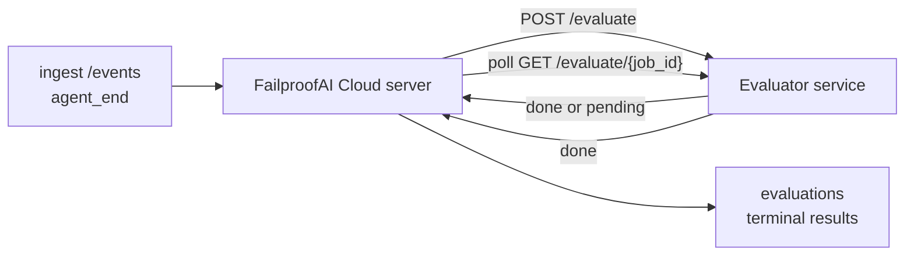

FailproofAI Cloud может автоматически оценивать качество каждого завершённого запуска агента: вы предоставляете небольшой сервис оценки, а FailproofAI Cloud берёт на себя остальное. Используйте её для отслеживания интересующих вас параметров (полезность, эффективность инструментов, фактичность, безопасность — выбираете вы), раннего выявления регрессий и быстрого сравнения агентов или окружений. Оценка является дополнительной функцией: конвейер ничего не делает, пока вы не установите `EVALUATOR_ENDPOINT` на сервере.

> **Примечание:** Вы определяете параметры оценки. Ваш оценивающий сервис может возвращать любые числовые ключи; FailproofAI Cloud сохраняет, отслеживает и отображает всё, что вы отправляете.

## Кратко

1. **Напишите оценивающий сервис.** Создайте небольшой HTTP-сервис, который читает транскрипт сессии и возвращает оценки. FailproofAI Cloud поставляется с рабочим примером, который вы можете скопировать. См. [Написание оценивающего сервиса с SDK](#writing-an-evaluator-with-the-sdk).
2. **Укажите FailproofAI Cloud на него.** Установите `EVALUATOR_ENDPOINT` (и общий `EVALUATOR_TOKEN`) на процесс сервера.
3. **Смотрите, как появляются оценки.** Каждая завершённая сессия автоматически оценивается; результаты отображаются на странице деталей сессии, в сетке сессий и на сохранённых панелях.


*После настройки оценивающего сервиса каждый завершённый запуск оценивается, и результаты появляются на правой панели сессии: резюме вверху, затем полосы оценок по параметрам с обоснованием.*

---

## Как это работает



Когда FailproofAI Cloud SDK генерирует событие `agent_end` для сессии, сервер
планирует оценку. Затем он отправляет полный транскрипт событий в ваш
оценивающий сервис, который может:

- **Вернуть результат сразу** с `{"status":"done", "scores":{...}, "reasoning":{...}, "summary":"..."}`. Результат
  добавляется в временную линию оценок сессии. `reasoning` и
  `summary` опциональны.
- **Отложить** с `{"status":"pending", "job_id":"abc-123"}`. FailproofAI Cloud затем
  вызывает `GET {EVALUATOR_ENDPOINT}/evaluate/abc-123` до тех пор, пока ваш оценивающий сервис
  не вернёт `{"status":"done", ...}` или `{"status":"error", "error":"..."}`.

  Интервал опроса зависит от задачи: ответ `pending` может включать
  `next_poll_secs` для переопределения; в противном случае FailproofAI Cloud использует
  значение `default_poll_interval_secs` из `GET /config`; если его нет, сервер
  использует `EVALUATOR_POLLING_INTERVAL_SECS` (по умолчанию 10 сек). Все значения
  ограничиваются диапазоном [1 сек, 1 ч].

Сессии, которые никогда не генерируют `agent_end` (например, упавший процесс агента),
также могут быть обработаны: конфигурация оценивающего сервиса `GET /config` может возвращать
`{"inactivity_timeout_secs": 1800}`, и FailproofAI Cloud будет оценивать любую сессию,
которая неактивна в течение этого времени. Установите поле в `null` или опустите его,
чтобы отключить этот резервный механизм.

Конвейер полностью неактивен, когда `EVALUATOR_ENDPOINT` не установлен.

Сессия может накапливать **несколько финальных оценок в течение времени**: каждое
событие `agent_end` (и каждая ручная переоценка с панели) добавляет
свежую строку оценки. Это поддерживаемый способ оценки продолжённой
беседы: пользователь завершает работу агента, возвращается позже, отправляет больше событий,
завершает работу агента снова, и вторая оценка запускается против полного обновлённого
транскрипта. Панель отображает самую последнюю оценку как заголовок,
а предыдущие оценки как свёртываемую временную линию. Пока одна
оценка выполняется для сессии, дополнительные события `agent_end` для этой
сессии игнорируются; следующий после завершения выполняемой оценки
будет поставлен в очередь для свежей оценки как обычно.

Резервный механизм неактивности повторно активируется и на возобновлённых сессиях: если новые события
поступают после предыдущей финальной оценки и сессия затем становится неактивной дольше
`inactivity_timeout_secs`, свежая оценка ставится в очередь.

Преходящие сбои (5xx, 429, таймауты, сетевые ошибки) повторяются с
экспоненциальной задержкой до `EVALUATOR_MAX_ATTEMPTS`; ответы 4xx являются
финальными. FailproofAI Cloud безопасно запускается с несколькими горизонтально масштабируемыми экземплярами сервера;
работа разбита так, чтобы одна сессия никогда не была отправлена
дважды одновременно.

---

## HTTP контракт

Каждый защищённый маршрут использует **аутентификацию по токену носителя**. Одно и то же значение должно быть
настроено с обеих сторон:

- Сервер FailproofAI Cloud: переменная окружения `EVALUATOR_TOKEN`
- Сервис оценки: настроен аналогично (SDK `agenteye-evaluator`
  по соглашению читает `EVALUATOR_TOKEN`)

Если `EVALUATOR_TOKEN` не установлен, сервер не отправляет заголовок `Authorization`; оценивающий сервис
может затем принимать анонимные запросы, что нормально для
сети только внутри, но не рекомендуется в открытом интернете.

### Маршруты, которые должен обслуживать оценивающий сервис

| Маршрут | Тело / параметры | Ответ |
|---|---|---|
| `GET /health` | нет | `{"status":"ok"}` (открыт, без аутентификации) |
| `GET /config` | нет | `{"inactivity_timeout_secs": <int> \| null, "default_poll_interval_secs": <int> \| опущено}` |
| `POST /evaluate` | JSON `EvalRequest` | `{"status":"done", ...}` или `{"status":"pending", "job_id":"..."}` |
| `GET /evaluate/{id}` | нет | аналогичная форма ответа как `/evaluate` |

### Тело `EvalRequest`, отправляемое сервером

```json
{
  "schema_version": "1",
  "session_id":     "session-abc123",
  "agent_id":       "planner",
  "environment":    "production",
  "started_at":     "2026-05-10T12:00:00Z",
  "ended_at":       "2026-05-10T12:05:00Z",
  "events": [
    { "id": 1234, "ts": "...", "event_type": "agent_start", "payload": { ... } },
    ...
  ]
}
```

### Формы ответов

**Синхронная (готово):**

```json
{
  "status": "done",
  "scores": { "helpfulness": 0.85, "tool_efficiency": 0.6 },
  "reasoning": {
    "helpfulness": "answered the question directly with citations",
    "tool_efficiency": "called list_files three times when one would have done"
  },
  "summary": "strong answer quality, weak tool selection"
}
```

`reasoning` (карта обоснований для каждой оценки) и `summary` (общее
описание в один абзац) оба опциональны. Ключи в `reasoning` должны
соответствовать ключам в `scores`; панель отображает каждую запись встроенной
под её полосой оценки. Старые оценивающие сервисы, возвращающие только `scores`, продолжают
работать без изменений; `reasoning` и `summary` просто читаются как null и
соответствующие элементы UI опускаются.

**Асинхронная (отложенная):**

```json
{ "status": "pending", "job_id": "abc-123", "next_poll_secs": 30 }
```

`next_poll_secs` опционален; если опущен, сервер использует
`default_poll_interval_secs` оценивающего сервиса из `/config`, затем его собственную
переменную окружения `EVALUATOR_POLLING_INTERVAL_SECS`.

**Финальная ошибка на стороне оценивающего сервиса:**

```json
{ "status": "error", "error": "model service unavailable" }
```

Сервер обрабатывает любое другое тело 2xx как ошибку протокола и записывает
финальную `error` для сессии.

---

## Написание оценивающего сервиса с SDK

Вам не нужно реализовывать HTTP контракт вручную. Пакет Python `agenteye-evaluator`
предоставляет типизированную обёртку FastAPI, которая обрабатывает аутентификацию, маршрутизацию и
формы запроса/ответа для вас.

FailproofAI Cloud также поставляется с **рабочим примером оценивающего сервиса**, который
оценивает `helpfulness`, `tool_efficiency` и `factuality` на основе формы
транскрипта. Скопируйте его как отправную точку и замените вашей собственной логикой: судья LLM,
механизм правил, что угодно, соответствующее вашему уровню качества.

Минимально жизнеспособный оценивающий сервис:

```python
import os
from agenteye_evaluator import Evaluator, EvalRequest, EvalResponse

app = Evaluator(token=os.environ["EVALUATOR_TOKEN"])

@app.evaluator
def run(req: EvalRequest) -> EvalResponse:
    # Inspect req.events (the full session transcript) and return scores.
    tool_calls = sum(1 for e in req.events if e.event_type == "tool_use")
    return EvalResponse(
        scores={"tool_calls": float(tool_calls)},
        reasoning={"tool_calls": f"{tool_calls} tool invocations in the transcript"},
        summary="tight tool loop" if tool_calls < 5 else "agent looped on tools",
    )
```

Экземпляр `app` работает под любым ASGI сервером, поэтому `uvicorn module:app` его запускает.

Для оценивающих сервисов, которым нужно отложить дорогостоящую работу, верните `JobPending`
вместо этого и зарегистрируйте обработчик `@app.job_lookup`; сервер FailproofAI Cloud
опрашивает `GET /evaluate/{job_id}` до тех пор, пока вы не вернёте финальный статус или не истечёт
лимит `EVALUATOR_MAX_POLL_DURATION_SECS` (по умолчанию 1 ч).

Полный справочник API, асинхронный паттерн и схема событий задокументированы в
README SDK `agenteye-evaluator`.

---

## Запуск вашего оценивающего сервиса

Оценивающий сервис — **ваш сервис** — FailproofAI Cloud не поставляет
оценивающий сервис по умолчанию, поэтому вы строите и запускаете его там же, где запускаете ваши сервисы.
Он работает под любым ASGI сервером (например `uvicorn my_evaluator:app`); обслуживайте
маршруты `/health`, `/config` и `/evaluate` из
[HTTP контракта](#http-contract), затем укажите на него сервер (см.
[Настройка сервера](#configuring-the-server)).

Как только оценивающий сервис доступен, `GET /health` возвращает `{"status":"ok"}`. После
того как агент завершит работу полностью, `GET /evaluations` на сервере возвращает строку с
`status: "done"` и оценками, которые произвёл ваш оценивающий сервис.

---

## Настройка сервера

Установите на процесс сервера:

| Переменная окружения | Значение |
|---|---|
| `EVALUATOR_ENDPOINT` | Базовый URL вашего оценивающего сервиса (`http://evaluator:9000`). Не установлено = конвейер отключен. |
| `EVALUATOR_TOKEN` | Токен носителя. Должен быть равен значению, с которым настроен сервис оценки. |
| `EVALUATOR_WORKERS` | Рабочие задачи на экземпляр сервера (по умолчанию 2). |
| `EVALUATOR_CLAIM_BATCH` | Строки, заявляемые за тик рабочего (по умолчанию 4). Пакеты обрабатываются **одновременно**; эффективная параллельность на вашей конечной точке оценки: `EVALUATOR_WORKERS × EVALUATOR_CLAIM_BATCH`. |
| `EVALUATOR_POLL_IDLE_SECS` | Как долго рабочий спит между попытками отправки, когда нет оценки в очереди (по умолчанию 2 сек). |
| `EVALUATOR_POLLING_INTERVAL_SECS` | Финальный резервный вариант для интервала `GET /evaluate/{id}`, когда ни `next_poll_secs` в ответе, ни `default_poll_interval_secs` оценивающего сервиса не установлены (по умолчанию 10 сек). |
| `EVALUATOR_REQUEST_TIMEOUT_MS` | Таймаут для одного запроса (по умолчанию 30000). |
| `EVALUATOR_MAX_ATTEMPTS` | После этого количества преходящих сбоев результат записывается как финальная `error` (по умолчанию 5). |
| `EVALUATOR_CONFIG_REFRESH_SECS` | Интервал `GET /config` (по умолчанию 300). |
| `EVALUATOR_MAX_POLL_DURATION_SECS` | Максимальное настоящее время, которое сессия может оставаться в очереди опроса перед завершением как `timeout` (по умолчанию 3600 сек). Защищает от оценивающего сервиса, который продолжает возвращать `pending` бесконечно. |

Чтобы включить автоматическую оценку, установите `EVALUATOR_ENDPOINT` и
`EVALUATOR_TOKEN` на сервере, затем перезагрузите его, чтобы применить изменение. С
`EVALUATOR_ENDPOINT` не установленным конвейер остаётся неактивным.

Вышеуказанные настраиваемые параметры опциональны; устанавливайте соответствующие переменные
окружения на сервере только если вам нужно переопределить значения по умолчанию.

---

## Справочник API

| Метод | Путь | Требуемое разрешение | Назначение |
|---|---|---|---|
| `GET` | `/evaluations` | `evaluations:read` | Запрос финальных результатов. Поддерживает `session_id`, `agent_id`, `environment`, `status` (`done`/`error`/`timeout`), `ts_from`, `ts_to`, `cursor`, `limit`, `score_filters`, `latest_per_session`. `limit` по умолчанию 50 и ограничен на 200 (обратите внимание, это отличается от `/events`, который ограничен на 1000). `environment` принимает список через запятую (например `environment=prod,staging`); одиночные значения также работают. С `latest_per_session=true` ответ содержит максимум одну строку для каждого `session_id` (самую последнюю по `completed_at`), используется страницей списка сессий для свёртывания временной линии оценок сессии к её текущему заголовку. По умолчанию false (возвращает полную историю). |
| `GET` | `/evaluations/aggregate` | `evaluations:read` | Свёрнутое здоровье оценок для отфильтрованного набора: общее количество, разбор done/error/timeout, статистика для каждого ключа оценки (count/avg/min/max/p50 над произвольными ключами `scores`), и временная линия, разбитая на временные интервалы. Принимает **те же параметры фильтра, что и `/evaluations`** плюс `featured_keys` (CSV ключей оценок для отслеживания) и `latest_per_session`. Питает функцию Dashboards; метрики являются точными по всему совпадающему набору, не выборкой. |
| `GET` | `/evaluations/environments` | `evaluations:read` | Различные значения окружения из таблицы `evaluations`. Используется для заполнения фильтров-выпадающих меню, ограниченных данными, читаемыми для оценок. |
| `GET` | `/evaluation-jobs` | `evaluations:read` | Видимость в процессе выполняемых оценок. Фильтруйте по `status` (`pending`/`polling`). |
| `GET` | `/events` | `events:read` | Потоковая передача необработанных событий сессии. Поддерживает `session_id`, `agent_id`, `event_type` (CSV), `environment` (CSV), `ts_from`, `ts_to`, `cursor`, `limit` и `order`. `order` — это `desc` (новое первым, по умолчанию) или `asc` (старое первым); неузнанное значение падает обратно на `desc`. Разбор по курсору через `next_cursor` ответа (id события): передайте его обратно как `cursor` для получения следующей страницы; с `asc` следующая страница — это события после этого id, с `desc` — события перед ним. `limit` по умолчанию 50 и ограничен на 1000. |
| `GET` | `/sessions/:session_id/export` | `events:read` | Возвращает точное тело JSON, которое оценивающий сервис получит для этой сессии, обслуживаемое как загружаемое вложение с именем `session-<id>.json`. Полезно для воспроизведения производственных сессий через `agenteye-evaluator` для автономного тестирования. Байты идентичны тому, что отправляет конвейер оценки. |
| `POST` | `/sessions/:session_id/re-evaluate` | `evaluations:trigger` | Поставить в очередь свежую оценку для сессии; запускается независимо от того, существует ли предыдущая оценка. Новый результат **добавляется** к временной линии оценок сессии вместо перезаписи предыдущей, поэтому предыдущие оценки остаются видимыми как история. Возвращает `202` при постановке в очередь, `404` для неизвестной сессии, `409` если оценка уже выполняется. Используйте это после развёртывания нового оценивающего сервиса или для сессий, которые никогда не генерировали `agent_end`. |

### Фильтрация по диапазону оценок: `score_filters`

`GET /evaluations` принимает дополнительный параметр `score_filters`, который
сужает результаты по числовым значениям внутри объекта `scores`. Параметр
является списком, разделённым запятыми, записей `key:min..max`; любая граница может быть
опущена. Несколько записей объединяются логическим И. Строки,
где названный ключ отсутствует или не числовой, исключены. Запрос может
содержать максимум 20 записей фильтра; превышение этого возвращает HTTP 400.

Примеры:
```text
# helpfulness в [0.5, 0.8]
GET /evaluations?score_filters=helpfulness:0.5..0.8

# tool_efficiency максимум 0.3 (без нижней границы)
GET /evaluations?score_filters=tool_efficiency:..0.3

# helpfulness >= 0.5 И factuality >= 0.9
GET /evaluations?score_filters=helpfulness:0.5..,factuality:0.9..
```

Каждый объект ответа `/evaluations` имеет эти поля:

| Поле | Тип | Примечания |
|---|---|---|
| `evaluation_id` | строка (UUID) | Канонический идентификатор этой финальной оценки. Каждая финальная оценка получает новый UUID; одна сессия может содержать несколько. |
| `id` | строка (UUID) | Обратная совместимость, получает такое же значение как `evaluation_id`. |
| `session_id` | строка | Сессия, для которой запустилась оценка. Сессия может иметь несколько оценок в временной линии. |
| `agent_id` | строка | Идентифицирует агента, который произвёл сессию. |
| `environment` | строка | Метка окружения, скопированная из сессии. |
| `status` | enum | Одно из `"done"`, `"error"`, `"timeout"`. |
| `scores` | объект \| null | Оценки, возвращённые вашим оценивающим сервисом. |
| `reasoning` | объект \| null | Опциональная карта обоснований для каждой оценки, возвращённая вашим оценивающим сервисом. Ключи типично зеркалируют те, что в `scores`. Панель отображает каждую запись под её полосой оценки. |
| `summary` | строка \| null | Опциональное описание в один абзац, возвращённое вашим оценивающим сервисом. Панель отображает это выше разбора по параметрам как заголовок оценки. |
| `error` | строка \| null | Заполнено только на `"error"` / `"timeout"`. |
| `attempt_count` | целое число | Количество попыток отправки (≥ 1). |
| `duration_ms` | целое число \| null | Продолжительность финальной попытки. |
| `completed_at` | строка (ISO 8601 UTC) | Когда был записан финальный результат. Результаты упорядочены по `completed_at` (новое первым). |
| `created_at` | строка (ISO 8601 UTC) | Имеет такой же таймстэмп как `completed_at` (семантика write-once). |

---

## Разрешения

| Разрешение | Предоставляет доступ к |
|---|---|
| `evaluations:read` | Список результатов оценок, просмотр оценок на панели, загрузка метрик здоровья панели. |
| `evaluations:trigger` | Ручное поставление в очередь оценки для сессии через `POST /sessions/:session_id/re-evaluate` или кнопку переоценки на панели. |
| `dashboards:read` | Просмотр сохранённых панелей (также нужен `evaluations:read` для загрузки их метрик). |
| `dashboards:write` | Создание и редактирование панелей. |
| `dashboards:delete` | Удаление панелей. |

Администратор начальной загрузки (`ADMIN_KEY`, `ADMIN_EMAIL`) автоматически получает эти.

---

## Просмотр результатов

- **`/sessions/<id>`**: временная линия событий + правая панель, отображающая
  оценки сессии и любую ошибку попытки отправки. Если ваш ключ имеет
  `evaluations:trigger`, кнопка **переоценить** появляется рядом с кнопкой экспорта,
  полезно для сессий, которые никогда не генерировали `agent_end`, или для
  обновления оценок после развёртывания нового оценивающего сервиса. Панель опрашивает новый
  результат и обновляет правую панель когда он приходит.
- **`/sessions`**: фильтруемая сетка сессий; столбец оценок показывает статус
  оценки каждой сессии и оценки с первого взгляда.
- **`/dashboards`**: сохранённые представления здоровья оценок (см. [Dashboards](#dashboards) ниже).


*Сетка сессий показывает статус оценки каждого запуска и оценки с первого взгляда; красные/янтарные/зелёные значки выделяют низкие оценки.*

---

## Dashboards

Страница **Dashboards** (`/dashboards`) позволяет вам сохранить комбинацию фильтров оценок как
именованное, переиспользуемое представление и смотреть, как этот срез оценок
работает с первого взгляда. Dashboards **совместно используются всей вашей организацией**;
все с `dashboards:read` видят одно и то же множество.

Каждая панель закрепляет:

- **Filters**: те же элементы управления, что на странице сессий: окружение, статус,
  агент, скользящее окно времени и фильтры диапазонов оценок (`key:min..max`).
- **Конфигурацию отображения**: какие ключи оценок выделить, пороги здоровья зелёный/янтарный/красный,
  какие панели показывать и сворачивать ли на самую последнюю
  оценку для каждой сессии.

Каждая карточка показывает количество совпадающих сессий, разбор done/error/timeout,
среднее значение каждой выделенной оценки и небольшую тренд-спарклайн. Открытие
панели показывает полные панели; **"открыть в сессиях"** берёт вас на
страницу сессий с предустановленным фильтром на точно этот срез. Метрики вычисляются
на сервере по всему совпадающему набору (через `GET /evaluations/aggregate`), поэтому
числа точные вместо выборки.


**Разрешения:** просмотр нуждается в `dashboards:read` и `evaluations:read`;
создание и редактирование нужны `dashboards:write`; удаление нужно `dashboards:delete`.
Администратор начальной загрузки автоматически получает все эти.

---

## Решение проблем

**Сессии существуют, но оценки не создаются.** Подтвердите, что `EVALUATOR_ENDPOINT`
установлен на процесс сервера, что сервер и оценивающий сервис разделяют одно и то же
значение `EVALUATOR_TOKEN`, и что конечная точка `/health` оценивающего сервиса
доступна с сервера. С `EVALUATOR_ENDPOINT` не установленным конвейер неактивен.

**Выполняемые оценки накапливаются.** Запросите `GET /evaluation-jobs`, чтобы увидеть
очередь выполняемых. Проверьте `attempt_count`, `next_attempt_at` и `last_error`
на каждой строке. Обычные причины: сервис оценки недоступен или возвращает 5xx
(повторяется с задержкой), неправильный `EVALUATOR_TOKEN` (401 является финальной), или
асинхронный оценивающий сервис, который возвращает `pending` бесконечно (см. ниже).

**Сессии завершены, но нет финальной оценки.** Запросите
`GET /evaluation-jobs?status=polling`; результат может всё ещё выполняться.
Если задача зависла на `pending`, сервер испытывает сложности с доступом к оценивающему сервису;
проверьте, что оценивающий сервис работает и что `EVALUATOR_TOKEN` совпадает.

**`HTTP 401 от оценивающего сервиса: неверный токен носителя`.** `EVALUATOR_TOKEN`
на сервере не совпадает со значением, с которым настроен сервис оценки.
Они должны быть идентичны.

**Асинхронный оценивающий сервис возвращает `pending` бесконечно.** Сервер опрашивает
`GET /evaluate/{job_id}` до тех пор, пока оценивающий сервис не вернёт `done` или `error`,
или пока не истечёт `EVALUATOR_MAX_POLL_DURATION_SECS` (по умолчанию 1 ч). После лимита
оценка записывается как `timeout` и удаляется из очереди выполняемых.
Увеличьте `EVALUATOR_MAX_POLL_DURATION_SECS`, если ваш оценивающий сервис законно нуждается
в большем времени, чем по умолчанию.

---

## Следующие шаги

- [Evaluator agent skill](/ru/cloud/agent-skills): попросите кодирующего агента спроектировать ваши параметры на основе реальных сессий и построить для вас этот сервис.
- [Python SDK](/ru/cloud/sdk): генерируйте события `agent_end`, которые запускают оценку.
- [API keys](/ru/cloud/access): разрешения `evaluations:read` и `evaluations:trigger`.
- [Audits](/ru/cloud/audits): другая автоматизированная функция качества FailproofAI Cloud для проверки на основе политик.