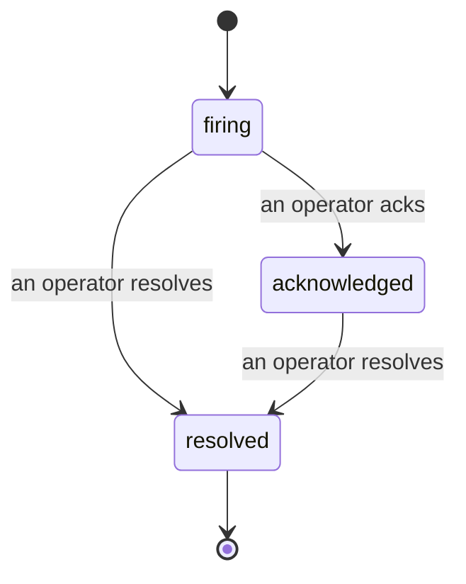

Когда срабатывает оповещение, первый вопрос всегда один: «кто этим займётся?» Инциденты отвечают на него: в момент обнаружения нарушения все видят, что инцидент открыт, кто за него отвечает и ровно что произошло, с чистой и упорядоченной записью, которую можно сразу передать на анализ после инцидента.

*Входящие группируют открытые инциденты по статусу и фильтруют по серьёзности и ответственному, чтобы вы видели, что требует внимания человека прямо сейчас.*

## Сразу видно, кто этим занимается

Больше не нужно спрашивать «кто-нибудь это смотрит?» в чате. Нарушение автоматически открывает инцидент и помещает его в общую входящую папку, сгруппированную по статусам. Подтвердите его — и ваше имя будет на нём, так команда узнает, что это берётся в работу. Подтверждение общее: несколько операторов могут подтвердить один инцидент, и каждое подтверждение записывается отдельно, так что полный боевой штаб видно по именам без перепутанности. Назначьте одного ответственного за первичный анализ и фильтруйте входящие по серьёзности или ответственному, чтобы видеть только то, что вам нужно.

## Вся история в одной шкале времени

Когда инцидент завершён, у вас уже есть описание. Откройте любой инцидент — и вы увидите свидетельства нарушения, его ответственных и подписчиков, цепочку комментариев для координации и неизменяемую временную шкалу активности.

*Все события, по порядку, каждая строка подписана тем, кто её создал.*

Каждое действие (открыто, подтверждено, разрешено и так далее) записывается в эту временную шкалу и никогда не изменяется. Каждая запись имеет автора: оператора, который её выполнил, с указанием почты, или **automated** для всего, что FailproofAI Cloud сделал самостоятельно, например открыл инцидент при обнаружении нарушения. Ничего не анонимно и ничего не теряется, так что анализ после инцидента практически пишется сам по себе.

## Как инцидент развивается

- **Открыт (firing):** нарушение открывает инцидент и пингует ваши каналы один раз. Повторные нарушения объединяются в один инцидент и обновляют его свидетельства вместо повторных пингов.
- **Подтверждён (acknowledged):** оператор взял его в работу. Он остаётся открытым, и позже нарушения тихо обновляют свидетельства.
- **Разрешён (resolved):** оператор закрывает его. Автоматическое разрешение при исчезновении условия планируется, но ещё не включено, поэтому инцидент остаётся открытым до ручного разрешения оператором, что держит всех в курсе о том, что действительно решено. Новый инцидент может открыться по тому же оповещению позже.

Одно оповещение может иметь максимум один открытый инцидент одновременно, так что нестабильное правило не закидает вас дубликатами. Вы также можете открыть инцидент вручную: самостоятельный для чего-то, что не поймало ни одно оповещение, или привязанный к существующему оповещению, если у вас есть `incidents:write`.

## Где его найти

Инциденты находятся по адресу `/<org-slug>/incidents`. Просмотр требует **`incidents:read`**; открытие ручного инцидента требует **`incidents:write`**; подтверждение, назначение, комментирование и разрешение требуют **`incidents:ack`**. Старые ключи, которым был дан снятый с производства `alerts:ack`, продолжают работать, так как он признаётся как `incidents:ack`, поэтому вашу ротацию дежурных не нужно переиздавать.

## Связанное

- [Оповещения](/ru/cloud/alerts): правила, которые открывают эти инциденты при нарушении порога.
- [Отслеживание ошибок](/ru/cloud/errors): смотрите все сбои в одном месте и повысьте один до оповещения.
- [Аудиты](/ru/cloud/audits): запланированный аналитик, который находит сбои, за которыми не наблюдало ни одно правило.