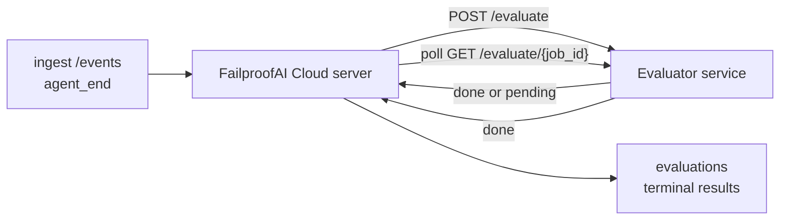

FailproofAI Cloud, her tamamlanan agent çalışmasını kalite açısından otomatik olarak puanlandırabilir: küçük bir puanlama hizmeti sağlarsınız ve FailproofAI Cloud geri kalanını halleder. Önem verdiğiniz boyutları (yararlılık, araç verimliliği, doğruluk, güvenlik; siz seçersiniz) izlemek, gerilemeyi erkenden yakalamak ve agent'ları veya ortamları bir bakışta karşılaştırmak için kullanın. Puanlama isteğe bağlıdır: sunucuda `EVALUATOR_ENDPOINT` ayarlanana kadar işlem hattı hiçbir şey yapmaz.

> **Not:** Puan boyutlarını siz tanımlarsınız. Değerlendiricininiz istediği sayısal anahtarları döndürebilir; FailproofAI Cloud geri gönderdiğiniz her şeyi depolar, trendini oluşturur ve görüntüler.

## Bakış

1. **Bir puanlayıcı yazın.** Oturum transkriptini okuyan ve puanlar döndüren küçük bir HTTP hizmeti kurun. FailproofAI Cloud, kopyalayabileceğiniz çalışan bir referans seviyesiyle gelir. Bkz. [SDK ile Değerlendirici Yazma](#sdk-ile-değerlendirici-yazma).
2. **FailproofAI Cloud'yi ona gösterin.** Sunucu işlemine `EVALUATOR_ENDPOINT` (ve paylaşılan `EVALUATOR_TOKEN`) ayarlayın.
3. **Puanları izleyin.** Her tamamlanan oturum otomatik olarak puanlandırılır; sonuçlar oturum detay sayfasında, oturumlar ızgarasında ve kaydedilmiş panolarda görünür.


*Bir değerlendirici yapılandırıldığında, her tamamlanan çalışma puanlandırılır ve sonuçlar oturumun sağ panelinde görünür: üstte özet, ardından akıl yürütmeli boyut başına puan çubukları.*

---

## Nasıl çalışır?



FailproofAI Cloud SDK bir oturum için `agent_end` olayını yaydığında, sunucu bir değerlendirmeyi programlar. Daha sonra tam olay transkriptini değerlendirici hizmetinize POST eder; bu şunlardan birini yapabilir:

- **Sonucu satır içi döndürün** `{"status":"done", "scores":{...}, "reasoning":{...}, "summary":"..."}` ile. Sonuç oturumun değerlendirme zaman çizelgesine eklenir. `reasoning` ve `summary` isteğe bağlıdır.
- **Erteleyin** `{"status":"pending", "job_id":"abc-123"}` ile. FailproofAI Cloud daha sonra değerlendiricininiz `{"status":"done", ...}` veya `{"status":"error", "error":"..."}` döndürene kadar `GET {EVALUATOR_ENDPOINT}/evaluate/abc-123` çağrısını yapar.

  Yoklama sıklığı iş başına değişir: `pending` yanıtı `next_poll_secs` içerebilir; aksi takdirde FailproofAI Cloud `GET /config` yapılandırıcısından `default_poll_interval_secs` değerini kullanır; aksi takdirde sunucu `EVALUATOR_POLLING_INTERVAL_SECS` (varsayılan 10s) değerine geri döner. Tüm değerler [1s, 1h] aralığına sabitlenir.

`agent_end` yaymayan oturumlar (örneğin, kilitlenmişs agent işlemi) da alınabilir: değerlendiricinin `GET /config` `{"inactivity_timeout_secs": 1800}` döndürebilir ve FailproofAI Cloud bu kadar süre boşta kalan herhangi bir oturumu değerlendirir. Bu işlev devre dışı bırakmak için alanı `null` olarak ayarlayın veya atlayın.

`EVALUATOR_ENDPOINT` ayarlanmadığında işlem hattı tamamen işlemsizdir.

Bir oturum zaman içinde **birden fazla terminal değerlendirmesi** biriktire bilir: her `agent_end` olayı (ve panodan her manuel yeniden değerlendirme) yeni bir değerlendirme satırı ekler. Bu, devam eden bir konuşmayı değerlendirmenin desteklenen yoludur: bir kullanıcı bir agent'ı sonlandırır, daha sonra geri gelir, daha fazla olay gönderir, agent'ı tekrar sonlandırır ve tam güncellenmiş transkript için ikinci bir değerlendirme çalışır. Pano en son değerlendirmeyi başlık olarak ve önceki değerlendirmeleri daraltılabilir zaman çizelgesi olarak gösterir. Bir oturum için bir değerlendirme çalışırken, o oturum için ek `agent_end` olayları yoksayılır; çalışan değerlendirme tamamlandıktan sonrakı ilk olay her zamanki gibi yeni bir değerlendirmeyi sıraya alır.

Hareketsizlik geri dönüş, devam eden oturumlar üzerinde de yeniden etkinleştirilir: bir önceki terminal değerlendirmeden sonra yeni olaylar gelirse ve oturum `inactivity_timeout_secs` ötesine boşta kalırsa, yeni bir değerlendirme sıraya alınır.

Geçici hatalar (5xx, 429, zaman aşımları, ağ hataları) `EVALUATOR_MAX_ATTEMPTS` değerine kadar üstel geri dönüşle yeniden denenilir; 4xx yanıtları terminaldir. FailproofAI Cloud, birden çok yatay ölçeklenmiş sunucu örnekleriyle güvenle çalışabilir; çalışma bölümlere ayrılır, böylece aynı oturum asla eşzamanlı olarak iki kez gönderilmez.

---

## HTTP sözleşmesi

Her kimliği doğrulanan rota **taşıyıcı token kimlik doğrulaması** kullanır. Aynı değer her iki tarafta da yapılandırılması gerekir:

- FailproofAI Cloud sunucusu: ortam değişkeni `EVALUATOR_TOKEN`
- Değerlendirici hizmeti: aynı şekilde yapılandırılmış (agenteye-evaluator SDK kuralı gereği `EVALUATOR_TOKEN` okur)

`EVALUATOR_TOKEN` ayarlanmadığında, sunucu `Authorization` başlığı göndermez; değerlendirici anonim istekleri kabul edebilir, bu da yalnızca ağ için iyidir ancak genel internet üzerinde önerilmez.

### Değerlendiricinin sunması gereken rotalar

| Rota | Gövde / parametreler | Yanıt |
|---|---|---|
| `GET /health` | hiçbiri | `{"status":"ok"}` (açık, kimlik doğrulaması yok) |
| `GET /config` | hiçbiri | `{"inactivity_timeout_secs": <int> \| null, "default_poll_interval_secs": <int> \| omitted}` |
| `POST /evaluate` | `EvalRequest` JSON | `{"status":"done", ...}` veya `{"status":"pending", "job_id":"..."}` |
| `GET /evaluate/{id}` | hiçbiri | `/evaluate` ile aynı yanıt şekli |

### Sunucu tarafından gönderilen `EvalRequest` gövdesi

```json
{
  "schema_version": "1",
  "session_id":     "session-abc123",
  "agent_id":       "planner",
  "environment":    "production",
  "started_at":     "2026-05-10T12:00:00Z",
  "ended_at":       "2026-05-10T12:05:00Z",
  "events": [
    { "id": 1234, "ts": "...", "event_type": "agent_start", "payload": { ... } },
    ...
  ]
}
```

### Yanıt şekilleri

**Senkron (tamamlandı):**

```json
{
  "status": "done",
  "scores": { "helpfulness": 0.85, "tool_efficiency": 0.6 },
  "reasoning": {
    "helpfulness": "answered the question directly with citations",
    "tool_efficiency": "called list_files three times when one would have done"
  },
  "summary": "strong answer quality, weak tool selection"
}
```

`reasoning` (puan başına gerekçe haritası) ve `summary` (genel tek paragraf anlatısı) her ikisi de isteğe bağlıdır. `reasoning` içindeki anahtarlar `scores` içindeki anahtarları yansıtmalıdır; pano her girişi puan çubuğunun altında satır içi olarak gösterir. Yalnızca `scores` döndüren eski değerlendericiler değiştirilmeden çalışmaya devam eder; `reasoning` ve `summary` basitçe null olarak okunur ve karşılık gelen UI olanakları çıkarılır.

**Asenkron (ertelendi):**

```json
{ "status": "pending", "job_id": "abc-123", "next_poll_secs": 30 }
```

`next_poll_secs` isteğe bağlıdır; atlanırsa sunucu `/config` değerlendiricisinin `default_poll_interval_secs` değerine, ardından kendi `EVALUATOR_POLLING_INTERVAL_SECS` ortam değişkenine geri döner.

**Terminal değerlendirici tarafı hatası:**

```json
{ "status": "error", "error": "model service unavailable" }
```

Sunucu diğer 2xx gövdeleri protokol hatası olarak ele alır ve oturum için terminal `error` kaydeder.

---

## SDK ile Değerlendirici Yazma

HTTP sözleşmesini elle uygulamamanız gerekmez. `agenteye-evaluator` Python paketi, kimlik doğrulamayı, yönlendirmeyi ve istek/yanıt şekillerini sizin için işleyen yazılan bir FastAPI sarmalayıcısı sağlar.

FailproofAI Cloud ayrıca transkript şeklinden `helpfulness`, `tool_efficiency` ve `factuality` puanlandıran **çalışan bir referans değerlendiricisi** ile gelir. Başlangıç noktası olarak kopyalayın ve kendi mantığınızla değiştirin: bir LLM yargıçsı, bir kural motoru, kalite standartlarınıza uygun her şey.

Minimum uygulanabilir değerlendirici:

```python
import os
from agenteye_evaluator import Evaluator, EvalRequest, EvalResponse

app = Evaluator(token=os.environ["EVALUATOR_TOKEN"])

@app.evaluator
def run(req: EvalRequest) -> EvalResponse:
    # Inspect req.events (the full session transcript) and return scores.
    tool_calls = sum(1 for e in req.events if e.event_type == "tool_use")
    return EvalResponse(
        scores={"tool_calls": float(tool_calls)},
        reasoning={"tool_calls": f"{tool_calls} tool invocations in the transcript"},
        summary="tight tool loop" if tool_calls < 5 else "agent looped on tools",
    )
```

`app` örneği herhangi bir ASGI sunucusu altında çalışır, bu nedenle `uvicorn module:app` başlatır.

Pahalı işi ertelemeleri gereken değerlendiriciler için, bunun yerine `JobPending` döndürün ve `@app.job_lookup` işleyicisini kaydedin; FailproofAI Cloud sunucusu terminal durum döndürene veya `EVALUATOR_MAX_POLL_DURATION_SECS` sınırı (varsayılan 1 sa) geçene kadar `GET /evaluate/{job_id}` yoklaması yapar.

Tam API başvurusu, asenkron desen ve olay şeması `agenteye-evaluator` SDK'sının README'sinde belgelenmiştir.

---

## Değerlendiricininizi Çalıştırma

Değerlendirici **sizin hizmetinizdir** — FailproofAI Cloud varsayılan bir değerlendirici seviyesiyle gelmez, bu nedenle kendi hizmetlerinizi çalıştırdığınız yerde oluşturup çalıştırırsınız. Herhangi bir ASGI sunucusu altında çalışır (örneğin `uvicorn my_evaluator:app`); [HTTP sözleşmesinden](#http-sözleşmesi) `/health`, `/config` ve `/evaluate` rotalarını sunun, ardından sunucuyu ona gösterin (bkz. [Sunucuyu Yapılandırma](#sunucuyu-yapılandırma)).

Değerlendirici erişilebilir olduğunda, `GET /health` `{"status":"ok"}` döndürür. Bir agent'ı uçtan uca çalıştırdıktan sonra, sunucudaki `GET /evaluations` değerlendiricininizin ürediği puanlarla `status: "done"` olan bir satır döndürür.

---

## Sunucuyu Yapılandırma

Sunucu işlemi üzerinde ayarlayın:

| Ortam değişkeni | Anlamı |
|---|---|
| `EVALUATOR_ENDPOINT` | Değerlendiricininizin temel URL'si (`http://evaluator:9000`). Ayarlanmadı = işlem hattı devre dışı. |
| `EVALUATOR_TOKEN` | Taşıyıcı token. Değerlendirici hizmetinin yapılandırıldığı değerle eşit olmalıdır. |
| `EVALUATOR_WORKERS` | Sunucu örneği başına işçi görevleri (varsayılan 2). |
| `EVALUATOR_CLAIM_BATCH` | İşçi setiği başına talep edilen satırlar (varsayılan 4). Toplu işler **eşzamanlı olarak** işlenir; değerlendirici uç noktasında etkili eşzamanlılık `EVALUATOR_WORKERS × EVALUATOR_CLAIM_BATCH` değeridir. |
| `EVALUATOR_POLL_IDLE_SECS` | Hiçbir değerlendirme ödenmezken bir işçinin gönderme denemeleri arasında kaç saniye uyuduğu (varsayılan 2s). |
| `EVALUATOR_POLLING_INTERVAL_SECS` | `GET /evaluate/{id}` sıklığında nihai geri dönüş, ne yanıt başına `next_poll_secs` ne de değerlendiricinin `default_poll_interval_secs` ayarlanmadığında (varsayılan 10s). |
| `EVALUATOR_REQUEST_TIMEOUT_MS` | İstek başına zaman aşımı (varsayılan 30000). |
| `EVALUATOR_MAX_ATTEMPTS` | Bu kadar geçici hata sonrasında sonuç terminal `error` olarak kaydedilir (varsayılan 5). |
| `EVALUATOR_CONFIG_REFRESH_SECS` | `GET /config` sıklığı (varsayılan 300). |
| `EVALUATOR_MAX_POLL_DURATION_SECS` | Bir oturumun `timeout` olarak sonlandırılmadan önce yoklama kuyruğunda kalabileceği maksimum gerçek saat (varsayılan 3600s). Değerlendirici tarafından `pending` döndüren bir değerlendiriciye karşı koruma. |

Otomatik puanlamayı açmak için sunucuda `EVALUATOR_ENDPOINT` ve `EVALUATOR_TOKEN` ayarlayın, ardından değişikliği seçmek için yeniden başlatın. `EVALUATOR_ENDPOINT` ayarlanmadığında işlem hattı bir no-op kalır.

Yukarıdaki tuning düğmeleri isteğe bağlıdır; varsayılanları geçersiz kılmanız gerekiyorsa karşılık gelen ortam değişkenlerini yalnızca sunucuda ayarlayın.

---

## API başvurusu

| Yöntem | Yol | Gerekli izin | Amaç |
|---|---|---|---|
| `GET` | `/evaluations` | `evaluations:read` | Terminal sonuçları sorgulayın. `session_id`, `agent_id`, `environment`, `status` (`done`/`error`/`timeout`), `ts_from`, `ts_to`, `cursor`, `limit`, `score_filters`, `latest_per_session` destekler. `limit` varsayılan olarak 50'dir ve 200 ile sınırlandırılmıştır (bunun `/events` öğesinden farklı olduğunu unutmayın, bu da 1000 ile sınırlandırılmıştır). `environment` virgülle ayrılmış bir liste kabul eder (örn. `environment=prod,staging`); tek değerler hala çalışır. `latest_per_session=true` ile yanıt en fazla `session_id` başına bir satır (en sonraki `completed_at` tarafından) içerir, bu da bir oturumun değerlendirme zaman çizelgesini mevcut başlığına daraltmak için oturumlar listesi sayfasında kullanılır. Varsayılan olarak false (tam geçmişi döndürür). |
| `GET` | `/evaluations/aggregate` | `evaluations:read` | Filtrelenmiş bir dilim için toplanmış eval sağlığı: toplam sayı, bir done/error/timeout dökümü, puan başına anahtar istatistikleri (keyfi `scores` anahtarları üzerinde sayı/ort/min/maks/p50) ve zaman sınırlı zaman çizelgesi. `/evaluations` **ile aynı filtre parametrelerini** artı `featured_keys` (trendli puan anahtarlarının CSV'si) ve `latest_per_session` kabul eder. Panolar özelliğini destekler; metrikler tam eşleşen küme üzerinde kesin, örneklanmamış. |
| `GET` | `/evaluations/environments` | `evaluations:read` | `evaluations` tablosundan ayrı ortam değerleri. Değerlendirme-okunabilir verilere kapsamlı filtre açılır listelerini doldurmak için kullanılır. |
| `GET` | `/evaluation-jobs` | `evaluations:read` | Uçuştaki değerlendirmelere yönelik görünürlük. `status` (`pending`/`polling`) ile filtreleyin. |
| `GET` | `/events` | `events:read` | Bir oturumun ham olaylarını akışa alın. `session_id`, `agent_id`, `event_type` (CSV), `environment` (CSV), `ts_from`, `ts_to`, `cursor`, `limit` ve `order` destekler. `order` `desc` (yeni ilk, varsayılan) veya `asc` (eski ilk); tanınmayan bir değer `desc` değerine geri döner. İmleci yanıtın `next_cursor` (olay id'si) aracılığıyla sayfalayın: sonraki sayfayı almak için `cursor` olarak geri geçirin; `asc` ile sonraki sayfa, `desc` ile bu id'den önceki olaylar bu id'den sonra olaylar. `limit` varsayılan olarak 50'dir ve 1000 ile sınırlandırılmıştır. |
| `GET` | `/sessions/:session_id/export` | `events:read` | Değerlendiricinin bu oturum için alacağı tam JSON gövdesini `session-<id>.json` adlı indirilebilir bir ek olarak döndürür. Çevrimdışı test için üretim oturumlarını `agenteye-evaluator` aracılığıyla yeniden oynatmak için faydalı. Baytlar değerlendirici işlem hattının gönderdiği şeyle bayt olarak özdeştir. |
| `POST` | `/sessions/:session_id/re-evaluate` | `evaluations:trigger` | Bir oturum için yeni bir değerlendirmeyi sıraya alın; önceki bir değerlendirme olup olmadığına bakılmaksızın çalışır. Yeni sonuç, önceki oturumun değerlendirme zaman çizelgesine **eklenir** ve üzerine yazılmaz, bu nedenle önceki puanlar tarih olarak görünür kalır. Sıraya alma sırasında `202`, bilinmeyen oturum için `404`, bir değerlendirme zaten uçuştaysa `409` döndürür. Bunu yeni bir değerlendirici dağıttıktan sonra veya `agent_end` yaymayan oturumlar için kullanın. |

### Puan aralığına göre filtreleme: `score_filters`

`GET /evaluations` `scores` nesnesi içindeki sayısal değerlere göre sonuçları daraltırsa isteğe bağlı bir `score_filters` parametresini kabul eder. Parametre, virgülle ayrılmış `key:min..max` girdilerinin bir listesidir; her iki sınır atlanabilir. Birden çok girdi mantıksal AND ile birleştirilir. Adlandırılmış anahtarın olmadığı veya sayısal olmayan satırlar hariç tutulur. Bir istek en fazla 20 filtre girişi taşıyabilir; bunu aşmak HTTP 400 döndürür.

Örnekler:
```text
# helpfulness in [0.5, 0.8]
GET /evaluations?score_filters=helpfulness:0.5..0.8

# tool_efficiency at most 0.3 (no lower bound)
GET /evaluations?score_filters=tool_efficiency:..0.3

# helpfulness >= 0.5 AND factuality >= 0.9
GET /evaluations?score_filters=helpfulness:0.5..,factuality:0.9..
```

Her `/evaluations` yanıt nesnesinin bu alanları vardır:

| Alan | Tür | Notlar |
|---|---|---|
| `evaluation_id` | dize (UUID) | Bu terminal değerlendirmesi için kanonik tanımlayıcı. Her terminal değerlendirme yeni bir UUID alır; tek bir oturum birden çok tutabilir. |
| `id` | dize (UUID) | `evaluation_id` ile aynı değeri taşıyan geri uyumluluk diğer adı. |
| `session_id` | dize | Bu değerlendirmenin karşı koştuğu oturum. Bir oturumun zaman çizelgesinde birden çok değerlendirmesi olabilir. |
| `agent_id` | dize | Oturumu üreten agent'ı tanımlar. |
| `environment` | dize | Oturumdan kopyalanan ortam etiketi. |
| `status` | enum | Biri `"done"`, `"error"`, `"timeout"`. |
| `scores` | nesne \| null | Değerlendiricininiz tarafından döndürülen puanlar. |
| `reasoning` | nesne \| null | Değerlendiricininiz tarafından döndürülen isteğe bağlı puan başına gerekçe haritası. Anahtarlar genellikle `scores` içindekileri yansıtır. Pano her girişi puan çubuğunun altında gösterir. |
| `summary` | dize \| null | Değerlendiricininiz tarafından döndürülen isteğe bağlı tek paragraf genel anlatısı. Pano bunu değerlendirmenin başlığı olarak puan başına dökümün üzerinde gösterir. |
| `error` | dize \| null | Yalnızca `"error"` / `"timeout"` üzerinde doldurulmuş. |
| `attempt_count` | tamsayı | Gönderme denemesi sayısı (≥ 1). |
| `duration_ms` | tamsayı \| null | Son denemenin süresi. |
| `completed_at` | dize (ISO 8601 UTC) | Terminal sonuç kaydedildiğinde. Sonuçlar `completed_at` (en yeni ilk) tarafından sıralanır. |
| `created_at` | dize (ISO 8601 UTC) | `completed_at` ile aynı zaman damgasını taşır (yazma bir kez semantiği). |

---

## İzinler

| İzin | Verir |
|---|---|
| `evaluations:read` | Değerlendirme sonuçlarını listeleyin, panoda puanları görüntüleyin ve pano sağlığı metriklerini yükleyin. |
| `evaluations:trigger` | `POST /sessions/:session_id/re-evaluate` aracılığıyla veya panonun yeniden değerlendirme düğmesinden bir oturum için manuel olarak bir değerlendirmeyi sıraya alın. |
| `dashboards:read` | Kaydedilmiş panoları görüntüleyin (metriklerini yüklemek için `evaluations:read` de gerekir). |
| `dashboards:write` | Panolar oluşturun ve düzenleyin. |
| `dashboards:delete` | Panolar silin. |

Bootstrap admin (`ADMIN_KEY`, `ADMIN_EMAIL`) otomatik olarak bunları alır.

---

## Sonuçları Görüntüleme

- **`/sessions/<id>`**: olay zaman çizelgesi + oturumun puanlarını ve gönderme denemesinden herhangi bir hatayı gösteren sağ panel. Anahtarınız `evaluations:trigger` izniyle gelirse, export düğmesinin yanında **yeniden değerlendirme** düğmesi görünür, `agent_end` yaymayan oturumlar için veya yeni bir değerlendirici dağıttıktan sonra puanları yenilemek için yararlıdır. Pano yeni sonuç için yoklar ve iniş yaptığında sağ paneli günceller.
- **`/sessions`**: filtrelenebilir oturum ızgarası; puan sütunu her oturumun değerlendirme durumunu ve puanlarını bir bakışta gösterir.
- **`/dashboards`**: kaydedilmiş eval-sağlığı görünümleri (aşağıdaki [Panolar](#panolar) öğesine bakın).


*Oturumlar ızgarası her çalışmanın değerlendirme durumunu ve puanlarını bir bakışta gösterir; kırmızı/turuncu/yeşil rozet düşük puanları öne çıkarır.*

---

## Panolar

**Panolar** sayfası (`/dashboards`) değerlendirme filtrelerinin bir kombinasyonunu adlı, yeniden kullanılabilir bir görünüm olarak kaydetmenize ve değerlendirmelerin o diliminin nasıl yaptığını bir bakışta izlemenize olanak tanır. Panolar **bütün kuruluşunuz genelinde paylaşılır**; `dashboards:read` olan herkes aynı seti görür.

Her pano sabitler:

- **Filtreler**: oturumlar sayfasıyla aynı denetimler: ortam, durum, agent, kayan bir zaman penceresi ve puan aralığı filtreleri (`key:min..max`).
- **Bir görüntü yapılandırması**: hangi puan anahtarlarının öne çıkarılacağı, yeşil/turuncu/kırmızı sağlık eşikleri, hangi panelerin gösterileceği ve oturum başına en son değerlendirmeye daraltılıp daraltılmayacağı.

Her kart eşleşen oturum sayısını, bir done/error/timeout dökümünü, her öne çıkarılan puanın ortalamasını ve küçük bir trend sparkline'ını gösterir. Bir panoyu açmak tam boyutlu panelları gösterir; **"oturumları aç"** sizi tam olarak bu dilime önceden filtrelenmiş oturumlar sayfasına bırakır. Metrikler sunucu tarafında tam eşleşen küme üzerinden (via `GET /evaluations/aggregate`) hesaplanır, bu nedenle sayılar örneklenmiş yerine kesindir.


**İzinler:** görüntüleme hem `dashboards:read` hem de `evaluations:read` gerektirir; oluşturma ve düzenleme `dashboards:write` gerektirir; silme `dashboards:delete` gerektirir. Bootstrap admin bunların tümünü otomatik olarak alır.

---

## Sorun Giderme

**Oturumlar var ancak değerlendirme oluşturulmadı.** `EVALUATOR_ENDPOINT` sunucu işleminde ayarlandığını, sunucu ve değerlendiricinin aynı `EVALUATOR_TOKEN` değerini paylaştığını ve değerlendiricinin `/health` uç noktasının sunucudan erişilebilir olduğunu doğrulayın. `EVALUATOR_ENDPOINT` ayarlanmadığında işlem hattı bir no-op'tur.

**Uçuştaki değerlendirmeler yığın halinde birikir.** Uçuştaki kuyruğu görmek için `GET /evaluation-jobs` sorgusunu çalıştırın. Her satırda `attempt_count`, `next_attempt_at` ve `last_error` inceleyin. Yaygın nedenler: değerlendirici hizmeti ulaşılamıyor veya 5xx döndürüyor (geri dönüş ile yeniden deneniyor), yanlış `EVALUATOR_TOKEN` (401 terminaldir) veya `pending` tanımsız olarak döndüren asenkron değerlendirici (aşağıya bakın).

**Oturumlar tamamlandı ancak terminal değerlendirmesi yok.** `GET /evaluation-jobs?status=polling` sorgusu çalıştırın; sonuç hala uçuştaysa olabilir. Bir iş `pending` de takılıysa sunucu değerlendiriciye ulaşmakta zorluk çekiyor; değerlendiricinin açık olduğunu ve `EVALUATOR_TOKEN` eşleştiğini kontrol edin.

**`HTTP 401 from evaluator: invalid bearer token`.** Sunucudaki `EVALUATOR_TOKEN` değerlendirici hizmetinin yapılandırıldığı değerle eşleşmez. Özdeş olması gerekir.

**Asenkron değerlendirici `pending` tanımsız olarak döndürür.** Sunucu değerlendirici `done` veya `error` döndürene veya `EVALUATOR_MAX_POLL_DURATION_SECS` (varsayılan 1 sa) geçene kadar `GET /evaluate/{job_id}` yoklaması yapar. Limit geçtikten sonra değerlendirme `timeout` olarak kaydedilir ve uçuş kuyruğundan kaldırılır. Değerlendiricininiz meşru olarak varsayılandan daha uzun süreye ihtiyacsa `EVALUATOR_MAX_POLL_DURATION_SECS` artırın.

---

## Sonraki adımlar

- [Değerlendirici agent becerisi](/tr/cloud/agent-skills): kodlama agent'ının boyutlarınızı gerçek oturumlara karşı tasarlaması ve bu hizmeti sizin için oluşturması. 
- [Python SDK](/tr/cloud/sdk): puanlamayı tetikleyen `agent_end` olaylarını yayın.
- [API anahtarları](/tr/cloud/access): `evaluations:read` ve `evaluations:trigger` izinleri.
- [Denetimler](/tr/cloud/audits): FailproofAI Cloud'nin diğer otomatik kalite özelliği, ilke tabanlı inceleme için.