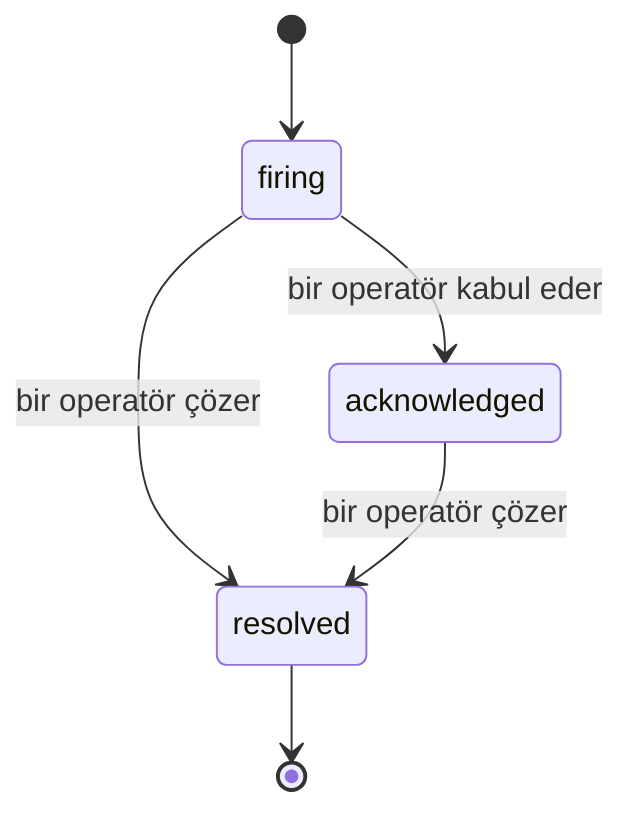

Bir uyarı tetiklendiğinde, ilk soru her zaman "kim bunu ele alıyor?" Olaylar buna yanıt verir: bir şey ihlal olduğu anda, herkes olayın açık olduğunu, kimin sahip olduğunu ve tam olarak şimdiye kadar neler olduğunu görebilir; doğrudan bir post-mortem'e verebileceğiniz temiz, atfedilen bir kaydı ile.

*Gelen kutusu açık olayları duruma göre gruplandırır ve önem düzeyi ve sorumlulu göre filtreler, böylece şu anda insan müdahalesine ihtiyaç duyan şeyleri görürsünüz.*

## Kimin sahip olduğunu bir bakışta bilin

Artık bir sohbet dizisinde "bunu kim bakıyor?" sorusu yok. Bir ihlal otomatik olarak bir olay açar ve bunu paylaşılan bir gelen kutusuna koyar, duruma göre gruplandırılmış. Bunu kabul ederseniz, adınız üzerine yazılır, böylece takımın geri kalanı bunun ele alındığını bilir. Kabul paylaşılmıştır: birçok operatör aynı olayı kabul edebilir ve her biri kendi başına kaydedilir, böylece tam bir savaş odası adları ile gösterilir, birbirinin üzerine basılmaz. Triage için bir sahip atayın ve gelen kutuyu önem düzeyi veya sorumluya göre filtreleyin ve bunu sizinkine indirin.

## Tüm hikaye, bir zaman çizelgesinde

Olay bittiğinde, zaten yazı işleriniz hazırdır. Herhangi bir olayı açın ve ihlal kanıtını, sorumluları ve abone uygulamasını, yerinde koordinasyon için bir yorum dizisini ve append-only etkinlik zaman çizelgesini alırsınız.

*Olan her şey, sırayla, her satır bunu yapan tarafından imzalanmış.*

Her eylem (açıldı, kabul edildi, çözüldü, vb.) bu zaman çizelgesine yazılır ve hiçbir zaman düzenlenmez. Her giriş atfedilir: onu yapan operatöre, e-posta ile veya FailproofAI Cloud'nin kendi başına yaptığı her şey için **automated** olarak (ihlal üzerine olay açmak gibi). Hiçbir şey anonim değildir ve hiçbir şey kaybolmaz, bu nedenle post-mortem daha az çok kendi kendini yazar.

## Bir olay nasıl hareket eder

- **Açık (tetikleniyor):** ihlal olayı açar ve kanallarınıza bir kez sayfa gösterir. Tekrarlanan ihlaller aynı olaya katlanır ve sizi tekrar tekrar sayfa göstermek yerine kanıtlarını yeniler.
- **Kabul edildi:** bir operatör bunu ele alır. Açık kalır ve sonraki ihlaller kanıtları sessizce günceller.
- **Çözüldü:** bir operatör bunu kapatır. Koşul temizlendiğinde otomatik çözüm planlanmıştır ancak henüz etkinleştirilmemiştir, bu nedenle bir olay bir insan onu çözene kadar açık kalır ve bu herkesin gerçekte neler temizlendiği konusunda dürüst olmasını sağlar. Aynı uyarıda daha sonra yeni bir olay açılabilir.

Bir uyarı aynı anda en fazla bir açık olayı tutar, bu nedenle titreşen bir kural sizi çiftliklere gömeemez. Ayrıca bir olayı elle açabilirsiniz: hiçbir uyarının yakalamadığı bir şey için bağımsız bir olay veya `incidents:write` varsa mevcut bir uyarıya bağlı bir olay.

## Nerede bulabilirim

Olaylar `/<org-slug>/incidents` konumunda bulunur. Görüntüleme **`incidents:read`** gerektirir; manuel bir olay açmak **`incidents:write`** gerektirir; kabul etme, atama, yorum yapma ve çözüm **`incidents:ack`** gerektirir. Emekli `alerts:ack` tuşu verilen eski anahtarlar `incidents:ack` olarak onurlandırıldığından çalışmaya devam eder, bu nedenle on-call rotasyonunuz yeniden verilmesi gerekmez.

## İlişkili

- [Uyarılar](/tr/cloud/alerts): bir eşik ihlal ettiğinde bu olayları açan kurallar.
- [Hata izleme](/tr/cloud/errors): her hatayı tek bir yerde görün ve birini uyarıya yükseltin.
- [Denetim](/tr/cloud/audits): hiçbir kuralın izlemediği hataları bulan zamanlanmış analist.