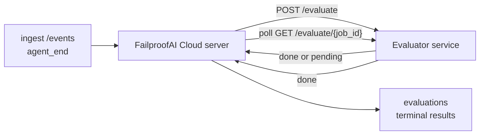

FailproofAI Cloud có thể tự động chấm điểm mọi phiên chạy agent đã hoàn thành về chất lượng: bạn cung cấp một dịch vụ chấm điểm nhỏ, và FailproofAI Cloud sẽ xử lý phần còn lại. Sử dụng nó để theo dõi các chiều độ bạn quan tâm (tính hữu ích, hiệu quả công cụ, tính xác thực, bảo mật; bạn lựa chọn), phát hiện sự suy giảm sớm và so sánh các agent hoặc môi trường một cách nhanh chóng. Chấm điểm là tùy chọn: đường dẫn sẽ không hoạt động cho đến khi bạn đặt `EVALUATOR_ENDPOINT` trên máy chủ.

> **Ghi chú:** Bạn định nghĩa các chiều chấm điểm. Bộ đánh giá của bạn có thể trả về bất kỳ khóa số nào mà nó muốn; FailproofAI Cloud lưu trữ, theo dõi xu hướng và hiển thị bất cứ thứ gì bạn gửi lại.

## Tóm tắt nhanh

1. **Viết một bộ chấm điểm.** Thiết lập một dịch vụ HTTP nhỏ đọc bản ghi phiên và trả về điểm số. FailproofAI Cloud cung cấp một bản tham khảo hoạt động mà bạn có thể sao chép. Xem [Viết bộ đánh giá với SDK](/vi/cloud/evaluators).
2. **Chỉ đến nó với FailproofAI Cloud.** Đặt `EVALUATOR_ENDPOINT` (và một `EVALUATOR_TOKEN` được chia sẻ) trên quy trình máy chủ.
3. **Theo dõi điểm số.** Mọi phiên hoàn thành được chấm điểm tự động; kết quả hiển thị trên trang chi tiết phiên, lưới phiên và bảng điều khiển đã lưu.


*Sau khi bộ đánh giá được định cấu hình, mỗi lần chạy được hoàn thành được chấm điểm và kết quả xuất hiện trong thanh bên phải của phiên: bản tóm tắt ở trên cùng, sau đó là thanh điểm số từng chiều với lý do.*

---

## Cách nó hoạt động



Khi FailproofAI Cloud SDK phát ra sự kiện `agent_end` cho một phiên, máy chủ sẽ lên lịch đánh giá. Sau đó, nó POSTs bản ghi sự kiện đầy đủ tới dịch vụ bộ đánh giá của bạn, dịch vụ này có thể:

- **Trả về kết quả ngay lập tức** với `{"status":"done", "scores":{...}, "reasoning":{...}, "summary":"..."}`. Kết quả được thêm vào dòng thời gian đánh giá của phiên. `reasoning` và `summary` là tùy chọn.
- **Trì hoãn** với `{"status":"pending", "job_id":"abc-123"}`. FailproofAI Cloud sau đó gọi `GET {EVALUATOR_ENDPOINT}/evaluate/abc-123` cho đến khi bộ đánh giá của bạn trả về `{"status":"done", ...}` hoặc `{"status":"error", "error":"..."}`.

  Tần suất thăm dò được theo công việc: phản hồi `pending` có thể bao gồm `next_poll_secs` để ghi đè; nếu không, FailproofAI Cloud sử dụng giá trị `default_poll_interval_secs` từ `GET /config`; nếu không, máy chủ quay lại `EVALUATOR_POLLING_INTERVAL_SECS` (mặc định 10 giây). Tất cả các giá trị được giới hạn trong [1 giây, 1 giờ].

Các phiên không bao giờ phát ra `agent_end` (ví dụ: quy trình agent bị sập) cũng có thể được nhận: `GET /config` của bộ đánh giá có thể trả về `{"inactivity_timeout_secs": 1800}`, và FailproofAI Cloud sẽ đánh giá bất kỳ phiên nào không hoạt động trong khoảng thời gian đó. Đặt trường thành `null` hoặc bỏ qua nó để tắt dự phòng này.

Đường dẫn hoàn toàn không hoạt động khi `EVALUATOR_ENDPOINT` chưa được đặt.

Một phiên có thể tích lũy **nhiều đánh giá terminal theo thời gian**: mỗi sự kiện `agent_end` (và mỗi lần đánh giá lại thủ công từ bảng điều khiển) thêm một hàng đánh giá mới. Đây là cách được hỗ trợ để đánh giá một cuộc trò chuyện được tiếp tục: người dùng kết thúc một agent, quay lại sau đó, gửi thêm sự kiện, kết thúc agent một lần nữa, và đánh giá thứ hai chạy so với bản ghi sự kiện đầy đủ được cập nhật. Bảng điều khiển hiển thị đánh giá gần đây nhất làm tiêu đề và các đánh giá trước đó dưới dạng dòng thời gian có thể thu gọn. Trong khi một đánh giá đang chạy cho một phiên, các sự kiện `agent_end` bổ sung cho phiên đó bị bỏ qua; cái tiếp theo sau khi đánh giá đang chạy hoàn thành sẽ xếp hàng một đánh giá mới như bình thường.

Dự phòng không hoạt động cũng tái bật trên các phiên được tiếp tục: nếu các sự kiện mới đến sau một đánh giá terminal trước đó và phiên sau đó không hoạt động quá `inactivity_timeout_secs`, một đánh giá mới được xếp hàng.

Các lỗi tạm thời (5xx, 429, timeout, lỗi mạng) được thử lại với backoff lũy thừa lên đến `EVALUATOR_MAX_ATTEMPTS`; phản hồi 4xx là terminal. FailproofAI Cloud an toàn để chạy với nhiều phiên bản máy chủ được mở rộng ngang; công việc được phân vùng để phiên tương tự không bao giờ được gửi hai lần cùng một lúc.

---

## Hợp đồng HTTP

Mọi tuyến được xác thực sử dụng **xác thực bearer token**. Cùng một giá trị phải được định cấu hình ở cả hai bên:

- Máy chủ FailproofAI Cloud: biến môi trường `EVALUATOR_TOKEN`
- Dịch vụ đánh giá: được định cấu hình theo cách tương tự (SDK `agenteye-evaluator` đọc `EVALUATOR_TOKEN` theo quy ước)

Nếu `EVALUATOR_TOKEN` chưa được đặt, máy chủ không gửi tiêu đề `Authorization`; bộ đánh giá sau đó có thể chấp nhận yêu cầu ẩn danh, điều này tốt cho một mạng nội bộ nhưng không được khuyến khích trên internet công cộng.

### Các tuyến bộ đánh giá phải phục vụ

| Tuyến | Nội dung / tham số | Phản hồi |
|---|---|---|
| `GET /health` | không có | `{"status":"ok"}` (mở, không có xác thực) |
| `GET /config` | không có | `{"inactivity_timeout_secs": <int> \| null, "default_poll_interval_secs": <int> \| omitted}` |
| `POST /evaluate` | `EvalRequest` JSON | `{"status":"done", ...}` hoặc `{"status":"pending", "job_id":"..."}` |
| `GET /evaluate/{id}` | không có | cùng hình dạng phản hồi như `/evaluate` |

### Nội dung `EvalRequest` được gửi bởi máy chủ

```json
{
  "schema_version": "1",
  "session_id":     "session-abc123",
  "agent_id":       "planner",
  "environment":    "production",
  "started_at":     "2026-05-10T12:00:00Z",
  "ended_at":       "2026-05-10T12:05:00Z",
  "events": [
    { "id": 1234, "ts": "...", "event_type": "agent_start", "payload": { ... } },
    ...
  ]
}
```

### Hình dạng phản hồi

**Đồng bộ (hoàn thành):**

```json
{
  "status": "done",
  "scores": { "helpfulness": 0.85, "tool_efficiency": 0.6 },
  "reasoning": {
    "helpfulness": "answered the question directly with citations",
    "tool_efficiency": "called list_files three times when one would have done"
  },
  "summary": "strong answer quality, weak tool selection"
}
```

`reasoning` (bản đồ lý do cho mỗi điểm) và `summary` (câu chuyện toàn cảnh một đoạn) đều là tùy chọn. Các khóa trong `reasoning` phải phản ánh các khóa trong `scores`; bảng điều khiển hiển thị mỗi mục nội tuyến dưới thanh điểm số của nó. Các bộ đánh giá cũ chỉ trả về `scores` tiếp tục hoạt động không thay đổi; `reasoning` và `summary` chỉ được đọc là null và các phần giao diện tương ứng bị bỏ qua.

**Không đồng bộ (trì hoãn):**

```json
{ "status": "pending", "job_id": "abc-123", "next_poll_secs": 30 }
```

`next_poll_secs` là tùy chọn; nếu bỏ qua máy chủ quay lại `default_poll_interval_secs` của bộ đánh giá từ `/config`, sau đó là biến `EVALUATOR_POLLING_INTERVAL_SECS` riêng của nó.

**Lỗi terminal phía bộ đánh giá:**

```json
{ "status": "error", "error": "model service unavailable" }
```

Máy chủ coi bất kỳ nội dung 2xx khác làm lỗi giao thức và ghi lại một `error` terminal cho phiên.

---

## Viết bộ đánh giá với SDK

Bạn không phải triển khai hợp đồng HTTP bằng tay. Gói Python `agenteye-evaluator` cung cấp cho bạn một trình bao bọc FastAPI được gõ xử lý xác thực, định tuyến và các hình dạng yêu cầu/phản hồi cho bạn.

FailproofAI Cloud cũng cung cấp một **bộ đánh giá tham khảo hoạt động** chấm điểm `helpfulness`, `tool_efficiency` và `factuality` từ hình dạng của bản ghi. Sao chép nó làm điểm khởi đầu và hoán đổi logic của riêng bạn: một trọng tài LLM, một công cụ quy tắc, bất cứ thứ gì phù hợp với tiêu chuẩn chất lượng của bạn.

Bộ đánh giá tối thiểu khả thi:

```python
import os
from agenteye_evaluator import Evaluator, EvalRequest, EvalResponse

app = Evaluator(token=os.environ["EVALUATOR_TOKEN"])

@app.evaluator
def run(req: EvalRequest) -> EvalResponse:
    # Inspect req.events (the full session transcript) and return scores.
    tool_calls = sum(1 for e in req.events if e.event_type == "tool_use")
    return EvalResponse(
        scores={"tool_calls": float(tool_calls)},
        reasoning={"tool_calls": f"{tool_calls} tool invocations in the transcript"},
        summary="tight tool loop" if tool_calls < 5 else "agent looped on tools",
    )
```

Phiên bản `app` chạy dưới bất kỳ máy chủ ASGI nào, vì vậy `uvicorn module:app` bắt đầu nó.

Đối với các bộ đánh giá cần phải trì hoãn công việc tốn kém, hãy trả về `JobPending` thay thế và đăng ký trình xử lý `@app.job_lookup`; máy chủ FailproofAI Cloud thăm dò `GET /evaluate/{job_id}` cho đến khi bạn trả về trạng thái terminal hoặc giới hạn `EVALUATOR_MAX_POLL_DURATION_SECS` (mặc định 1 giờ) hết hạn.

Tài liệu tham khảo API đầy đủ, mô hình không đồng bộ và lược đồ sự kiện được ghi lại trong README của SDK `agenteye-evaluator`.

---

## Chạy bộ đánh giá của bạn

Bộ đánh giá là **dịch vụ của bạn** — FailproofAI Cloud không cung cấp bộ đánh giá mặc định, vì vậy bạn xây dựng và chạy nó ở bất cứ nơi nào bạn chạy các dịch vụ riêng của mình. Nó chạy dưới bất kỳ máy chủ ASGI nào (ví dụ `uvicorn my_evaluator:app`); phục vụ các tuyến `/health`, `/config` và `/evaluate` từ [hợp đồng HTTP](/vi/cloud/evaluators), sau đó chỉ máy chủ tới nó (xem [Định cấu hình máy chủ](/vi/cloud/evaluators)).

Sau khi bộ đánh giá có thể truy cập được, `GET /health` trả về `{"status":"ok"}`. Sau khi một agent chạy từ đầu đến cuối, `GET /evaluations` trên máy chủ trả về một hàng có `status: "done"` và điểm số bộ đánh giá của bạn tạo ra.

---

## Định cấu hình máy chủ

Đặt trên quy trình máy chủ:

| Biến môi trường | Ý nghĩa |
|---|---|
| `EVALUATOR_ENDPOINT` | URL cơ sở của bộ đánh giá của bạn (`http://evaluator:9000`). Chưa đặt = đường dẫn bị vô hiệu hóa. |
| `EVALUATOR_TOKEN` | Bearer token. Phải bằng giá trị dịch vụ bộ đánh giá được định cấu hình với. |
| `EVALUATOR_WORKERS` | Tác vụ công nhân trên phiên bản máy chủ (mặc định 2). |
| `EVALUATOR_CLAIM_BATCH` | Hàng được yêu cầu trên mỗi tick công nhân (mặc định 4). Các lô được xử lý **đồng thời**; hiệu ứng đồng thời trên điểm cuối bộ đánh giá của bạn là `EVALUATOR_WORKERS × EVALUATOR_CLAIM_BATCH`. |
| `EVALUATOR_POLL_IDLE_SECS` | Công nhân ngủ bao lâu giữa các nỗ lực gửi khi không có đánh giá nào đến hạn (mặc định 2 giây). |
| `EVALUATOR_POLLING_INTERVAL_SECS` | Dự phòng cuối cùng cho tần suất `GET /evaluate/{id}` khi không có `next_poll_secs` trên mỗi phản hồi cũng như `default_poll_interval_secs` của bộ đánh giá được đặt (mặc định 10 giây). |
| `EVALUATOR_REQUEST_TIMEOUT_MS` | Timeout mỗi yêu cầu (mặc định 30000). |
| `EVALUATOR_MAX_ATTEMPTS` | Sau nhiều lỗi tạm thời này kết quả được ghi lại là `error` terminal (mặc định 5). |
| `EVALUATOR_CONFIG_REFRESH_SECS` | Tần suất `GET /config` (mặc định 300). |
| `EVALUATOR_MAX_POLL_DURATION_SECS` | Thời gian tối đa một phiên có thể ở trong hàng đợi thăm dò trước khi bị kết thúc làm `timeout` (mặc định 3600 giây). Bảo vệ chống lại bộ đánh giá luôn trả về `pending` mãi mãi. |

Để bật chấm điểm tự động, đặt cả `EVALUATOR_ENDPOINT` và `EVALUATOR_TOKEN` trên máy chủ, sau đó khởi động lại nó để áp dụng thay đổi. Khi `EVALUATOR_ENDPOINT` chưa được đặt đường dẫn vẫn là một no-op.

Các nút tinh chỉnh ở trên là tùy chọn; chỉ đặt các biến môi trường tương ứng trên máy chủ nếu bạn cần ghi đè các mặc định.

---

## Tài liệu tham khảo API

| Phương thức | Đường dẫn | Quyền cần thiết | Mục đích |
|---|---|---|---|
| `GET` | `/evaluations` | `evaluations:read` | Kết quả terminal truy vấn. Hỗ trợ `session_id`, `agent_id`, `environment`, `status` (`done`/`error`/`timeout`), `ts_from`, `ts_to`, `cursor`, `limit`, `score_filters`, `latest_per_session`. `limit` mặc định là 50 và được capped ở 200 (lưu ý điều này khác với `/events`, được capped ở 1000). `environment` chấp nhận danh sách được phân tách bằng dấu phẩy (ví dụ: `environment=prod,staging`); các giá trị duy nhất vẫn hoạt động. Với `latest_per_session=true` phản hồi chứa tối đa một hàng cho mỗi `session_id` (gần đây nhất theo `completed_at`) được sử dụng bởi trang danh sách phiên để thu gọn dòng thời gian đánh giá của phiên thành tiêu đề hiện tại của nó. Mặc định là false (trả về toàn bộ lịch sử). |
| `GET` | `/evaluations/aggregate` | `evaluations:read` | Sức khỏe eval được tổng hợp cho một lát được lọc: tổng số, phân tích done/error/timeout, thống kê per-score-key (count/avg/min/max/p50 trên các khóa `scores` tùy ý) và dòng thời gian được phân trang. Chấp nhận **các tham số lọc giống như `/evaluations`** cộng với `featured_keys` (CSV của các khóa điểm để theo dõi) và `latest_per_session`. Tính năng Dashboards; chỉ số chính xác trên toàn bộ bộ phù hợp, không được lấy mẫu. |
| `GET` | `/evaluations/environments` | `evaluations:read` | Giá trị môi trường riêng biệt từ bảng `evaluations`. Được sử dụng để điền các menu thả xuống bộ lọc có phạm vi dữ liệu có thể đọc được đánh giá. |
| `GET` | `/evaluation-jobs` | `evaluations:read` | Khả năng hiển thị các đánh giá đang bay. Lọc theo `status` (`pending`/`polling`). |
| `GET` | `/events` | `events:read` | Luồng các sự kiện thô của phiên. Hỗ trợ `session_id`, `agent_id`, `event_type` (CSV), `environment` (CSV), `ts_from`, `ts_to`, `cursor`, `limit` và `order`. `order` là `desc` (mới nhất trước, mặc định) hoặc `asc` (cũ nhất trước); một giá trị không được nhận dạng quay lại `desc`. Phân trang con trỏ qua `next_cursor` của phản hồi (một id sự kiện): chuyển nó lại làm `cursor` để nhận trang tiếp theo; với `asc` trang tiếp theo là các sự kiện sau id đó, với `desc` là các sự kiện trước nó. `limit` mặc định là 50 và được capped ở 1000. |
| `GET` | `/sessions/:session_id/export` | `events:read` | Trả về chính xác nội dung JSON mà bộ đánh giá sẽ nhận cho phiên này, phục vụ như một tệp đính kèm có thể tải xuống được đặt tên là `session-<id>.json`. Hữu ích cho việc phát lại các phiên sản xuất thông qua `agenteye-evaluator` để kiểm tra ngoại tuyến. Các byte giống hệt với những gì đường dẫn bộ đánh giá gửi. |
| `POST` | `/sessions/:session_id/re-evaluate` | `evaluations:trigger` | Xếp hàng một đánh giá mới cho một phiên; chạy cho dù có hay không có đánh giá trước đó. Kết quả mới được **thêm vào** dòng thời gian đánh giá của phiên thay vì ghi đè lên kết quả trước đó, vì vậy điểm số trước đó vẫn hiển thị như lịch sử. Trả về `202` khi xếp hàng, `404` cho phiên không xác định, `409` nếu một đánh giá đã đang tiến hành. Sử dụng sau khi triển khai một bộ đánh giá mới hoặc cho các phiên không bao giờ phát ra `agent_end`. |

### Lọc theo phạm vi điểm: `score_filters`

`GET /evaluations` chấp nhận tham số `score_filters` tùy chọn thu hẹp kết quả theo các giá trị số bên trong đối tượng `scores`. Tham số là danh sách được phân tách bằng dấu phẩy của các mục `key:min..max`; bất kỳ ràng buộc nào cũng có thể được bỏ qua. Các mục múi hợp với AND logic. Các hàng trong đó khóa được đặt tên bị thiếu hoặc không phải số được loại trừ. Một yêu cầu có thể mang tối đa 20 mục lọc; vượt quá điều đó trả về HTTP 400.

Ví dụ:
```text
# helpfulness in [0.5, 0.8]
GET /evaluations?score_filters=helpfulness:0.5..0.8

# tool_efficiency at most 0.3 (no lower bound)
GET /evaluations?score_filters=tool_efficiency:..0.3

# helpfulness >= 0.5 AND factuality >= 0.9
GET /evaluations?score_filters=helpfulness:0.5..,factuality:0.9..
```

Mỗi đối tượng phản hồi `/evaluations` có các trường này:

| Trường | Kiểu | Ghi chú |
|---|---|---|
| `evaluation_id` | string (UUID) | Định danh chính tắc cho đánh giá terminal này. Mỗi đánh giá terminal nhận được một UUID mới; một phiên có thể giữ nhiều. |
| `id` | string (UUID) | Bí danh tương thích ngược mang cùng giá trị như `evaluation_id`. |
| `session_id` | string | Phiên này đánh giá chạy lại. Một phiên có thể có nhiều đánh giá trong dòng thời gian. |
| `agent_id` | string | Xác định agent tạo ra phiên. |
| `environment` | string | Nhãn môi trường được sao chép từ phiên. |
| `status` | enum | Một trong `"done"`, `"error"`, `"timeout"`. |
| `scores` | object \| null | Điểm số được trả về bởi bộ đánh giá của bạn. |
| `reasoning` | object \| null | Bản đồ lý do tùy chọn trên mỗi điểm được trả về bởi bộ đánh giá của bạn. Các khóa thường phản ánh những cái trong `scores`. Bảng điều khiển hiển thị mỗi mục dưới thanh điểm số của nó. |
| `summary` | string \| null | Tóm tắt toàn cảnh tùy chọn một đoạn được trả về bởi bộ đánh giá của bạn. Bảng điều khiển hiển thị điều này trên phân tích per-score làm tiêu đề của đánh giá. |
| `error` | string \| null | Được điền trên `"error"` / `"timeout"` chỉ. |
| `attempt_count` | integer | Số nỗ lực gửi (≥ 1). |
| `duration_ms` | integer \| null | Thời lượng của nỗ lực cuối cùng. |
| `completed_at` | string (ISO 8601 UTC) | Khi kết quả terminal được ghi lại. Kết quả được sắp xếp theo `completed_at` (mới nhất trước). |
| `created_at` | string (ISO 8601 UTC) | Mang cùng dấu thời gian với `completed_at` (ngữ nghĩa ghi một lần). |

---

## Quyền

| Quyền | Cấp quyền |
|---|---|
| `evaluations:read` | Liệt kê kết quả đánh giá, xem điểm trong bảng điều khiển và tải chỉ số sức khỏe bảng điều khiển. |
| `evaluations:trigger` | Xếp hàng một đánh giá thủ công cho một phiên thông qua `POST /sessions/:session_id/re-evaluate` hoặc nút đánh giá lại của bảng điều khiển. |
| `dashboards:read` | Xem bảng điều khiển đã lưu (cũng cần `evaluations:read` để tải chỉ số của chúng). |
| `dashboards:write` | Tạo và chỉnh sửa bảng điều khiển. |
| `dashboards:delete` | Xóa bảng điều khiển. |

Admin bootstrap (`ADMIN_KEY`, `ADMIN_EMAIL`) tự động nhận những cái này.

---

## Xem kết quả

- **`/sessions/<id>`**: dòng thời gian sự kiện + thanh bên phải hiển thị điểm số của phiên và bất kỳ lỗi nào từ nỗ lực gửi. Nếu khóa của bạn có `evaluations:trigger`, một nút **đánh giá lại** xuất hiện bên cạnh nút xuất bản, hữu ích cho các phiên không bao giờ phát ra `agent_end` hoặc để làm mới điểm số sau khi triển khai bộ đánh giá mới. Bảng điều khiển thăm dò kết quả mới và cập nhật thanh bên phải khi nó xuất hiện.
- **`/sessions`**: lưới phiên có thể lọc; cột điểm số hiển thị trạng thái đánh giá và điểm số của mỗi phiên một cách nhanh chóng.
- **`/dashboards`**: chế độ xem sức khỏe eval được lưu (xem [Bảng điều khiển](/vi/cloud/evaluators) dưới đây).


*Lưới phiên hiển thị trạng thái đánh giá và điểm số của mỗi lần chạy một cách nhanh chóng; huy hiệu đỏ/hổ phách/xanh làm cho điểm số thấp nổi bật.*

---

## Bảng điều khiển

Trang **Dashboards** (`/dashboards`) cho phép bạn lưu một sự kết hợp các bộ lọc đánh giá làm chế độ xem có tên, có thể tái sử dụng và theo dõi cách lát cắt đó của đánh giá đang làm một cách nhanh chóng. Bảng điều khiển được **chia sẻ trên toàn bộ tổ chức của bạn**; mọi người có `dashboards:read` nhìn thấy cùng một bộ.

Mỗi bảng điều khiển ghim:

- **Bộ lọc**: các điều khiển tương tự như trang phiên: môi trường, trạng thái, agent, cửa sổ thời gian lăn và bộ lọc phạm vi điểm (`key:min..max`).
- **Cấu hình hiển thị**: các khóa điểm để nổi bật, ngưỡng sức khỏe xanh/hổ phách/đỏ, các bảng điều khiển nào để hiển thị và liệu có nên thu gọn thành đánh giá mới nhất trên mỗi phiên.

Mỗi thẻ hiển thị số lượng phiên phù hợp, phân tích done/error/timeout, trung bình của mỗi điểm nổi bật và một sparkline xu hướng nhỏ. Mở bảng điều khiển hiển thị các bảng điều khiển toàn kích thước; **mở trong phiên** hạ bạn vào trang phiên được lọc trước chính xác lát cắt đó. Chỉ số được tính toán phía máy chủ trên toàn bộ bộ phù hợp (thông qua `GET /evaluations/aggregate`), vì vậy các số chính xác thay vì được lấy mẫu.


**Quyền:** xem yêu cầu cả `dashboards:read` và `evaluations:read`; tạo và chỉnh sửa yêu cầu `dashboards:write`; xóa yêu cầu `dashboards:delete`. Admin bootstrap nhận tất cả những cái này tự động.

---

## Khắc phục sự cố

**Phiên tồn tại nhưng không có đánh giá nào được tạo.** Xác nhận `EVALUATOR_ENDPOINT` được đặt trên quy trình máy chủ, máy chủ và bộ đánh giá chia sẻ cùng một giá trị `EVALUATOR_TOKEN` và điểm cuối `/health` của bộ đánh giá có thể truy cập được từ máy chủ. Khi `EVALUATOR_ENDPOINT` chưa được đặt đường dẫn là một no-op.

**Các đánh giá đang bay tích lũy.** Truy vấn `GET /evaluation-jobs` để xem hàng đợi đang bay. Kiểm tra `attempt_count`, `next_attempt_at` và `last_error` trên mỗi hàng. Nguyên nhân phổ biến: dịch vụ bộ đánh giá không thể truy cập hoặc trả về 5xx (thử lại với backoff), `EVALUATOR_TOKEN` sai (401 là terminal) hoặc bộ đánh giá không đồng bộ trả về `pending` mãi mãi (xem dưới đây).

**Phiên hoàn thành nhưng không có đánh giá terminal.** Truy vấn `GET /evaluation-jobs?status=polling`; kết quả vẫn có thể đang bay. Nếu một công việc bị mắc kẹt trong `pending`, máy chủ gặp sự cố khi đạt tới bộ đánh giá; kiểm tra rằng bộ đánh giá đang chạy và `EVALUATOR_TOKEN` khớp.

**`HTTP 401 from evaluator: invalid bearer token`.** `EVALUATOR_TOKEN` trên máy chủ không khớp với giá trị dịch vụ bộ đánh giá được định cấu hình. Chúng phải giống hệt nhau.

**Bộ đánh giá không đồng bộ trả về `pending` mãi mãi.** Máy chủ thăm dò `GET /evaluate/{job_id}` cho đến khi bộ đánh giá trả về `done` hoặc `error`, hoặc cho đến khi `EVALUATOR_MAX_POLL_DURATION_SECS` (mặc định 1 giờ) hết hạn. Sau khi vượt qua giới hạn, đánh giá được ghi lại là `timeout` và được loại bỏ khỏi hàng đợi đang bay. Nâng cao `EVALUATOR_MAX_POLL_DURATION_SECS` nếu bộ đánh giá của bạn thực sự cần lâu hơn mặc định.

---

## Các bước tiếp theo

- [Kỹ năng agent đánh giá](/vi/cloud/agent-skills): có một agent mã thiết kế các chiều của bạn chống lại các phiên thực tế và xây dựng dịch vụ này cho bạn.
- [Python SDK](/vi/cloud/sdk): phát ra các sự kiện `agent_end` kích hoạt chấm điểm.
- [Khóa API](/vi/cloud/access): các quyền `evaluations:read` và `evaluations:trigger`.
- [Kiểm toán](/vi/cloud/audits): tính năng tự động chất lượng khác của FailproofAI Cloud, để xem xét dựa trên chính sách.