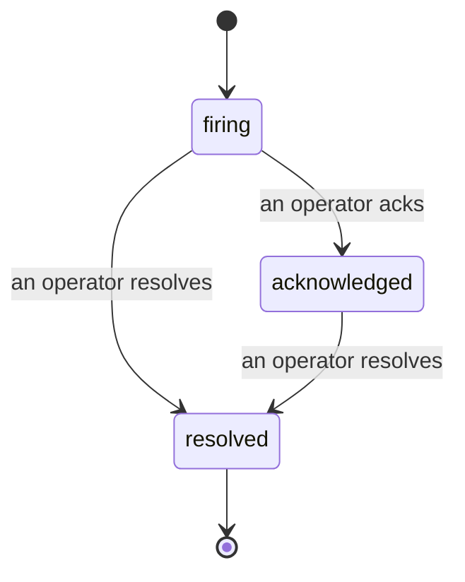

Khi một cảnh báo phát động, câu hỏi đầu tiên luôn là "ai đang xử lý?" Sự cố trả lời nó: ngay lập tức khi có vi phạm, mọi người có thể thấy sự cố đang mở, ai sở hữu nó và chính xác những gì đã xảy ra cho đến nay, với một bản ghi được ghi nhận rõ ràng mà bạn có thể chuyển thẳng cho cuộc họp hậu sự.

*Hộp thư nhóm các sự cố mở theo trạng thái và lọc theo mức độ nghiêm trọng và người được giao nhiệm vụ, để bạn thấy những gì cần con người bây giờ.*

## Biết ai đang xử lý, trong nháy mắt

Không còn "có ai đang xem cái này không?" trong một luồng trò chuyện. Một vi phạm sẽ tự động mở một sự cố và đặt nó vào hộp thư được chia sẻ, nhóm theo trạng thái. Xác nhận nó và tên bạn được ghi lên, vì vậy phần còn lại của đội biết rằng nó đã được xử lý. Xác nhận được chia sẻ: nhiều nhà điều hành có thể xác nhận cùng một sự cố và mỗi cái được ghi lại riêng, vì vậy một phòng chiến tranh đầy đủ sẽ xuất hiện theo tên thay vì làm hỏng lẫn nhau. Gán một chủ sở hữu cho phân loại và lọc hộp thư theo mức độ nghiêm trọng hoặc người được giao nhiệm vụ để cắt xuống những gì là của bạn.

## Toàn bộ câu chuyện, trong một dòng thời gian

Khi sự cố kết thúc, bạn đã có bản viết. Mở bất kỳ sự cố nào và bạn sẽ nhận được bằng chứng vi phạm, những người được giao nhiệm vụ và người đăng ký của nó, một luồng bình luận để phối hợp tại chỗ, và một dòng thời gian hoạt động chỉ thêm vào.

*Mọi thứ đã xảy ra, theo thứ tự, mỗi dòng được ký bởi người đã làm nó.*

Mỗi hành động (mở, xác nhận, giải quyết, v.v.) được ghi vào dòng thời gian đó và không bao giờ được chỉnh sửa. Mỗi mục được ghi nhận: cho nhà điều hành đã thực hiện nó, theo email, hoặc thành **automated** cho bất kỳ điều gì FailproofAI Cloud đã tự làm, như mở sự cố trên vi phạm. Không có gì ẩn danh và không có gì bị mất, vì vậy cuộc họp hậu sự hầu như tự viết.

## Sự cố di chuyển như thế nào

- **Mở (firing):** vi phạm mở sự cố và trang một lần trên các kênh của bạn. Các vi phạm lặp lại được gộp vào cùng một sự cố và làm mới bằng chứng của nó thay vì trang bạn nhiều lần.
- **Đã xác nhận:** một nhà điều hành nhận nó. Nó vẫn mở, và các vi phạm sau này cập nhật bằng chứng một cách yên tĩnh.
- **Đã giải quyết:** một nhà điều hành đóng nó lại. Giải quyết tự động khi điều kiện được xóa đã được lên kế hoạch nhưng chưa được bật, vì vậy một sự cố vẫn mở cho đến khi con người giải quyết nó, điều này giữ cho mọi người trung thực về những gì đã thực sự được xóa. Một sự cố mới có thể mở trên cùng một cảnh báo sau đó.

Một cảnh báo chứa nhiều nhất một sự cố mở tại một thời điểm, vì vậy một quy tắc dao động không thể chôn bạn trong các bản sao. Bạn cũng có thể mở một sự cố bằng tay: một sự cố độc lập cho một cái gì đó không có cảnh báo nào bắt được, hoặc một sự cố được đính kèm vào một cảnh báo hiện có, nếu bạn có `incidents:write`.

## Nơi tìm nó

Các sự cố nằm tại `/<org-slug>/incidents`. Xem cần **`incidents:read`**; mở một sự cố thủ công cần **`incidents:write`**; xác nhận, gán, bình luận và giải quyết cần **`incidents:ack`**. Các kóa cũ hơn được cấp `alerts:ack` đã ngừng hoạt động vẫn hoạt động, vì nó được công nhận là `incidents:ack`, vì vậy ca trực của bạn không cần được phát hành lại.

## Liên quan

- [Alerts](/vi/cloud/alerts): các quy tắc mở những sự cố này khi một ngưỡng vi phạm.
- [Error tracking](/vi/cloud/errors): xem mỗi lỗi ở một nơi và nâng một lên thành cảnh báo.
- [Audits](/vi/cloud/audits): nhà phân tích lên lịch tìm thấy những lỗi không có quy tắc nào đang xem.