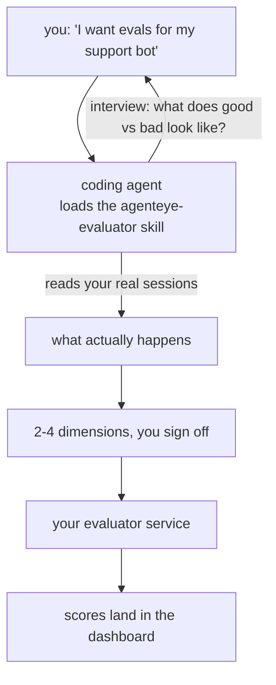

You should not have to memorize a flag to ask *"is anything broken today?"*

FailproofAI publishes four **Agent Skills** — small folders of instructions that a coding
agent like Claude Code or Codex loads on demand when a task matches. They are not services,
libraries, or plugins. Each one teaches your agent to drive something you already have,
using credentials you already hold.

Three of them cover FailproofAI Cloud. The fourth, `failproofai-policy-author`, covers the
open-source half — turning a recurring agent mistake into a policy that blocks it.

| Skill | Ask it to | What it touches |
|---|---|---|
| **`agenteye-cli`** | Read your data and run your organization — *"which sessions errored today?"*, *"give CI a key that can only push events"* | Drives the [CLI](/zh/cloud/cli) as you |
| **`agenteye-python-sdk`** | Instrument your own agent so it reports at all — *"add observability to this agent"* | Writes code in your agent's repo |
| **`agenteye-evaluator`** | Decide what quality means for you, then build the scorer | Writes code in your repo; reads your sessions |
| **`failproofai-policy-author`** | Turn what an agent keeps doing wrong into enforcement — *"my agent keeps force-pushing"* | Writes policy files; reads your audit results |

The first three hand off in that order: the SDK skill gets events flowing, the evaluator
skill scores them, the CLI skill reads them back. Starting from scratch? Start at the top of
that list.

`failproofai-policy-author` is a separate entry point. It needs no cloud account and no
connected machine — it works against the policies on your own machine, and it is the one to
reach for after [`failproofai audit`](/zh/audit) shows you what your agents actually do.

---

## Getting them

All four live in FailproofAI's **public** skills collection:
**[github.com/FailproofAI/skills](https://github.com/FailproofAI/skills)**

Nothing is gated. None of them carries a credential of its own — each only drives a tool
you have already installed, with the session you logged in with.

```bash
# Claude Code, this project only
npx skills add FailproofAI/skills --skill agenteye-cli -a claude-code

# the policy-authoring skill — no cloud account needed
npx skills add FailproofAI/skills --skill failproofai-policy-author -a claude-code

# every project (installs to ~/.claude/skills/)
npx skills add FailproofAI/skills --skill agenteye-cli -a claude-code -g --copy

# Codex instead
npx skills add FailproofAI/skills --skill agenteye-cli -a codex

# then manage them like any other skill
npx skills list -a claude-code
```

The four `--skill` values are `agenteye-cli`, `agenteye-python-sdk`, `agenteye-evaluator`
and `failproofai-policy-author`. Installing several is the normal setup — the agent picks
between them from what you ask.

<Note>
  The skills ship as their own folders and are **not** inside the `pipx install agenteye`
  package, so don't look for them there.
</Note>

---

## `agenteye-cli` — operate your deployment by asking

```text
you    Why did session run-001 fail?

agent  Running: agenteye --json events --session-id run-001 --all
       The checkout-agent hit a TimeoutError on its third tool call.
```

Reads are instant. Every write pauses for you:

```text
you    Give CI a key that can only push events.

agent  This creates an API key. I'll run:
         agenteye keys create ci --add events:add
       OK to proceed?

you    yes

agent  Done. Key "ci" created with events:add only. The secret is shown once — store it now.
```

**Prerequisites:** the [`agenteye` CLI](/zh/cloud/cli) installed and on `PATH`, your dashboard
URL set, and a logged-in session (`agenteye login`). The skill **cannot** complete the
emailed one-time-code login for you — it will tell you to run `agenteye login` when the
session is missing or expired.

<Warning>
  **This skill has your full permissions, including writes.** It runs the CLI *as you*, so
  it can do anything your login can: create and rotate keys, change settings, resolve
  incidents, delete saved queries. The CLI's "are you sure?" prompt does not fire for a
  non-interactive caller, so the skill is written to state the exact command and wait for
  your OK before any change. **You are the confirmation step.**

  This is a different blast radius from the [in-dashboard assistant](/zh/cloud/assistant),
  which is read-only with approval-gated authoring and can never delete.
</Warning>

---

## `agenteye-python-sdk` — instrument an agent, correctly

The [SDK](/zh/cloud/sdk) is small — thirteen event methods, all keyword-only — and a coding
agent can produce plausible instrumentation from the reference in a minute.

The catch is that wrong instrumentation looks exactly like right instrumentation until
someone opens a dashboard and finds it empty. The expensive mistakes are all **silences**:

| The mistake | What you see |
|---|---|
| No `agent_start` | Every event lands. Zero sessions. |
| Environment never set | Everything works, filed under `dev`. |
| `outcome="failure"` | The run shows green — only `failed`, `error`, `timeout`, `rejected` count. |
| A typo'd field name | Accepted, and stored as a brand new field. |
| Events emitted from a thread pool | Silently dropped. |

None of these raise. None show up in tests. Every one is in the skill, stated as a contract
with the check that catches it.

The skill works in three steps, in the order a careful engineer would:

<Steps>
  <Step title="Plan">
    It reads your agent loop and asks the two questions only you can answer: what counts as
    one run (your `session_id`), and who the distinguishable actors are (your `agent_id`).
    Both get agreed *before* code is written — changing them later splits your history and
    breaks every trend built on it.
  </Step>
  <Step title="Write">
    It binds identity once per run instead of threading it through every call site, and
    picks a concurrency-safe shape. That detail matters: the obvious shortcut silently
    merges two overlapping runs into one session.
  </Step>
  <Step title="Verify">
    It runs your agent and reads the resulting event files, checking that `agent_start` is
    present, the environment is right, and one run produced exactly one session.
  </Step>
</Steps>

That third step is the one people skip, and the SDK writes events to local files — so a
complete integration can be proven on a laptop with **no server, no API key, and no
network**. Which is exactly why the skill insists on doing it.

**Prerequisites:** Python 3.10+, the agent codebase, and the SDK. Nothing else — no
dashboard login, no key.

---

## `agenteye-evaluator` — decide what to score, then build the scorer

The hard part of evaluation is not the code. The [HTTP contract](/zh/cloud/evaluators) is
small enough that an agent can implement it from the spec alone. Evaluators fail because
they **score the wrong thing** — and an evaluator that scores the wrong thing is worse than
none, because it produces a dashboard everyone learns to ignore.

So most of this skill is the part before any code exists:



It interviews you (*"describe a run that went well; now one that went badly"*), then pulls
your real sessions and reads them end to end. Those two halves usually disagree, and the
gap is the point: what you *intend* to measure versus what your transcripts can actually
support.

A dimension only survives two tests. It must be **computable** from the events, and it must
be **discriminating** — if it scores 0.9 on both your good run and your bad one, it teaches
nothing and gets cut. What comes back is a proposal of 2–4 dimensions with the reasoning
attached, for you to approve before a line is written.

**Prerequisites:** the CLI installed and logged in (with `events:read`, plus
`evaluations:read` for the final check), and somewhere real for the evaluator to live — it
becomes a long-running service, so it needs a repo, not a scratch file. Evaluators often
live in their own repo, separate from the agent being scored; the skill looks for one and
asks before scaffolding.

---

## `failproofai-policy-author` — turn a recurring mistake into enforcement

The other three skills are about seeing what your agents did. This one is about stopping it
happening again — and it is the only skill that works entirely on the open-source half, with
no cloud account and no connected machine.

```text
you    my agent keeps force-pushing over my branch

agent  Loading failproofai-policy-author.
       `block-force-push` already ships as a builtin — no custom policy needed.
       Checking whether it is enabled here, and for which agent CLIs.
       If it is not, enabling it is one command:

         failproofai policy add block-force-push

       Want me to enable it?
```

It checks the builtins before writing anything, because the usual right answer is a rule
that already exists. Only when nothing fits does it author a policy file, pick the event and
tool to match on, and then **verify the policy actually fires** rather than assuming it did.

Three things it is good at:

<CardGroup cols={1}>

<Card title="Acting on an audit" icon="list-check">
  Run [`failproofai audit`](/zh/audit), and it sorts the findings into what a policy can
  actually prevent, what needs a different fix, and what is noise — then presents that
  triage before changing anything.
</Card>

<Card title="Plain-English complaints" icon="comment">
  *"it deleted my files again"* is enough. You do not have to know which event or tool the
  policy should match on, or that a policy is what you want.
</Card>

<Card title="Making a rules file real" icon="file-shield">
  A `CLAUDE.md` or `AGENTS.md` is advisory — the agent can ignore it. The skill extracts the
  rules that are mechanically checkable and turns those into policies that fire on every
  tool call.
</Card>

</CardGroup>

**Prerequisites:** the `failproofai` CLI installed, and policies installed for at least one
agent CLI ([`failproofai config`](/zh/cli/config)). No cloud account, no login.

<Note>
  It deliberately stays in its lane: it will not read your cloud telemetry (that is
  `agenteye-cli`), design evaluator scoring (`agenteye-evaluator`), fix the bug an agent
  introduced, or write a repo invariant that belongs in a test.
</Note>

---

## How these compare to the in-dashboard assistant

Two natural-language front doors, very different blast radii:

| | Agent skills | [In-dashboard assistant](/zh/cloud/assistant) |
|---|---|---|
| Runs | On your workstation, in your coding agent | Server-side, in the dashboard |
| Authenticates as | You, via your CLI session | Your dashboard session, scoped to your read permissions |
| Can mutate | **Yes** — the CLI's full surface | Only saved queries and dashboards, each approval-gated |
| Can delete | **Yes** | **Never** |
| Best for | Doing things: provisioning, triage, building | Asking things: "how is quality trending this week?" |

Both are useful, and most teams run both. Just know which one you are talking to.

---

## Related

<CardGroup cols={2}>

<Card title="CLI reference" icon="terminal" href="/zh/cloud/cli">
  Every command, flag, and JSON shape the CLI skill drives.
</Card>

<Card title="CLI recipes" icon="code" href="/zh/cloud/cli-recipes">
  `jq` patterns and exit-code handling for scripts and agents.
</Card>

<Card title="Python SDK" icon="python" href="/zh/cloud/sdk">
  The event reference the SDK skill writes against.
</Card>

<Card title="Evaluators" icon="ruler" href="/zh/cloud/evaluators">
  The scoring contract the evaluator skill implements.
</Card>

<Card title="Built-in policies" icon="shield" href="/zh/built-in-policies">
  The 40 rules the policy-author skill checks before writing anything new.
</Card>

<Card title="Custom policies" icon="pen-to-square" href="/zh/custom-policies">
  The policy file format that skill writes against.
</Card>

</CardGroup>
