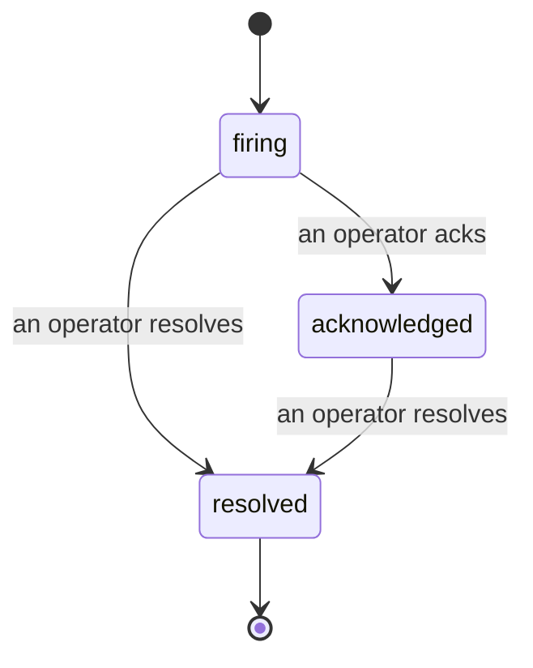

当告警触发时，第一个问题永远是"谁在处理？"事故功能给出了答案：一旦发生违规，所有人都能立即看到事故已开启、负责人是谁，以及目前已发生的一切——形成一份干净、有归属的记录，可以直接用于事后复盘。

*收件箱按状态将未处理的事故分组，并支持按严重程度和负责人筛选，让你快速看到当前需要人工介入的内容。*

## 一眼知道谁在负责

再也不用在群聊里问"有人在看这个吗？"。违规发生时会自动创建事故并进入共享收件箱，按状态分组。确认事故后，你的名字就挂在上面，让团队其他成员知道已有人接手。确认操作支持多人同时进行：多名操作员可以各自确认同一个事故，每条记录独立保存，整个作战小组都能按名字显示，而不会互相覆盖。指定一名负责人进行分类处理，再按严重程度或负责人筛选收件箱，快速聚焦到属于自己的事故。

## 完整故事，尽在一条时间线

事故结束时，你已经有了现成的复盘素材。打开任意事故，你会看到违规证据、负责人和订阅者、用于协调沟通的评论线程，以及一条只能追加的活动时间线。

*所有发生过的事，按时间顺序排列，每一行都标注了操作人。*

每一个操作（开启、确认、解决等）都会写入时间线，且永远不会被编辑删除。每条记录都有归属：操作员按邮箱标注，由 FailproofAI Cloud 自动执行的操作（例如在违规时自动开启事故）则标注为 **automated**。没有匿名记录，没有信息丢失，事后复盘几乎可以自动生成。

## 事故的流转方式

- **未处理（firing）：** 违规触发事故创建，并向你的渠道发送一次通知。后续重复违规会折叠进同一个事故并刷新证据，不会反复通知。
- **已确认（acknowledged）：** 操作员接手处理。事故保持开启状态，后续违规会静默更新证据。
- **已解决（resolved）：** 操作员关闭事故。条件恢复正常后自动解决的功能在规划中，尚未启用，因此事故会保持开启直到有人手动解决——这确保了所有人对实际已恢复情况的诚实判断。之后同一告警可以再次创建新的事故。

同一时间，一条告警最多只能有一个未关闭的事故，因此频繁抖动的规则不会让你淹没在重复事故中。你也可以手动创建事故：既可以是与任何告警无关的独立事故（用于捕捉告警未覆盖的情况），也可以关联到现有告警，前提是你拥有 `incidents:write` 权限。

## 在哪里找到它

事故功能位于 `/<org-slug>/incidents`。查看需要 **`incidents:read`** 权限；手动创建事故需要 **`incidents:write`** 权限；确认、分配、评论和解决需要 **`incidents:ack`** 权限。旧版密钥授予的已废弃 `alerts:ack` 权限仍然有效，因为它会被识别为 `incidents:ack`，所以你的值班轮换无需重新下发密钥。

## 相关内容

- [告警](/zh/cloud/alerts)：当阈值被突破时触发事故的规则。
- [错误追踪](/zh/cloud/errors)：在一处查看所有故障，并将其中一个提升为告警。
- [审计](/zh/cloud/audits)：定期运行的分析器，用于发现没有规则在监控的故障。